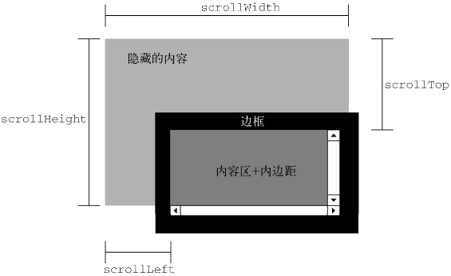

# 第16章 DOM2和DOM3

DOM1级主要定义的是HTML和XML文档的底层结构。DOM2和DOM3级则在这个结构的基础上引入了更多的交互能力，也支持了更高级的XML特性。为此，DOM2和DOM3级分为许多模块（模块之间具有某种关联），分别描述了DOM的某个非常具体的子集。这些模块 如下。

- DOM2级核心（DOM Level 2 Core）：在1级核心基础上构建，为节点添加了更多方法和属性。
- DOM2级视图（DOM Level 2 Views）：为文档定义了基于样式信息的不同视图。
- DOM2级事件（DOM Level 2 Events）：说明了如何使用事件与DOM文档交互。
- DOM2级样式（DOM Level 2 Style）：定义了如何以编程方式来访问和改变CSS样式信息。
- DOM2级遍历和范围（DOM Level 2 Traversal and Range）：引入了遍历DOM文档和选择其特定部分的新接口。
- DOM2级 HTML（DOM Level 2 HTML）：在1级HTML基础上构建，添加了更多属性、方法和新接口。
- DOM Mutation Observers: Allows for definition of callbacks upon changes to the DOM. Mutation Observers were defined in the DOM4 specification to replace Mutation Events.


## 16.1 DOM变化

### 16.1.1 针对XML命名空间的变化

**DOM2级核心”为不同的DOM类型引入了一些与XML命名空间有关的方法。这些变化只在使用XML或XHTML文档时才有用；对于HTML文档没有实际意义。**

有了XML命名空间，不同XML文档的元素就可以混合在一起，共同构成格式良好的文档，而不必担心发生命名冲突。从技术上说，HTML不支持XML命名空间，但XHTML支持XML命名空间。

#### `Node`类型的变化

在DOM2级中，`Node`类型包含下列特定于命名空间的属性：

- `localName`：不带命名空间前缀的节点名称。当节点使用了命名空间前缀时，其`nodeName`等于`prefix+":"+ localName`。
- `namespaceURI`：命名空间URI或者（在未指定的情况下是）`null`。
- `prefix`：命名空间前缀或者（在未指定的情况下是）`null`。

DOM3级在此基础上更进一步，又引入了下列与命名空间有关的方法：

- `isDefaultNamespace(namespaceURI)`：在指定的`namespaceURI`是当前节点的默认命名空间的情况下返回`true`。
- `lookupNamespaceURI(prefix)`：返回给定`prefix`的命名空间。
- `lookupPrefix(namespaceURI)`：返回给定`namespaceURI`的前缀。

#### `Document`类型的变化

DOM2级中的`Document`类型也发生了变化，包含了下列与命名空间有关的方法：

- `createElementNS(namespaceURI, tagName)`：使用给定的`tagName`创建一个属于命名空间`namespaceURI`的新元素。
- `createAttributeNS(namespaceURI, attributeName)`：使用给定的`attributeName`创建一个属于命名空间`namespaceURI`的新特性。
- `getElementsByTagNameNS(namespaceURI, tagName)`：返回属于命名空间`namespaceURI`的`tagName`元素的`NodeList`。

只有在文档中存在两个或多个命名空间时，这些与命名空间有关的方法才是必需的。

####  `Element`类型的变化

DOM2级核心”中有关`Element`的变化，主要涉及操作特性。新增的方法如下：

- `getAttributeNS(namespaceURI,localName)`：取得属于命名空间`namespaceURI`且名为`localName`的特性。
- `getAttributeNodeNS(namespaceURI,localName)`：取得属于命名空间`namespaceURI`且名为`localName`的特性节点。
- `getElementsByTagNameNS(namespaceURI, tagName)`：返回属于命名空间`namespaceURI`的`tagName`元素的`NodeList`。
- `hasAttributeNS(namespaceURI,localName)`：确定当前元素是否有一个名为`localName`的特性，而且该特性的命名空间是`namespaceURI`。注意，“DOM2级核心”也增加了一个`hasAttribute()`方法，用于不考虑命名空间的情况。
- `removeAttriubteNS(namespaceURI,localName)`：删除属于命名空间`namespaceURI`且名为`localName`的特性。
- `setAttributeNS(namespaceURI,qualifiedName,value)`：设置属于命名空间`namespaceURI`且名为`qualifiedName`的特性的值为`value`。
- `setAttributeNodeNS(attNode)`：设置属于命名空间`namespaceURI`的特性节点。

除了第一个参数之外，这些方法与DOM1级中相关方法的作用相同；第一个参数始终都是一个命名空间URI。

#### `NamedNodeMap`类型的变化

`NamedNodeMap`类型也新增了下列与命名空间有关的方法。由于特性是通过`NamedNodeMap`表示的，因此这些方法多数情况下只针对特性使用：

- `getNamedItemNS(namespaceURI,localName)`：取得属于命名空间`namespaceURI`且名为`localName`的项。
- `removeNamedItemNS(namespaceURI,localName)`：移除属于命名空间`namespaceURI`且名为`localName`的项。
- `setNamedItemNS(node)`：添加`node`，这个节点已经事先指定了命名空间信息。

### 16.1.2 其他方面的变化

#### `DocumentType`类型的变化

`DocumentType`类型新增了3个属性：

- `publicId`属性 ：表示的是文档类型声明中的两个信息段中的第一个；
- `systemId`属性 ：表示的是文档类型声明中的两个信息段中的第二个；
- `internalSubset`属性 ：用于访问包含在文档类型声明中的额外定义。

```js
console.log(document.doctype.publicId);
console.log(document.doctype.systemId);
console.log(document.doctype.internalSubset);
```

#### `Document`类型的变化

- **`importNode()`方法** ：的用途是从一个文档中取得一个节点，然后将其导入到另一个文档，使其成为这个文档结构的一部分。需要注意的是，每个节点都有一个`ownerDocument`属性，表示所属的文档。如果调用`appendChild()`时传入的节点属于不同的文档（`ownerDocument`属性的值不一样），则会导致错误。但在调用`importNode()`时传入不同文档的节点则会返回一个新节点，这个新节点的所有权归当前文档所有。
- **`defaultView`属性** ：其中保存着一个指针，指向拥有给定文档的窗口（或框架）。
- **`document.implementation.createDocumentType()`方法** ：用于创建一个新的`DocumentType`节点，接受3个参数：文档类型名称、`publicId`、`systemId`。
- **`document.implementation.createDocument()`方法** ：这个方法接受3个参数：针对文档中元素的`namespaceURI`、文档元素的标签名、新文档的文档类型。
- **`document.implementation.createHTMLDocument()`方法** ：创建一个完整的HTML文档，包括`<html>`、`<head>`、`<title>`和`<body>`元素。这个方法只接受一个参数，即新创建文档的标题（放在`<title>`元素中的字符串），返回新的HTML文档。这个新返回的文档，是`HTMLDocument`类型的实例，因而具有该类型的所有属性和方法，包括`title`和`body`属性。

```js
document.defaultView === window // true
```

```js
let htmldoc = document.implementation.createHTMLDocument("New Doc");
console.log(htmldoc.title); // "New Doc"
console.log(typeof htmldoc.body); // "object"
```

#### `Node`类型的变化

- **`isSupported()`方法** ：与DOM1级为`document.implementation`引入的`hasFeature()`方法类似，`isSupported()`方法用于确定当前节点具有什么能力。这个方法也接受相同的两个参数：特性名和特性版本号。如果浏览器实现了相应特性，而且能够基于给定节点执行该特性，`isSupported()`就返回`true`。

- **`isSameNode()`方法** ：这个方法都接受一个节点参数，并在传入节点与引用的节点相同时返回`true`。所谓相同，指的是两个节点引用的是同一个对象。
- **`isEqualNode()`方法** ：这个方法都接受一个节点参数，并在传入节点与引用的节点相等时返回`true`。所谓相等，指的是两个节点是相同的类型，具有相等的属性（`nodeName`、`nodeValue`，等等），而且它们的`attributes`和`childNodes`属性也相等（相同位置包含相同的值）。
- **`setUserData()`方法** ：这个方法会将数据指定给节点，它接受3个参数：要设置的键、实际的数据（可以是任何数据类型）和处理函数。以下代码可以将数据指定给一个节点。传入`setUserData()`中的处理函数会在带有数据的节点被复制、删除、重命名或引入一个文档时调用，因而你可以事先决定在上述操作发生时如何处理用户数据。处理函数接受5个参数：表示操作类型的数值（1表示复制，2表示导入，3表示删除，4表示重命名）、数据键、数据值、源节点和目标节点。在删除节点时，源节点是`null`；除在复制节点时，目标节点均为`null`。
- **`getUserData()`方法** ：使用`getUserData()`并传入相同的键，就可以取得`setUserData()`方法设置的数据。

```js
let div1 = document.createElement("div");
div1.setAttribute("class", "box");

let div2 = document.createElement("div");
div2.setAttribute("class", "box");

console.log(div1.isSameNode(div1)); // true
console.log(div1.isEqualNode(div2)); // true
console.log(div1.isSameNode(div2)); // false
```

```js
// 将数据指定给一个节点
document.body.setUserData("name", "Nicholas", function() {});

// 使用getUserData()并传入相同的键，就可以取得该数据
let value = document.body.getUserData("name");


let div = document.createElement("div");
div.setUserData("name", "Nicholas", function(operation, key, value, src, dest) {
    if (operation == 1) {
        dest.setUserData(key, value, function() {}); 
    }
});
let newDiv = div.cloneNode(true);
console.log(newDiv.getUserData("name")); // "Nicholas"
```

#### iframes的变化

- **`contentDocument`属性** ：这个属性包含一个指针，指向表示框架内容的文档对象。

```js
let iframe = document.getElementById("myIframe");
let iframeDoc = iframe.contentDocument;
```

由于`contentDocument`属性是`Document`类型的实例，因此可以像使用其他HTML文档一样使用它，包括所有属性和方法。


## 16.2 样式

在HTML中定义样式的方式有3种：

- 通过`<link>`元素包含外部样式表文件；
- 使用`<style>`元素定义嵌入式样式；
- 使用`style`特性定义针对特定元素的样式。

### 16.2.1 访问元素的样式

任何支持`style`特性的HTML元素在JavaScript中都有一个对应的`style`属性。这个`style`对象是`CSSStyleDeclaration`的实例，包含着通过HTML的`style`特性指定的所有样式信息，但不包含与外部样式表或嵌入样式表经层叠而来的样式。

在`style`特性中指定的任何CSS属性都将表现为这个`style`对象的相应属性。对于使用短划线（分隔不同的词汇，例如`background-image`）的CSS属性名，必须将其转换成驼峰大小写形式，才能通过JavaScript来访问。

```js
let myDiv = document.getElementById("myDiv");

//设置背景颜色
myDiv.style.backgroundColor = "red";

//改变大小
myDiv.style.width = "100px";
myDiv.style.height = "200px";

//指定边框
myDiv.style.border = "1px solid black";
```

#### DOM样式属性和方法

“DOM2级样式”规范还为`style`对象定义了一些属性和方法。这些属性和方法在提供元素的`style`特性值的同时，也可以修改样式。下面列出了这些属性和方法：

- `cssText`：在读取模式下，`cssText`返回浏览器对`style`特性中CSS代码的内部表示。在写入模式下，赋给`cssText`的值会重写整个`style`特性的值；也就是说，以前通过`style`特性指定的样式信息都将丢失。
- `length`：应用给元素的CSS属性的数量。在使用`length`和`item()`时，`style`对象实际上就相当于一个集合，都可以使用方括号语法来代替`item()`来取得给定位置的CSS属性。
- `parentRule`：表示CSS信息的`CSSRule`对象。
- `getPropertyCSSValue(propertyName)`：返回包含给定属性值的`CSSValue`对象。
- `getPropertyPriority(propertyName)`：如果给定的属性使用了`!important`设置，则返回`"important"`；否则，返回空字符串。
- `getPropertyValue(propertyName)`：返回给定CSS属性值的字符串值。
- `item(index)`：返回给定位置的CSS属性的名称。在使用`length`和`item()`时，`style`对象实际上就相当于一个集合，都可以使用方括号语法来代替`item()`来取得给定位置的CSS属性。
- `removeProperty(propertyName)`：从样式中删除给定属性。
- `setProperty(propertyName,value,priority)`：将给定属性设置为相应的值，并加上优先权标志（`"important"`或者一个空字符串）。

#### 计算的样式 (Computed Styles)

“DOM2级样式”增强了`document.defaultView`，提供了`getComputedStyle()`方法。这个方法接受两个参数：要取得计算样式的元素和一个伪元素字符串（例如`":after"`）。如果不需要伪元素信息，第二个参数可以是`null`。`getComputedStyle()`方法返回一个`CSSStyleDeclaration`对象（与`style`属性的类型相同），其中包含当前元素的所有计算的样式。

```html
<!DOCTYPE html>
<html>
    <head>
        <title>Computed Styles Example</title>
        <style type="text/css">
            #myDiv {
            background-color: blue;
            width: 100px;
            height: 200px;
            }
        </style>
    </head>
    <body>
        <div id="myDiv" style="background-color: red; border: 1px solid black"></div>
    </body>
</html>
```

以下代码可以取得这个元素计算后的样式：

```js
let myDiv = document.getElementById("myDiv");
let computedStyle = document.defaultView.getComputedStyle(myDiv, null);

console.log(computedStyle.backgroundColor); // "red"
console.log(computedStyle.width); // "100px"
console.log(computedStyle.height); // "200px"
console.log(computedStyle.border); // "1px solid black" in some browsers
```

无论在哪个浏览器中，所有计算的样式都是只读的；不能修改计算后样式对象中的CSS属性。此外，计算后的样式也包含属于浏览器内部样式表的样式信息，因此任何具有默认值的CSS属性都会表现在计算后的样式中。

### 16.2.2 操作样式表

`CSSStyleSheet`类型表示的是样式表，包括通过`<link>`元素包含的样式表和在`<style>`元素中定义的样式表。这两个元素本身分别是由`HTMLLinkElement`和`HTMLStyleElement`类型表示的。

`CSSStyleSheet`继承自`StyleSheet`，后者可以作为一个基础接口来定义非CSS样式表。从`StyleSheet`接口继承而来的属性如下：

- `disabled`：表示样式表是否被禁用的布尔值。这个属性是可读/写的，将这个值设置为`true`可以禁用样式表。
- `href`：如果样式表是通过`<link>`包含的，则是样式表的URL；否则，是`null`。
- `media`：当前样式表支持的所有媒体类型的集合。与所有DOM集合一样，这个集合也有一个`length`属性和一个`item()`方法。也可以使用方括号语法取得集合中特定的项。如果集合是空列表，表示样式表适用于所有媒体。在IE中，`media`是一个反映`<link>`和`<style>`元素`media`特性值的字符串。
- `ownerNode`：指向拥有当前样式表的节点的指针，样式表可能是在HTML中通过`<link>`或`<style>`引入的（在XML中可能是通过处理指令引入的）。如果当前样式表是其他样式表通过`@import`导入的，则这个属性值为`null`。IE不支持这个属性。
- `parentStyleSheet`：在当前样式表是通过`@import`导入的情况下，这个属性是一个指向导入它的样式表的指针。
- `title`：`ownerNode`中`title`属性的值。
- `type`：表示样式表类型的字符串。对CSS样式表而言，这个字符串是`"text/css"`。

除了`disabled`属性之外，其他属性都是只读的。在支持以上所有这些属性的基础上，`CSSStyleSheet`类型还支持下列属性和方法：

- `cssRules`：样式表中包含的样式规则的集合。IE不支持这个属性，但有一个类似的`rules`属性。
- `ownerRule`：如果样式表是通过`@import`导入的，这个属性就是一个指针，指向表示导入的规则；否则，值为`null`。IE不支持这个属性。
- `deleteRule(index)`：删除`cssRules`集合中指定位置的规则。IE不支持这个方法，但支持一个类似的`removeRule()`方法。
- ` insertRule(rule,index)`：向cssRules集合中指定的位置插入`rule`字符串。IE不支持这个方法，但支持一个类似的`addRule()`方法。

应用于文档的所有样式表是通过`document.styleSheets`集合来表示的。通过这个集合的`length`属性可以获知文档中样式表的数量，而通过方括号语法或`item()`方法可以访问每一个样式表。

以下代码可以输出文档中使用的每一个样式表的`href`属性（`<style>`元素包含的样式表没有`href`属性）：

```js
let sheet = null;
for (let i = 0, len = document.styleSheets.length; i < len; i++) {
    sheet = document.styleSheets[i];
    console.log(sheet.href);
}
```

也可以直接通过`<link>`或`<style>`元素取得`CSSStyleSheet`对象。DOM规定了一个包含`CSSStyleSheet`对象的属性`sheet`。

```js
document.getElementsByTagName('style')[0].sheet
```

#### CSS规则

`CSSRule`对象表示样式表中的每一条规则。实际上，`CSSRule`是一个供其他多种类型继承的基类型，其中最常见的就是`CSSStyleRule`类型，表示样式信息（其他规则还有`@import`、`@font-face`、`@page`和`@charset`，但这些规则很少有必要通过脚本来访问）。

`CSSStyleRule`对象包含下列属性：

- `cssText`：返回整条规则对应的文本。由于浏览器对样式表的内部处理方式不同，返回的文本可能会与样式表中实际的文本不一样；Safari始终都会将文本转换成全部小写。IE不支持这个属性。
- `parentRule`：如果当前规则是导入的规则，这个属性引用的就是导入规则；否则，这个值为`null`。IE不支持这个属性。
- `parentStyleSheet`：当前规则所属的样式表。IE不支持这个属性。
- `selectorText`：返回当前规则的选择符文本。由于浏览器对样式表的内部处理方式不同，返回的文本可能会与样式表中实际的文本不一样（例如，Safari 3之前的版本始终会将文本转换成全部小写）。在Firefox、Safari、Chrome和IE中这个属性是只读的。Opera允许修改`selectorText`。
- `style`：一个`CSSStyleDeclaration`对象，可以通过它设置和取得规则中特定的样式值。
- `type`：表示规则类型的常量值。对于样式规则，这个值是1。IE不支持这个属性。

#### 创建规则

DOM规定，要向现有样式表中添加新规则，需要使用`insertRule()`方法。这个方法接受两个参数：规则文本和表示在哪里插入规则的索引。下面是一个例子。

```js
// 插入的规则会改变元素的背景颜色。插入的规则将成为样式表中的第一条规则（插入到了位置0）
sheet.insertRule("body { background-color: silver }", 0); 
```

#### 删除规则

从样式表中删除规则的方法是`deleteRule()`，这个方法接受一个参数：要删除的规则的位置。

```js
// 例如，要删除样式表中的第一条规则，可以使用以下代码。
sheet.deleteRule(0);    //DOM方法
```

### 16.2.3 元素大小

#### 偏移量

元素的可见大小由其高度、宽度决定，包括所有内边距、滚动条和边框大小（注意，不包括外边距）。通过下列4个属性可以取得元素的偏移量。

- `offsetHeight`：元素在垂直方向上占用的空间大小，以像素计。包括元素的高度、（可见的）水平滚动条的高度、上边框高度和下边框高度。
- `offsetWidth`：元素在水平方向上占用的空间大小，以像素计。包括元素的宽度、（可见的）垂直滚动条的宽度、左边框宽度和右边框宽度。
- `offsetLeft`：元素的左外边框至包含元素的左内边框之间的像素距离。
- `offsetTop`：元素的上外边框至包含元素的上内边框之间的像素距离。
- `offsetParent`：包含元素的引用保存在`offsetParent`属性中。


#### 客户区大小

元素的**客户区大小**（client dimension），指的是元素内容及其内边距所占据的空间大小。有关客户区大小的属性有两个：`clientWidth`和`clientHeight`。其中，`clientWidth`属性是元素内容区宽度加上左右内边距宽度；`clientHeight`属性是元素内容区高度加上上下内边距高度。


#### 滚动大小

**滚动大小**（scroll dimension），指的是包含滚动内容的元素的大小。有些元素（例如`<html>`元素），即使没有执行任何代码也能自动地添加滚动条；但另外一些元素，则需要通过CSS的`overflow`属性进行设置才能滚动。以下是4个与滚动大小相关的属性。

- `scrollHeight`：在没有滚动条的情况下，元素内容的总高度。
- `scrollWidth`：在没有滚动条的情况下，元素内容的总宽度。
- `scrollLeft`：被隐藏在内容区域左侧的像素数。通过设置这个属性可以改变元素的滚动位置。
- `scrollTop`：被隐藏在内容区域上方的像素数。通过设置这个属性可以改变元素的滚动位置。



#### 确定元素大小

**`getBoundingClientRect()`方法**返回会一个矩形对象，包含4个属性：`left`、`top`、`right`和`bottom`。这些属性给出了元素在页面中相对于视口的位置。

## 16.3 遍历

“DOM2级遍历和范围”模块定义了两个用于辅助完成顺序遍历DOM结构的类型：`NodeIterator`和`TreeWalker`。这两个类型能够基于给定的起点对DOM结构执行深度优先（depth-first）的遍历操作。

### 16.3.1 `NodeIterator`

`NodeIterator`类型是两者中比较简单的一个，可以使用`document.createNodeIterator()`方法创建它的新实例。这个方法接受下列4个参数：

- `root`：想要作为搜索起点的树中的节点。
- `whatToShow`：表示要访问哪些节点的数字代码。
- `filter`：是一个`NodeFilter`对象，或者一个表示应该接受还是拒绝某种特定节点的函数。
- `entityReferenceExpansion`：布尔值，表示是否要扩展实体引用。这个参数在HTML页面中没有用，因为其中的实体引用不能扩展。

`whatToShow`参数是一个位掩码，通过应用一或多个过滤器（filter）来确定要访问哪些节点。这个参数的值以常量形式在`NodeFilter`类型中定义，如下所示：

- `NodeFilter.SHOW_ALL`：显示所有类型的节点。
- `NodeFilter.SHOW_ELEMENT`：显示元素节点。
- `NodeFilter.SHOW_ATTRIBUTE`：显示特性节点。由于DOM结构原因，实际上不能使用这个值。
- `NodeFilter.SHOW_TEXT`：显示文本节点。
- `NodeFilter.SHOW_CDATA_SECTION`：显示CDATA节点。对HTML页面没有用。
- `NodeFilter.SHOW_ENTITY_REFERENCE`：显示实体引用节点。对HTML页面没有用。
- `NodeFilter.SHOW_ENTITY`：显示实体节点。对HTML页面没有用。
- `NodeFilter.SHOW_PROCESSING_INSTRUCTION`：显示处理指令节点。对HTML页面没有用。
- `NodeFilter.SHOW_COMMENT`：显示注释节点。
- `NodeFilter.SHOW_DOCUMENT`：显示文档节点。
- `NodeFilter.SHOW_DOCUMENT_TYPE`：显示文档类型节点。
- `NodeFilter.SHOW_DOCUMENT_FRAGMENT`：显示文档片段节点。对HTML页面没有用。
- `NodeFilter.SHOW_NOTATION`：显示符号节点。对HTML页面没有用。

`NodeIterator`类型的两个主要方法是：

- `nextNode()`方法 ：在深度优先的DOM子树遍历中，用于向前前进一步。在刚刚创建的`NodeIterator`对象中，有一个内部指针指向根节点，因此第一次调用`nextNode()`会返回根节点。当遍历到DOM子树的最后一个节点时，`nextNode()`返回`null`。
- `previousNode()`方法 ：在深度优先的DOM子树遍历中，用于向后后退一步。当遍历到DOM子树的最后一个节点，且`previousNode()`返回根节点之后，再次调用它就会返回`null`。

由于`nextNode()`和`previousNode()`方法都基于`NodeIterator`在DOM结构中的内部指针工作，所以DOM结构的变化会反映在遍历的结果中。

```js
// 创建了一个能够访问所有类型节点的简单的NodeIterator
let iterator = document.createNodeIterator(document, NodeFilter.SHOW_ALL, null, false);
```

### 16.3.2 `TreeWalker`

`TreeWalker`是`NodeIterator`的一个更高级的版本。除了包括`nextNode()`和`previousNode()`在内的相同的功能之外，这个类型还提供了下列用于在不同方向上遍历DOM结构的方法。

- `parentNode()`方法：遍历到当前节点的父节点；
- `firstChild()`方法：遍历到当前节点的第一个子节点；
- `lastChild()`方法：遍历到当前节点的最后一个子节点；
- `nextSibling()`方法：遍历到当前节点的下一个同辈节点；
- `previousSibling()`方法：遍历到当前节点的上一个同辈节点。
- `currentNode`属性：表示任何遍历方法在上一次遍历中返回的节点。

创建`TreeWalker`对象要使用`document.createTreeWalker()`方法，这个方法接受的4个参数与`document.createNodeIterator()`方法相同：作为遍历起点的根节点、要显示的节点类型、过滤器和一个表示是否扩展实体引用的布尔值。


## 16.4 范围

通过**范围**（range）可以选择文档中的一个区域，而不必考虑节点的界限（选择在后台完成，对用户是不可见的）。

### 16.4.1 DOM中的范围

DOM2级在`Document`类型中定义了`createRange()`方法。在兼容DOM的浏览器中，这个方法属于`document`对象。如果浏览器支持范围，那么就可以使用`createRange()`来创建DOM范围：

```js
let range = document.createRange();
```

与节点类似，新创建的范围也直接与创建它的文档关联在一起，不能用于其他文档。创建了范围之后，接下来就可以使用它在后台选择文档中的特定部分。而创建范围并设置了其位置之后，还可以针对范围的内容执行很多种操作，从而实现对底层DOM树的更精细的控制。

每个范围由一个`Range`类型的实例表示，这个实例拥有很多属性和方法。下列属性提供了当前范围在文档中的位置信息。

- `startContainer`：包含范围起点的节点（即选区中第一个节点的父节点）。
- `startOffset`：范围在`startContainer`中起点的偏移量。如果`startContainer`是文本节点、注释节点或CDATA节点，那么`startOffset`就是范围起点之前跳过的字符数量。否则，`startOffset`就是范围中第一个子节点的索引。
- `endContainer`：包含范围终点的节点（即选区中最后一个节点的父节点）。
- `endOffset`：范围在`endContainer`中终点的偏移量（与`startOffset`遵循相同的取值规则）。
- `commonAncestorContainer`：`startContainer`和`endContainer`共同的祖先节点在文档树中位置最深的那个。

#### 用DOM范围实现简单选择

要使用范围来选择文档中的一部分，可以使用如下两个方法：

- `selectNode()`方法 ：这个方法都接受一个参数，即一个DOM节点，然后使用该节点中的信息来填充范围。`selectNode()`方法选择整个节点，包括其子节点。
- `selectNodeContents()`方法 ：这个方法都接受一个参数，即一个DOM节点，然后使用该节点中的信息来填充范围。`selectNodeContents()`方法则只选择节点的子节点。

#### 用DOM范围实现复杂选择

要创建复杂的范围就得使用：

- `setStart()`方法：这个方法都接受两个参数：一个参照节点和一个偏移量值。对`setStart()`来说，参照节点会变成`startContainer`，而偏移量值会变成`startOffset`。
- `setEnd()`方法：这个方法都接受两个参数：一个参照节点和一个偏移量值。对于`setEnd()`来说，参照节点会变成`endContainer`，而偏移量值会变成`endOffset`。

#### 操作DOM范围中的内容

在创建范围时 ，内部会为这个范围创建一个文档片段，范围所属的全部节点都被添加到了这个文档片段中。

创建了范围之后，就可以使用各种方法对范围的内容进行操作了（注意，表示范围的内部文档片段中的所有节点，都只是指向文档中相应节点的指针）。

- **`deleteContents()`方法** ：这个方法能够从文档中删除范围所包含的内容。
- **`extractContents()`方法** ：也会从文档中移除范围选区。但这个方法的区别在于，`extractContents()`会返回范围的文档片段。利用这个返回的值，可以将范围的内容插入到文档中的其他地方。
- **`cloneContents()`方法** ：创建范围对象的一个副本。这个方法与`extractContents()`非常类似，因为它们都返回文档片段。它们的主要区别在于，`cloneContents()`返回的文档片段包含的是范围中节点的副本，而不是实际的节点。

#### 插入DOM范围中的内容

- **`insertNode()`方法** ：使用`insertNode()`方法可以向范围选区的开始处插入一个节点。
- **`surroundContents()`方法** ：除了向范围内部插入内容之外，还可以环绕范围插入内容，此时就要使用`surroundContents()`方法。这个方法接受一个参数，即环绕范围内容的节点。

#### 折叠DOM范围

所谓**折叠范围**，就是指范围中未选择文档的任何部分。

- **`collapse()`方法** ：使用`collapse()`方法来折叠范围，这个方法接受一个参数，一个布尔值，表示要折叠到范围的哪一端。参数`true`表示折叠到范围的起点，参数`false`表示折叠到范围的终点。
- **`collapsed`属性** ：要确定范围已经折叠完毕，可以检查`collapsed`属性。

#### 比较DOM范围

- **`compareBoundaryPoints()`方法** ：在有多个范围的情况下，可以使用`compareBoundaryPoints()`方法来确定这些范围是否有公共的边界（起点或终点）。`compareBoundaryPoints()`方法可能的返回值如下：如果第一个范围中的点位于第二个范围中的点之前，返回`-1`；如果两个点相等，返回`0`；如果第一个范围中的点位于第二个范围中的点之后，返回`1`。这个方法接受2个参数：表示比较方式的常量值和要比较的范围。表示比较方式的常量值如下所示。
  - `Range.START_TO_START(0)`：比较第一个范围和第二个范围的起点；
  - `Range.START_TO_END(1)`：比较第一个范围的起点和第二个范围的终点；
  - `Range.END_TO_END(2)`：比较第一个范围和第二个范围的终点；
  - `Range.END_TO_START(3)`：比较第一个范围的终点和第一个范围的起点。

#### 克隆DOM范围

- **`cloneRange()`方法** ：可以使用`cloneRange()`方法复制范围。这个方法会创建调用它的范围的一个副本。

```js
let newRange = range.cloneRange();
```

新创建的范围与原来的范围包含相同的属性，而修改它的端点不会影响原来的范围。

#### 清理DOM范围

- **`detach()`方法** ：在使用完范围之后，最好是调用`detach()`方法，以便从创建范围的文档中分离出该范围。调用`detach()`之后，就可以放心地解除对范围的引用，从而让垃圾回收机制回收其内存了。来看下面的例子。

```js
range.detach();        //从文档中分离
range = null;          //解除引用
```

在使用范围的最后再执行这两个步骤是我们推荐的方式。一旦分离范围，就不能再恢复使用了。

## 16.5 小结

DOM2级规范定义了一些模块，用于增强DOM1级。 **“DOM2级核心”为不同的DOM类型引入了一些与XML命名空间有关的方法。这些变化只在使用XML或XHTML文档时才有用；对于HTML文档没有实际意义。** 除了与XML命名空间有关的方法外，“DOM2级核心”还定义了以编程方式创建`Document`实例的方法，也支持了创建`DocumentType`对象。

**DOM2级样式**模块主要针对操作元素的样式信息而开发，其特性简要总结如下。

- 每个元素都有一个关联的`style`对象，可以用来确定和修改行内的样式。
- 要确定某个元素的计算样式（包括应用给它的所有CSS规则），可以使用`getComputedStyle()`方法。
- IE不支持`getComputedStyle()`方法，但为所有元素都提供了能够返回相同信息currentStyle属性。
- 可以通过`document.styleSheets`集合访问样式表。
- 除IE之外的所有浏览器都支持针对样式表的这个接口，IE也为几乎所有相应的DOM功能提供了自己的一套属性和方法。

**DOM2级遍历和范围**模块提供了与DOM结构交互的不同方式，简要总结如下。

- 遍历即使用`NodeIterator`或`TreeWalker`对DOM执行深度优先的遍历。
- `NodeIterator`是一个简单的接口，只允许以一个节点的步幅前后移动。而`TreeWalker`在提供相同功能的同时，还支持在DOM结构的各个方向上移动，包括父节点、同辈节点和子节点等方向。
- 范围是选择DOM结构中特定部分，然后再执行相应操作的一种手段。
- 使用范围选区可以在删除文档中某些部分的同时，保持文档结构的格式良好，或者复制文档中的相应部分。
- IE8及更早版本不支持“DOM2级遍历和范围”模块，但它提供了一个专有的文本范围对象，可以用来完成简单的基于文本的范围操作。IE9完全支持DOM遍历。