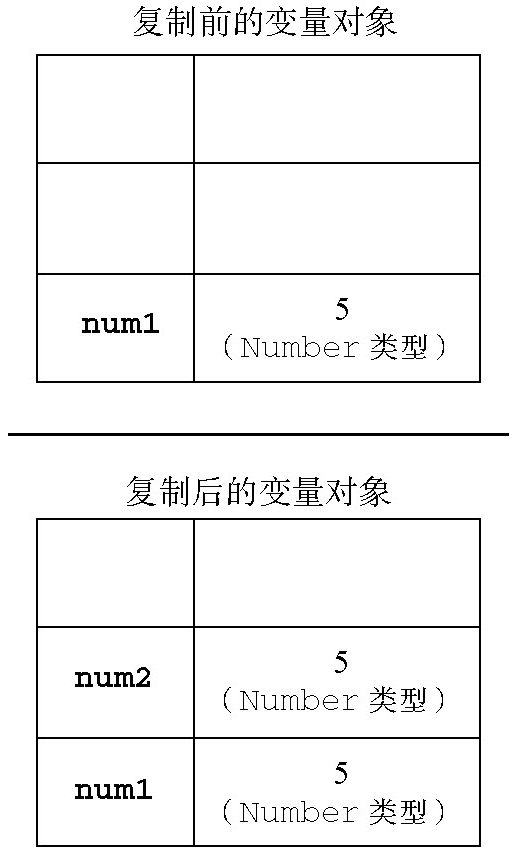
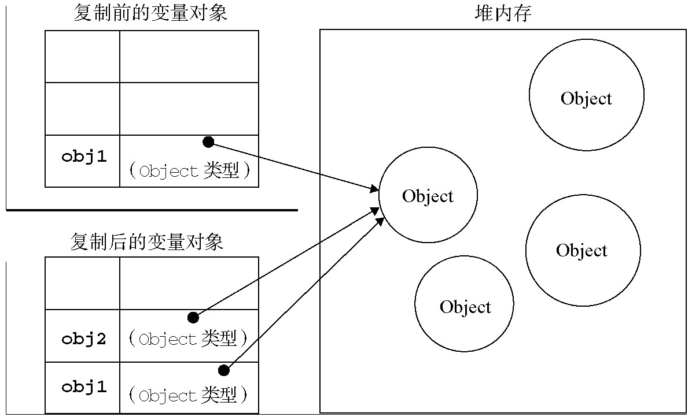
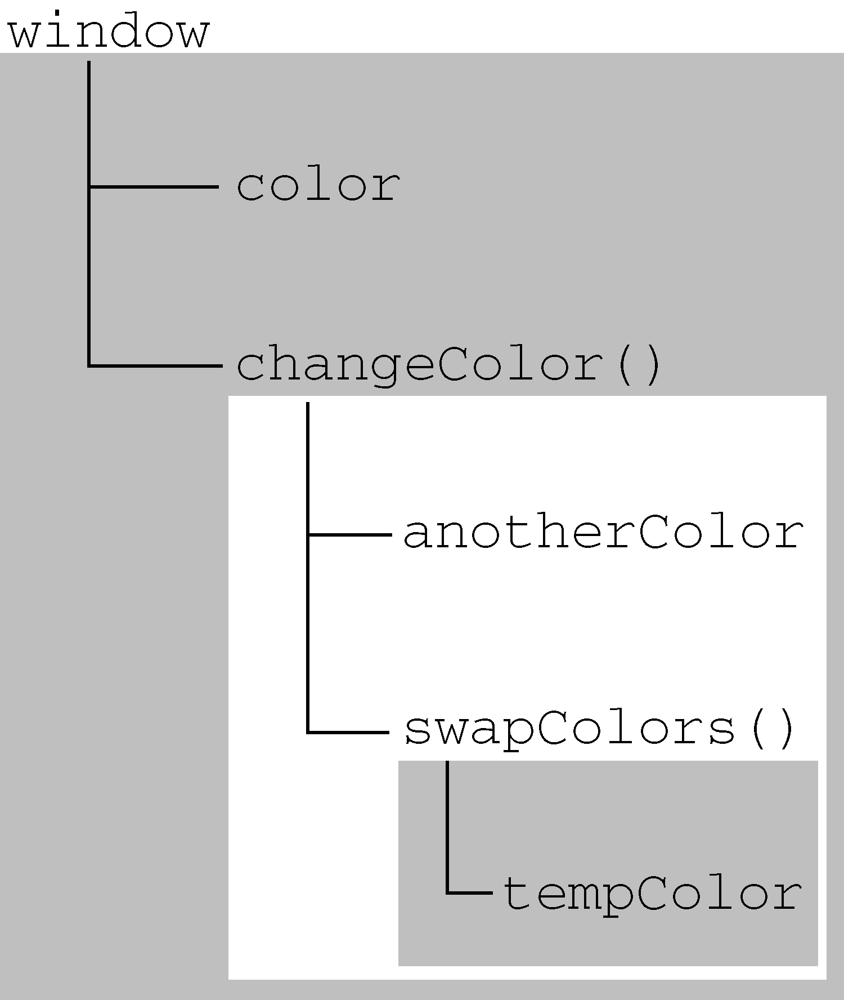

# 第4章 变量、作用域和内存问题

## 4.1 基本类型和引用类型的值(PRIMITIVE AND REFERENCE VALUES)

ECMAScript变量可能包含2种不同数据类型的值：

- **基本类型值：** 指的是6种基本数据类型：`Undefined`、`Null`、`Boolean`、`Number`、`String`和`Symbol`。这6种基本数据类型是按值访问的，因为可以操作保存在变量中的实际的值。
- **引用类型值：** 是保存在内存中的对象。在操作对象时，实际上是在操作对象的引用而不是实际的对象。为此，引用类型的值是按引用访问的。

> **注意：当复制保存着对象的某个变量时，操作的是对象的引用。但在为对象添加属性时，操作的是实际的对象。**

### 4.1.1 动态的属性

对于引用类型的值，我们可以为其添加属性和方法，也可以改变和删除其属性和方法。请看下面的例子：

```js
let person = new Object();
person.name = "Nicholas";
console.log(person.name); // "Nicholas"
```

不能给基本类型的值添加属性，尽管这样做不会导致任何错误。比如：

```js
let name = "Nicholas";
name.age = 27;
console.log(name.age); // undefined
```

### 4.1.2 复制变量值

如果从一个变量向另一个变量复制基本类型的值，会在变量对象上创建一个新值，然后把该值复制到为新变量分配的位置上。来看一个例子：

```js
let num1 = 5;
let num2 = num1;
```



当从一个变量向另一个变量复制引用类型的值时，同样也会将存储在变量对象中的值复制一份放到为新变量分配的空间中。不同的是，这个值的副本实际上是一个指针，而这个指针指向存储在堆中的一个对象。复制操作结束后，两个变量实际上将引用同一个对象。因此，改变其中一个变量，就会影响另一个变量，如下面的例子所示：

```js
let obj1 = new Object();
let obj2 = obj1;
obj1.name = "Nicholas";
console.log(obj2.name); // "Nicholas"
```



### 4.1.3 传递参数

**ECMAScript中所有函数的参数都是按值传递的。**

在向参数传递基本类型的值时，被传递的值会被复制给一个局部变量（即命名参数，或者用ECMAScript的概念来说，就是`arguments`对象中的一个元素）。实例如下：

```js
function addTen(num) {
    num += 10;
    return num;
}

let count = 20;
let result = addTen(count);
console.log(count); // 20 - no change
console.log(result); // 30
```

在向参数传递引用类型的值时，会把这个值在内存中的地址(location)复制给一个局部变量，因此这个局部变量的变化会反映在函数的外部。实例如下：

```js
function setName(obj) {
    obj.name = "Nicholas";
}

let person = new Object();
setName(person);
console.log(person.name); // "Nicholas"
```

### 4.1.4 检测类型

如果变量的值是一个对象或`null`，则`typeof`操作符会像下面例子中所示的那样返回`"object"`：

```js
let s = "Nicholas";
let b = true;
let i = 22;
let u;
let n = null;
let o = new Object();

console.log(typeof s); // string
console.log(typeof i); // number
console.log(typeof b); // boolean
console.log(typeof u); // undefined
console.log(typeof n); // object
console.log(typeof o); // object
```

ECMAScript提供了`instanceof`操作符来检测某个对象是什么引用类型的实例，其语法如下所示：

```js
result = variable instanceof constructor
```

如果变量是给定引用类型（根据它的原型链来识别）的实例，那么`instanceof`操作符就会返回`true`：

```js
console.log(person instanceof Object); // is the variable person an Object?
console.log(colors instanceof Array); // is the variable colors an Array?
console.log(pattern instanceof RegExp); // is the variable pattern a RegExp?
```


## 4.2 执行环境和作用域

**执行环境（execution context）** 定义了变量或函数有权访问的其他数据，决定了它们各自的行为。每个执行环境都有一个与之关联的**变量对象**（variable object），环境中定义的所有变量和函数都保存在这个对象中。虽然我们编写的代码无法访问这个对象，但解析器在处理数据时会在后台使用它。

**全局执行环境** 是最外围的一个执行环境。根据ECMAScript实现所在的宿主环境不同，表示执行环境的对象也不一样。在Web浏览器中，全局执行环境被认为是`window`对象，因此所有使用`var`定义的全局变量和函数都是作为`window`对象的属性和方法创建的。 **在顶级（top level）执行环境中使用`let`和`const`的变量声明不会在全局环境（global context）中被定义，但它们同样会在作用域链中被解析。** 某个执行环境中的所有代码执行完毕后，该环境被销毁，保存在其中的所有变量和函数定义也随之销毁（全局执行环境直到应用程序退 出——例如关闭网页或浏览器——时才会被销毁）。

**每个函数都有自己的执行环境。** 当执行流进入一个函数时，函数的环境就会被推入一个环境栈中。而在函数执行之后，栈将其环境弹出，把控制权返回给之前的执行环境。

当代码在一个环境中执行时，会创建变量对象的一个**作用域链**（scope chain）。作用域链的用途，是保证对执行环境有权访问的所有变量和函数的有序访问。作用域链的前端，始终都是当前执行的代码所在环境的变量对象。

**标识符解析** 是沿着作用域链一级一级地搜索标识符的过程。搜索过程始终从作用域链的前端开始，然后逐级地向后回溯，直至找到标识符为止（如果找不到标识符，通常会导致错误发生）。内部环境可以通过作用域链访问所有的外部环境，但外部环境不能访问内部环境中的任何变量和函数。这些环境之间的联系是线性、有次序的。每个环境都可以向上搜索作用域链，以查询变量和函数名；但任何环境都不能通过向下搜索作用域链而进入另一个执行环境。

执行环境和作用域链的示例：

```js
var color = "blue";
function changeColor() {
    let anotherColor = "red";
    function swapColors() {
        let tempColor = anotherColor;
        anotherColor = color;
        color = tempColor;
        // 这里可以访问color、anotherColor和tempColor
    }
    // 这里可以访问color和anotherColor，但不能访问tempColor
    swapColors();
}
// 这里只能访问color
changeColor();
```




### 4.2.1 作用域链的延长

虽然执行环境的类型总共只有2种：全局和局部（函数），但还是有其他办法来延长作用域链。当执行流进入下列任何一个语句时，作用域链就会得到加长：

- `with`语句：会将指定的对象添加到作用域链中。
- `try-catch`语句的`catch`块：创建一个新的变量对象，其中包含的是被抛出的错误对象的声明。

### 4.2.2 变量声明

#### 使用`var`的函数作用域声明

使用`var`声明的变量会自动被添加到最接近的环境中。在函数内部，最接近的环境就是函数的局部环境；在`with`语句中，最接近的环境是函数环境。如果初始化变量时没有使用`var`声明，该变量会自动被添加到全局环境。

```js
function add(num1, num2) {
    var sum = num1 + num2;
    return sum;
}

let result = add(10, 20); // 30
console.log(sum); // 由于sum不是有效的变量，因此会导致错误
```

省略这个例子中的`var`关键字，那么`sum`将成为全局变量，当`add()`执行完毕后，`sum`依然可以访问：

```js
function add(num1, num2) {
    sum = num1 + num2;
    return sum;
}
let result = add(10, 20); // 30
console.log(sum); // 30
```

> **我们建议在初始化变量之前，一定要先声明，这样就可以避免类似问题。在严格模式下，初始化未经声明的变量会导致错误。**


#### 使用`let`的块级作用域声明

第4版内容

#### 使用`const`的常量声明

第4版内容

#### 标识符查找

搜索过程从作用域链的前端开始，向上逐级查询与给定名字匹配的标识符。如果在局部环境中找到了该标识符，搜索过程停止，变量就绪。如果在局部环境中没有找到该变量名，则继续沿作用域链向上搜索。搜索过程将一直追溯到全局环境的变量对象。如果在全局环境中也没有找到这个标识符，则意味着该变量尚未声明。


## 4.3 垃圾收集

JavaScript具有自动垃圾收集机制。在编写JavaScript程序时，开发人员不用再关心内存使用问题，所需内存的分配以及无用内存的回收完全实现了自动管理。

局部变量的正常生命周期：局部变量只在函数执行的过程中存在。而在这个过程中，会为局部变量在栈（或堆）内存上分配相应的空间，以便存储它们的值。然后在函数中使用这些变量，直至函数执行结束。此时，局部变量就没有存在的必要了，因此可以释放它们的内存以供将来使用。

用于标识无用变量的策略可能会因实现而异，但具体到浏览器中的实现，则通常有2个策略：

- 标记清除
- 引用计数

### 4.3.1 标记清除

JavaScript中最常用的垃圾收集方式是**标记清除**（mark-and-sweep）。当变量进入环境（例如，在函数中声明一个变量）时，就将这个变量标记为“进入环境”；而当变量离开环境时，则将其标记为“离开环境”。被加上标记的变量将被视为准备删除的变量，原因是环境中的变量已经无法访问到这些变量了。最后，垃圾收集器完成**内存清除**工作，销毁那些带标记的值并回收它们所占用的内存空间。

### 4.3.2 引用计数

另一种不太常见的垃圾收集策略叫做**引用计数**（reference counting）。引用计数的含义是跟踪记录每个变量被引用的次数。当这个变量的引用次数变成0时，则说明没有办法再访问这个值了，因而就可以将其占用的内存空间回收回来。这样，当垃圾收集器下次再运行时，它就会释放那些引用次数为零的值所占用的内存。

当代码中存在循环引用现象时，“引用计数”算法就会导致问题。

解除变量的引用不仅有助于消除循环引用现象，而且对垃圾收集也有好处。为了确保有效地回收内存，应该及时解除不再使用的全局对象、全局对象属性以及循环引用变量的引用。

### 4.3.3 性能问题

垃圾收集器是周期性运行的，而且如果为变量分配的内存数量很可观，那么回收工作量也是相当大的。在这种情况下，确定垃圾收集的时间间隔是一个非常重要的问题。

### 4.3.4 管理内存

优化内存占用的最佳方式，就是为执行中的代码只保存必要的数据。对于全局变量和全局对象的属性，一旦数据不再有用，最好通过将其值设置为`null`来释放其引用。这个做法叫做**解除引用**（dereferencing）。

#### Performance Boosts with `const` and `let` Declarations


#### Hidden Classes and the delete Operation


#### Memory Leaks


#### Static Allocation and Object Pools


