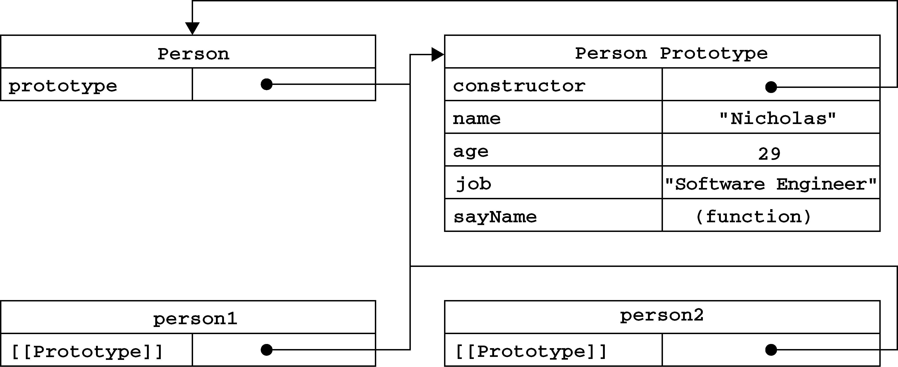
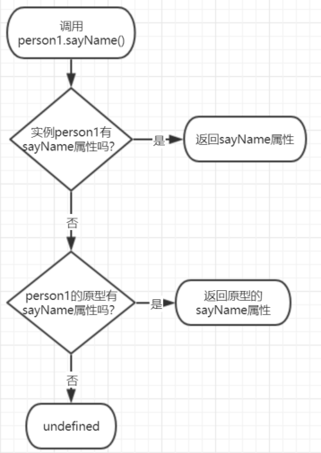
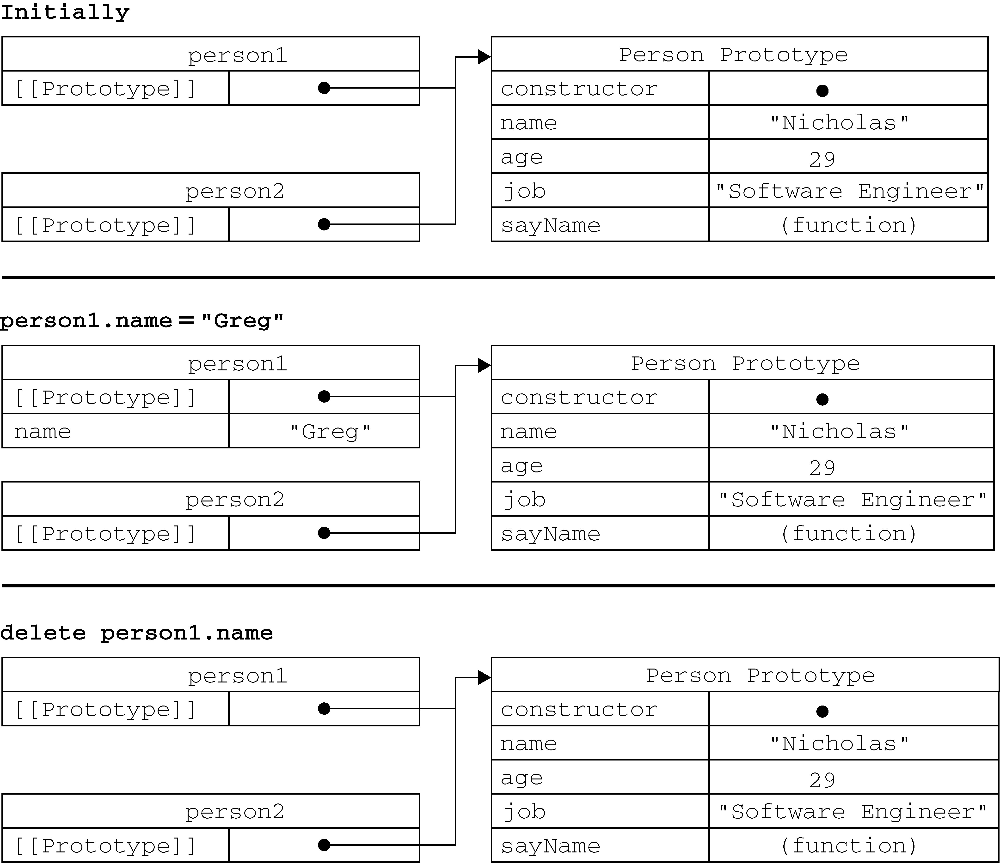
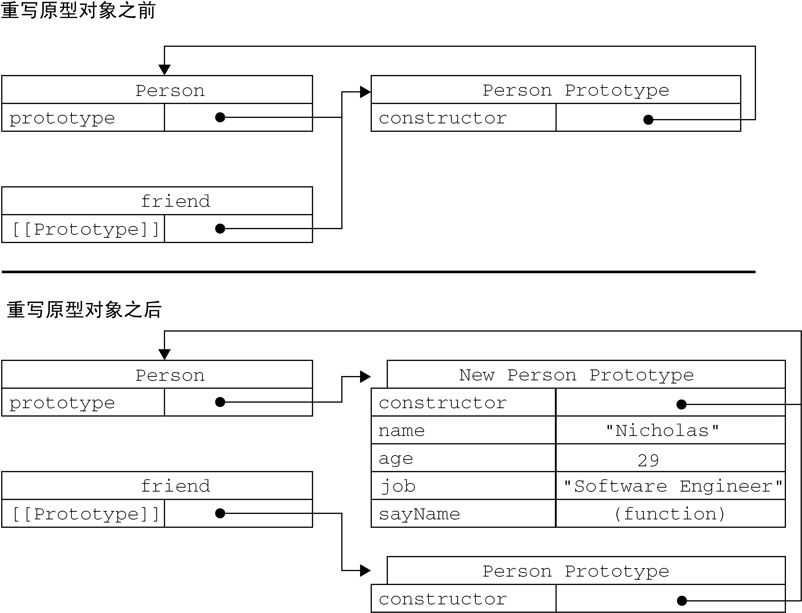
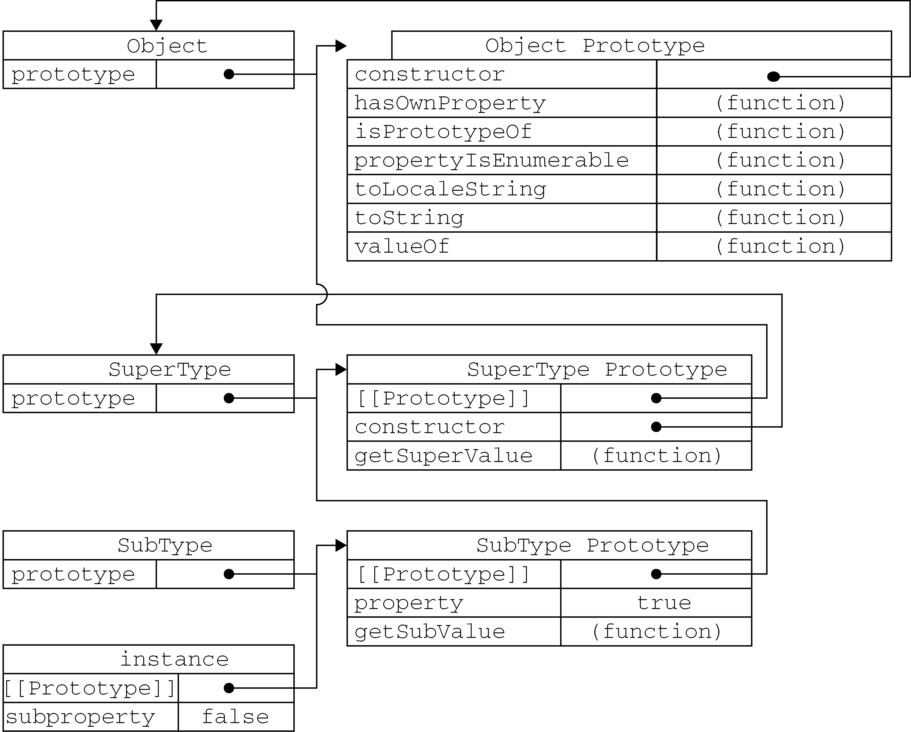
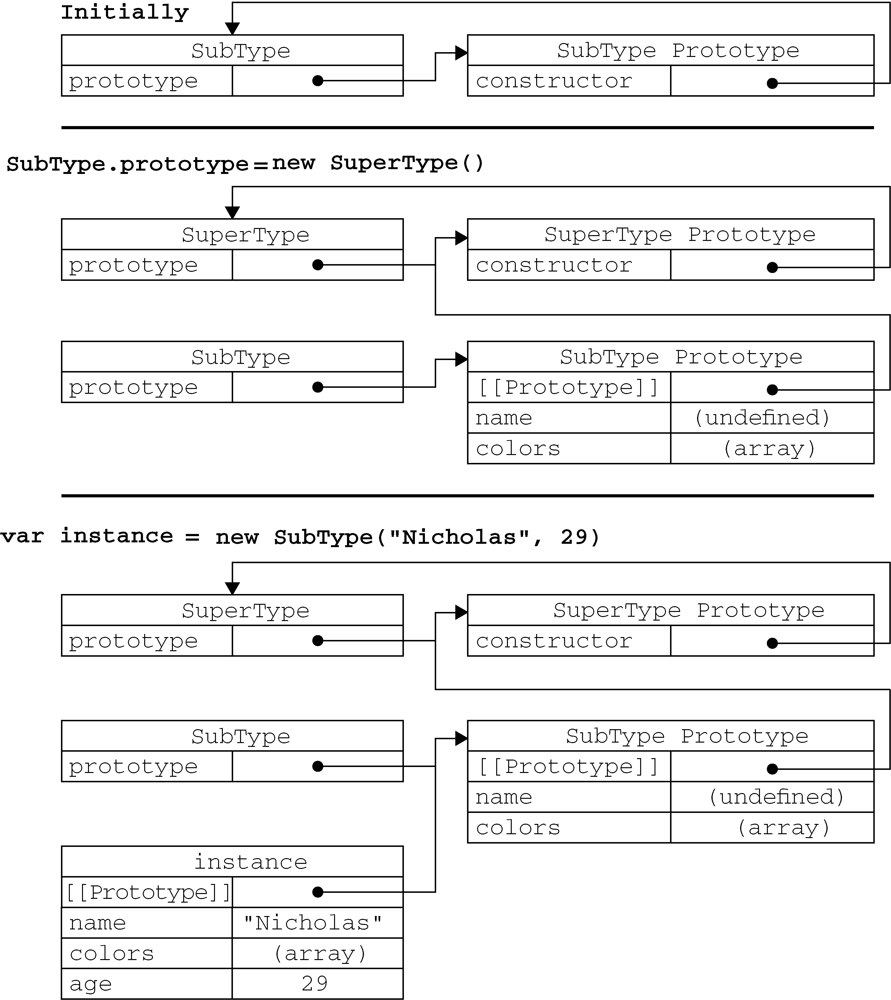

# 第8章 面向对象程序设计

ECMA-262把对象定义为：“无序属性的集合，其属性可以包含基本值、对象或者函数。” 严格来讲，这就相当于说对象是一组没有特定顺序的值。对象的每个属性或方法都有一个名字，而每个名字都映射到一个值。

## 8.1 理解对象

创建自定义对象的最简单方式就是创建一个`Object`的实例，然后再为它添加属性和方法：

```js
let person = new Object();
person.name = "Nicholas";
person.age = 29;
person.job = "Software Engineer";
person.sayName = function() {
    console.log(this.name);
};
```

对象字面量现在是创建这种对象的首选模式，前面的例子用对象字面量语法可以写成这样：

```js
let person = {
    name: "Nicholas",
    age: 29,
    job: "Software Engineer",
    sayName() {
        console.log(this.name);
    }
};
```

### 8.1.1 属性类型

ECMA-262在定义只有内部才用的特性（attribute）时，描述了属性（property）的各种特征。ECMA-262定义这些特性是为了实现JavaScript引擎用的，因此在JavaScript中不能直接访问它们。为了表示特性是内部值，该规范把它们放在了两对儿方括号中，例如`[[Enumerable]]`。

ECMAScript中有2种属性：

- 数据属性（data properties）
- 访问器属性（accessor properties）

#### 1.数据属性

**数据属性** 包含一个数据值的位置。在这个位置可以 **读取 **和 **写入值** 。数据属性有4个描述其行为的特性：

- `[[Configurable]]`：表示能否通过`delete`删除属性从而重新定义属性，能否修改属性的特性，或者能否把属性修改为访问器属性。像前面例子中那样直接在对象上定义的属性，它们的这个特性默认值为`true`。
- `[[Enumerable]]`：表示能否通过`for-in`循环返回属性。像前面例子中那样直接在对象上定义的属性，它们的这个特性默认值为`true`。
- `[[Writable]]`：表示能否修改属性的值。像前面例子中那样直接在对象上定义的属性，它们的这个特性默认值为`true`。
- `[[Value]]`：包含这个属性的数据值。读取属性值的时候，从这个位置读；写入属性值的时候，把新值保存在这个位置。这个特性的默认值为`undefined`。

对于像前面例子中那样直接在对象上定义的属性，它们的`[[Configurable]]`、`[[Enumerable]]`和`[[Writable]]`特性都被设置为`true`，而`[[Value]]`特性被设置为指定的值。

```js
let person = {
    name: "Nicholas"
};
```

**要修改属性默认的特性，必须使用`Object.defineProperty()`方法。** 这个方法接收3个参数：属性所在的对象、属性的名字和一个描述符对象。其中，描述符（descriptor）对象的属性必须是：`configurable`、`enumerable`、`writable`和`value`。设置其中的一或多个值，可以修改对应的特性值。例如：

```js
let person = {};
Object.defineProperty(person, "name", {
    writable: false,
    value: "Nicholas"
});
console.log(person.name); // "Nicholas"
person.name = "Greg";
console.log(person.name); // "Nicholas"
```

类似的规则也适用于不可配置的属性：

```js
let person = {};
Object.defineProperty(person, "name", {
    configurable: false,    //把configurable设置为false，表示不能从对象中删除属性。
    value: "Nicholas"
});
console.log(person.name); // "Nicholas"
delete person.name;
console.log(person.name); // "Nicholas"
```

而且，一旦把属性定义为不可配置的，就不能再把它变回可配置了。此时，再调用`Object.defineProperty()`方法修改除`writable`之外的特性，都会导致错误：

```js
let person = {};
Object.defineProperty(person, "name", {
    configurable: false,
    value: "Nicholas"
});

// 抛出错误
Object.defineProperty(person, "name", {
    configurable: true,
    value: "Nicholas"
});
```

在调用`Object.defineProperty()`方法时，如果不指定，`configurable`、`enumerable`和`writable`特性的默认值都是`false`。

#### 2.访问器属性

访问器属性不包含数据值；它们包含一对儿getter和setter函数（不过，这两个函数都不是必需的）。在读取访问器属性时，会调用getter函数，这个函数负责返回有效的值；在写入访问器属性时，会调用setter函数并传入新值，这个函数负责决定如何处理数据。访问器属性有如下4个特性。

- `[[Configurable]]`：表示能否通过`delete`删除属性从而重新定义属性，能否修改属性的特性，或者能否把属性修改为数据属性。对于直接在对象上定义的属性，这个特性的默认值为`true`。
- `[[Enumerable]]`：表示能否通过`for-in`循环返回属性。对于直接在对象上定义的属性，这个特性的默认值为`true`。
- `[[Get]]`：在读取属性时调用的函数。默认值为`undefined`。
- `[[Set]]`：在写入属性时调用的函数。默认值为`undefined`。

**访问器属性不能直接定义，必须使用`Object.defineProperty()`来定义：** 

```js
// Define object with pseudo-private member 'year_'
// and public member 'edition'
let book = {
    year_: 2017, //year_的下划线是一种常用的记号，用于表示只能通过对象方法访问的属性。
    edition: 1
};

Object.defineProperty(book, "year", {
    get() {
        return this.year_;
    },
    set(newValue) {
        if (newValue > 2017) {
            this.year_ = newValue;
            this.edition += newValue - 2017;
        }
    }
});

book.year = 2018;
console.log(book.edition); // 2
```

**不一定非要同时指定getter和setter。** 只指定getter意味着属性是不能写，尝试写入属性会被忽略。在严格模式下，尝试写入只指定了getter函数的属性会抛出错误。类似地，只指定setter函数的属性也不能读，否则在非严格模式下会返回`undefined`，而在严格模式下会抛出错误。

### 8.1.2 定义多个属性

由于为对象定义多个属性的可能性很大，ECMAScript提供了一个`Object.defineProperties()`方法。利用这个方法可以通过描述符一次定义多个属性。这个方法接收2个对象作为参数：第1个对象是要添加和修改其属性的对象，第2个对象的属性与第1个对象中要添加或修改的属性一一对应。

```js
let book = {};

Object.defineProperties(book, {
    year_: {
        value: 2017
    },
    edition: {
        value: 1
    },
    year: {
        get() {
            return this.year_;
        },
        set(newValue) {
            if (newValue > 2017) {
                this.year_ = newValue;
                this.edition += newValue - 2017;
            }
        }
    }
});
```

### 8.1.3　读取属性的特性

使用`Object.getOwnPropertyDescriptor()`方法，可以取得给定属性的描述符。这个方法接收2个参数：属性所在的对象和要读取其描述符的属性名称。返回值是一个对象，如果是访问器属性，这个对象的属性有`configurable`、`enumerable`、`get`和`set`；如果是数据属性，这个对象的属性有`configurable`、`enumerable`、`writable`和`value`。

```js
let book = {};

Object.defineProperties(book, {
    year_: {
        value: 2017
    },
    edition: {
        value: 1
    },
    year: {
        get: function() {
            return this.year_;
        },
        set: function(newValue){
            if (newValue > 2017) {
                this.year_ = newValue;
                this.edition += newValue - 2017;
            }
        }
    }
});

let descriptor = Object.getOwnPropertyDescriptor(book, "year_");
console.log(descriptor.value); // 2017
console.log(descriptor.configurable); // false
console.log(typeof descriptor.get); // "undefined"

let descriptor = Object.getOwnPropertyDescriptor(book, "year");
console.log(descriptor.value); // undefined
console.log(descriptor.enumerable); // false
console.log(typeof descriptor.get); // "function"
```

New in ECMAScript 2017 is the `Object.getOwnPropertyDescriptors()` static method. This method effectively performs on `Object.getOwnPropertyDescriptor()` on all own properties and returns them in a new object. For the previous example, using this static method would return the following object:

```js
let book = {};

Object.defineProperties(book, {
    year_: {
        value: 2017
    },
    edition: {
        value: 1
    },
    year: {
        get: function() {
            return this.year_;
        },
        set: function(newValue){
            if (newValue > 2017) {
                this.year_ = newValue;
                this.edition += newValue - 2017;
            }
        }
    }
});

console.log(Object.getOwnPropertyDescriptors(book));
// {
//     edition: {
//         configurable: false,
//         enumerable: false,
//         value: 1,
//         writable: false
//     },
//     year: {
//         configurable: false,
//         enumerable: false,
//         get: f(),
//         set: f(newValue),
//     },
//     year_: {
//         configurable: false,
//         enumerable: false,
//         value: 2019,
//         writable: false
//     }
// }
```


### 8.1.4 Merging Objects

### 8.1.5 Object Identity and Equality

### 8.1.6 Enhanced Object Syntax

### 8.1.7 Object Destructuring


## 8.2 创建对象

虽然`Object`构造函数或对象字面量都可以用来创建单个对象，但这些方式有个明显的 **缺点** ： **使用同一个接口创建很多对象，会产生大量的重复代码。**

### 8.2.1 概述

通过连续的规范，ECMAScript的可用功能遵循了非常不寻常的模式。 通过ECMAScript 5.1规范，没有对类或继承等面向对象的构造的正式支持。 但是，正如您在以下各节中将看到的那样，原型继承的巧妙应用使JavaScript开发人员能够成功模仿这种行为。

通过ECMAScript 6规范，引入了对类和继承的正式支持。 这些ES6类旨在完全包含先前规范中设计的基于原型的类解决方案。 但是，它们的实现在许多方面仅是ES5.1样式的构造函数和原型继承的语法抽象。

### 8.2.2 工厂模式

工厂模式抽象了创建具体对象的过程。这是一种用函数来封装以特定接口创建对象的方法：

```js
function createPerson(name, age, job) {
    let o = new Object();
    o.name = name;
    o.age = age;
    o.job = job;
    o.sayName = function() {
        console.log(this.name);
    };
    return o;
}

let person1 = createPerson("Nicholas", 29, "Software Engineer");
let person2 = createPerson("Greg", 27, "Doctor");
```

函数`createPerson()`能够根据接受的参数来构建一个包含所有必要信息的`Person`对象。可以无数次地调用这个函数，而每次它都会返回一个包含三个属性一个方法的对象。

**工厂模式虽然解决了创建多个相似对象的问题，但却没有解决对象识别的问题（即怎样知道一个对象的类型）。这个问题可以由 *构造函数模式* 解决。**


### 8.2.3 构造函数模式

ECMAScript 中的构造函数可用来创建特定类型的对象。我们也可以创建自定义的构造函数，从而定义自定义对象类型的属性和方法。

例如，可以使用构造函数模式将前面的例子重写如下。

```js
function Person(name, age, job){
    this.name = name;
    this.age = age;
    this.job = job;
    this.sayName = function() {
        console.log(this.name);
    };
}

// 创建2个Person的不同实例：person1和person2
let person1 = new Person("Nicholas", 29, "Software Engineer");
let person2 = new Person("Greg", 27, "Doctor");
person1.sayName(); // Nicholas
person2.sayName(); // Greg

// 这两个对象都有一个constructor（构造函数）属性，该属性指向Person
console.log(person1.constructor == Person); // true
console.log(person2.constructor == Person); // true

// 这两个对象既是Object的实例，同时也是Person的实例
console.log(person1 instanceof Object); // true
console.log(person1 instanceof Person); // true
console.log(person2 instanceof Object); // true
console.log(person2 instanceof Person); // true
```

在这个例子中，`Person()`函数取代了`createPerson()`函数。我们注意到，`Person()`中的代码除了与`createPerson()`存在以下不同之处：

- 没有显式地创建对象；
- 直接将属性和方法赋给了`this`对象；
- 没有`return`语句。

按照惯例，***构造函数*** 始终都应该以一个大写字母开头，而 ***非构造函数*** 则应该以一个小写字母开头。

**要创建`Person`的新实例，必须使用`new`操作符。以这种方式调用构造函数实际上会经历以下5个步骤：**

1. A new object is created in memory. 在内存中创建一个新对象；
2. The new object’s internal `[[Prototype]]` pointer is assigned to the constructor’s `prototype`
    property. 将新对象内部的`[[Prototype]]`指针赋给构造函数的`prototype`属性；
3. The `this` value of the constructor is assigned to the new object (so `this` points to the
    new object). 将构造函数的`this`值赋给新对象（因此`this`就指向了这个新对象）；
4. The code inside the constructor is executed (adds properties to the new object). 执行构造函数中的代码（为这个新对象添加属性）；
5. If the constructor function returns a non-null value, that object is returned. Otherwise, the
    new object that was just created is returned. 除非构造函数显式地返回一个其他非空值；否则，将返回新创建的对象。

**优点：创建自定义的构造函数意味着将来可以将它的实例标识为一种特定的类型；而这正是构造函数模式胜过工厂模式的地方。**

> 以这种方式定义的构造函数是定义在`Global`对象（在浏览器中是`window`对象）中的。

Constructor functions do not have to be expressed as a function declaration. A function expression assigned to a variable behaves identically:

```js
let Person = function(name, age, job) {
    this.name = name;
    this.age = age;
    this.job = job;
    this.sayName = function() {
        console.log(this.name);
    };
}

let person1 = new Person("Nicholas", 29, "Software Engineer");
let person2 = new Person("Greg", 27, "Doctor");

person1.sayName(); // Nicholas
person2.sayName(); // Greg

console.log(person1 instanceof Object); // true
console.log(person1 instanceof Person); // true
console.log(person2 instanceof Object); // true
console.log(person2 instanceof Person); // true
```

When instantiating, the parentheses after the constructor function are optional if you do not wish to pass any arguments—the new operator will invoke the constructor function no matter what:

```js
function Person() {
    this.name = "Jake";
    this.sayName = function() {
        console.log(this.name);
    };
}

let person1 = new Person();
let person2 = new Person;

person1.sayName(); // Jake
person2.sayName(); // Jake

console.log(person1 instanceof Object); // true
console.log(person1 instanceof Person); // true
console.log(person2 instanceof Object); // true
console.log(person2 instanceof Person); // true
```

#### 构造函数本身也是函数

**构造函数与其他函数的唯一区别，在于调用它们的方式不同。** 任何函数，只要通过`new`操作符来调用，那它就可以作为构造函数；而任何函数，如果不通过`new`操作符来调用，那它跟普通函数没什么两样。

```js
// 当作构造函数使用
// 这也是构造函数的典型用法，即使用new操作符来创建一个新对象。
let person = new Person("Nicholas", 29, "Software Engineer");
person.sayName(); // "Nicholas"

// 作为普通函数调用
// 当在全局作用域中调用一个函数时，this对象总是指向Global对象（在浏览器中就是window对象）
Person("Greg", 27, "Doctor"); // 属性和方法都被添加给window对象了
window.sayName(); // "Greg"

// 在另一个对象的作用域中调用
// 可以使用call()（或者apply()）在某个特殊对象的作用域中调用Person()函数。
let o = new Object();
Person.call(o, "Kristen", 25, "Nurse"); // 在对象o的作用域中调用Person()
// o就拥有了所有属性和sayName()方法
o.sayName(); // "Kristen"
```

#### 构造函数的问题

**使用构造函数的主要问题，就是每个方法都是`Function`对象的不同实例，即，构造函数创建出的不同对象的方法没有共享同一`Function`实例。** 在前面的例子中，`person1`和`person2`都有一个名为`sayName()`的方法，但那两个方法是`Function`的两个不同实例。因此，不同实例上的同名函数是不相等的，如下所示：

```js
console.log(person1.sayName == person2.sayName); // false
```

**然而，创建两个完成同样任务的`Function`实例的确没有必要；况且有`this`对象在，根本不用在执行代码前就把函数对象实例绑定到特定对象上面。**

这个问题可以通过把函数定义转移到构造函数外部来解决：

```js
function Person(name, age, job){
    this.name = name;
    this.age = age;
    this.job = job;
    this.sayName = sayName;  // 在构造函数内部，将sayName属性设置成等于全局的sayName函数。
}

// 把sayName()函数的定义转移到了构造函数外部。
function sayName() {
    console.log(this.name);
}

let person1 = new Person("Nicholas", 29, "Software Engineer");
let person2 = new Person("Greg", 27, "Doctor");
person1.sayName(); // Nicholas
person2.sayName(); // Greg

// 由于sayName包含的是一个指向函数的指针，因此person1和person2对象就共享了在全局作用域中定义的同一个sayName()函数。
console.log(person1.sayName == person2.sayName); // true
```

**但这种做法仍然有缺点：**

- 在全局作用域中定义的函数实际上只能被某个对象调用，这让全局作用域有点名不副实。
- 如果对象需要定义很多方法，那么就要定义很多个全局函数，于是我们这个自定义的引用类型就丝毫没有封装性可言了。

**这些问题可以通过使用 *原型模式* 来解决。**


### 8.2.4 原型模式 (The Prototype Pattern)

**每个被创建的函数都有一个`prototype`（原型）属性，这个属性是一个指针，指向一个对象，而这个对象的用途是：包含可以由特定类型的所有实例共享的属性和方法。** 

`prototype`就是通过调用构造函数而创建的那个对象实例的 ***原型对象*** 。

使用 *原型对象* 的好处是可以让所有对象实例共享它所包含的属性和方法。

```js
function Person() {}

Person.prototype.name = "Nicholas";
Person.prototype.age = 29;
Person.prototype.job = "Software Engineer";
Person.prototype.sayName = function() {
    console.log(this.name);
};

let person1 = new Person();
person1.sayName(); // "Nicholas"

let person2 = new Person();
person2.sayName(); // "Nicholas"

// person1和person2通过原型对象共享了相同的属性和方法
console.log(person1.sayName == person2.sayName); // true
```

用函数表达式也同样适用：

```js
let Person = function() {};

Person.prototype.name = "Nicholas";
Person.prototype.age = 29;
Person.prototype.job = "Software Engineer";
Person.prototype.sayName = function() {
    console.log(this.name);
};

let person1 = new Person();
person1.sayName(); // "Nicholas"

let person2 = new Person();
person2.sayName(); // "Nicholas"

// person1和person2通过原型对象共享了相同的属性和方法
console.log(person1.sayName == person2.sayName); // true
```

#### 原型对象的工作原理

只要创建了一个新函数，就会根据一组特定的规则为该函数创建一个`prototype`属性，这个属性指向函数的原型对象。

在默认情况下，所有原型对象都会自动获得一个`constructor`（构造函数）属性，这个属性是一个指向`prototype`属性所在函数的指针。就拿前面的例子来说，`Person.prototype.constructor`指向`Person`。

创建了自定义的构造函数之后，其原型对象默认只会取得`constructor`属性；至于其他方法，则都是从`Object`继承而来的。

当调用构造函数创建一个新实例后，该实例的内部将包含一个指针（内部属性），指向构造函数的原型对象。在ECMA-262中，这个指针叫`[[Prototype]]`。虽然在脚本中没有标准的方式访问`[[Prototype]]`，但Firefox、Safari和Chrome在每个对象上都支持一个属性`__proto__`；而在其他实现中，这个属性对脚本则是完全不可见的。

以前面使用`Person`构造函数和`Person.prototype`创建实例的代码为例，下图展示了各个对象之间的关系：



以下代码也验证了其中的各种关系和原型对象的行为：

```js
/**
* Constructor function can exist as function expression
* or function declaration, so both of these are suitable:
* function Person {}
* let Person = function() {}
*/
function Person() {}

/**
* Upon declaration, the constructor function already
* has a prototype object associated with it:
*/
console.log(typeof Person.prototype);
console.log(Person.prototype);
// {
// constructor: f Person(),
// __proto__: Object
// }

/**
* As mentioned previously, the constructor function has
* a 'prototype' reference to the prototype object, and
* the prototype object has a 'constructor' reference to
* the constructor function. These references are cyclical:
*/
console.log(Person.prototype.constructor === Person); // true

/**
* Any normal prototype chain will terminate at the Object prototype.
* The prototype of the Object prototype is null.
*/
console.log(Person.prototype.__proto__ === Object.prototype); // true
console.log(Person.prototype.__proto__.constructor === Object); // true
console.log(Person.prototype.__proto__.__proto__ === null); // true

console.log(Person.prototype.__proto__);
// {
// constructor: f Object(),
// toString: ...
// hasOwnProperty: ...
// isPrototypeOf: ...
// ...
// }

let person1 = new Person(),
person2 = new Person();

/**
* The constructor, the prototype object, and an instance
* are three completely distinct objects:
*/
console.log(person1 !== Person); // true
console.log(person1 !== Person.prototype); // true
console.log(Person.prototype !== person); // true

/**
* An instance is linked to the prototype through __proto__, which
* is the literal manifestation of the [[Prototype]] hidden property.
*
* A constructor is linked to the prototype through the constructor property.
*
* An instance has no direct link to the constructor, only through the prototype.
*/
console.log(person1.__proto__ === Person.prototype); // true
conosle.log(person1.__proto__.constructor === Person); // true

/**
* Two instances created from the same constructor function will share
* a prototype object:
*/
console.log(person1.__proto__ === person2.__proto__); // true

/**
* instanceof will check the instance's prototype chain against the
* prototype property of a constructor function:
*/
console.log(person1 instanceof Person); // true
console.log(person1 instanceof Object); // true
console.log(Person.prototype instanceof Object); // true
```

通过`isPrototypeOf()`方法来确定对象之间是否存在这种关系。如果`[[Prototype]]`指向调用`isPrototypeOf()`方法的对象（`Person.prototype`），那么这个方法就返回`true`，如下所示：

```js
// person1和person2内部都有一个指向Person.prototype的指针，因此都返回了true。
console.log(Person.prototype.isPrototypeOf(person1)); // true
console.log(Person.prototype.isPrototypeOf(person2)); // true
```

ECMAScript的`Object`对象有一个`Object.getPrototypeOf()`方法可以返回`[[Prototype]]`的值。 **利用`Object.getPrototypeOf()`可以方便地取得一个对象的原型，而这在利用原型实现继承的情况下是非常重要的。**

```js
// Object.getPrototypeOf()返回的对象就是这个对象的原型
console.log(Object.getPrototypeOf(person1) == Person.prototype); // true
// 取得了原型对象中name属性的值
console.log(Object.getPrototypeOf(person1).name); // "Nicholas"
```

The `Object` type also features a `setPrototypeOf()` method, which writes a new value into the `[[Prototype]]` of the instance. This allows you to overwrite the prototype hierarchy of an already instantiated object:

```js
let biped = {
    numLegs: 2
};

let person = {
    name: 'Matt'
};

Object.setPrototypeOf(person, biped);

console.log(person.name); // Matt
console.log(person.numLegs); // 2
console.log(Object.getPrototypeOf(person) === biped); // true
```

> WARNING: The `Object.setPrototypeOf()` operation will likely cause severe performance slowdowns when used. 

To avoid these slowdowns, prefer to just create a new object and specify its prototype with `Object.create()`:

```js
let biped = {
    numLegs: 2
};

let person = Object.create(biped);
person.name = 'Matt';

console.log(person.name); // Matt
console.log(person.numLegs); // 2
console.log(Object.getPrototypeOf(person) === biped); // true
```

#### 理解原型的层次结构 (Understanding the Prototype Hierarchy)

**每当读取某个对象的某个属性时，都会对指定名称的属性进行搜索：**

1. 首先搜索对象实例本身是否具有给定名字的属性。如果在实例中找到了具有给定名字的属性，则返回该属性的值。

2. 如果实例本身不具有给定名字的属性，则继续搜索指针指向的原型对象，在原型对象中查找具有给定名字的属性。

3. 如果在原型对象中找到了这个属性，则返回该属性的值。

例如在我们调用`person1.sayName()`的时候，会先后执行2次搜索：



虽然可以通过对象实例访问保存在原型中的值，但却 **不能通过对象实例重写原型中的值。** 当为对象实例添加一个属性时，这个属性就会**屏蔽**原型对象中保存的同名属性，但不会修改那个属性。即使将这个属性设置为`null`，也只会在实例中设置这个属性：

```js
function Person() {}

Person.prototype.name = "Nicholas";
Person.prototype.age = 29;
Person.prototype.job = "Software Engineer";
Person.prototype.sayName = function() {
    console.log(this.name);
};

let person1 = new Person();
let person2 = new Person();

person1.name = "Greg";
console.log(person1.name); // "Greg" - from instance
console.log(person2.name); // "Nicholas" - from prototype
```

不过，使用`delete`操作符则可以完全删除实例属性，从而让我们能够重新访问原型中的属性：

```js
function Person() {}

Person.prototype.name = "Nicholas";
Person.prototype.age = 29;
Person.prototype.job = "Software Engineer";
Person.prototype.sayName = function() {
    console.log(this.name);
};

let person1 = new Person();
let person2 = new Person();

person1.name = "Greg";
console.log(person1.name); // "Greg" - from instance
console.log(person2.name); // "Nicholas" - from prototype

delete person1.name;
console.log(person1.name); // "Nicholas" - from the prototype
```

使用`hasOwnProperty()`方法可以检测一个属性是存在于实例中，还是存在于原型中。这个方法（从`Object`继承）只在给定属性存在于对象实例中时，才会返回`true`：

```js
function Person() {}
Person.prototype.name = "Nicholas";
Person.prototype.age = 29;
Person.prototype.job = "Software Engineer";
Person.prototype.sayName = function() {
    console.log(this.name);
};

let person1 = new Person();
let person2 = new Person();

console.log(person1.hasOwnProperty("name")); // false

person1.name = "Greg";
console.log(person1.name); // "Greg" - from instance
console.log(person1.hasOwnProperty("name")); // true

console.log(person2.name); // "Nicholas" - from prototype
console.log(person2.hasOwnProperty("name")); // false

delete person1.name;
console.log(person1.name); // "Nicholas" - from the prototype
console.log(person1.hasOwnProperty("name")); // false
```

下图展示了上面例子在不同情况下的实现与原型的关系（图中省略了与`Person`构造函数的关系）：



#### 原型与`in`操作符

有2种方式使用`in`操作符：

- 单独使用
- 在`for-in`循环中使用

在单独使用时，`in`操作符会在通过对象能够访问给定属性时返回`true`，无论该属性存在于实例中还是原型中。

```js
function Person() {}

Person.prototype.name = "Nicholas";
Person.prototype.age = 29;
Person.prototype.job = "Software Engineer";
Person.prototype.sayName = function() {
    console.log(this.name);
};

let person1 = new Person();
let person2 = new Person();

console.log(person1.hasOwnProperty("name")); // false
console.log("name" in person1); // true

person1.name = "Greg";
console.log(person1.name); // "Greg" - from instance
console.log(person1.hasOwnProperty("name")); // true
console.log("name" in person1); // true

console.log(person2.name); // "Nicholas" - from prototype
console.log(person2.hasOwnProperty("name")); // false
console.log("name" in person2); // true

delete person1.name;
console.log(person1.name); // "Nicholas" - from the prototype
console.log(person1.hasOwnProperty("name")); // false
console.log("name" in person1); // true
```

同时使用`hasOwnProperty()`方法和`in`操作符，就可以确定该属性到底是存在于对象中，还是存在于原型中，如下所示：

```js
function hasPrototypeProperty(object, name){
    return !object.hasOwnProperty(name) && (name in object);
}
```

由于`in`操作符只要通过对象能够访问到属性就返回`true`，`hasOwnProperty()`只在属性存在于实例中时才返回`true`，因此只要`in`操作符返回`true`而`hasOwnProperty()`返回`false`，就可以确定属性是原型中的属性。

```js
function Person() {}

Person.prototype.name = "Nicholas";
Person.prototype.age = 29;
Person.prototype.job = "Software Engineer";
Person.prototype.sayName = function() {
    console.log(this.name);
};

let person = new Person();
console.log(hasPrototypeProperty(person, "name")); // true

person.name = "Greg";
console.log(hasPrototypeProperty(person, "name")); // false
```


在使用`for-in`循环时，返回的是所有能够通过对象访问的、可枚举的（enumerated）属性，其中既包括存在于实例中的属性，也包括存在于原型中的属性。屏蔽了原型中不可枚举属性（即将`[[Enumerable]]`标记为`false`属性）的实例属性也会在`for-in`循环中返回，因为根据规定，所有开发人员定义的属性都是可枚举的。

```js
function Person() {}

Person.prototype.name = "Nicholas";
Person.prototype.age = 29;
Person.prototype.job = "Software Engineer";
Person.prototype.sayName = function() {
    console.log(this.name);
};

for(const i in new Person()){
    console.log(i);
}
// name
// age
// job
// sayName
```

要取得对象上所有可枚举的实例属性，可以使用`Object.keys()`方法。这个方法接收一个对象作为参数，返回一个包含所有可枚举属性的字符串数组。这个字符串数组的顺序也是它们在`for-in`循环中出现的顺序。例如：

```js
function Person() {}

Person.prototype.name = "Nicholas";
Person.prototype.age = 29;
Person.prototype.job = "Software Engineer";
Person.prototype.sayName = function() {
    console.log(this.name);
};

let keys = Object.keys(Person.prototype);
console.log(keys); // ["name,age,job,sayName"]

let p1 = new Person();
p1.name = "Rob";
p1.age = 31;
let p1keys = Object.keys(p1);
console.log(p1keys); // ["name,age"]
```

如果你想要得到所有实例属性，无论它是否可枚举，可以使用`Object.getOwnPropertyNames()`方法。

```js
let keys = Object.getOwnPropertyNames(Person.prototype);
console.log(keys); // ["constructor", "name", "age", "job", "sayName"]
```

With the introduction of symbols in ECMAScript 6, the need for a sibling method to `Object.getOwnPropertyNames()` became apparent because symbol-keyed properties do not have a concept of a name. Therefore, `Object.getOwnPropertySymbols()` was introduced, which offers the same behavior as `Object.getOwnPropertyNames()` but with respect to symbols:

```js
let k1 = Symbol('k1'),
    k2 = Symbol('k2');

let o = {
    [k1]: 'k1',
    [k2]: 'k2'
};

console.log(Object.getOwnPropertySymbols(o));
// [Symbol(k1), Symbol(k2)]
```

#### Property Enumeration Order

for-in loops, `Object.keys()`, `Object.getOwnPropertyNames`, `Object.getOwnPropertySymbols()`, and `Object.assign()` have an important distinction when it comes to property enumeration order. for-in loops and `Object.keys()` do not have a deterministic order of enumeration—these are determined by the JavaScript engine and may vary by browser.
`Object.getOwnPropertyNames()`, `Object.getOwnPropertySymbols()`, and `Object.assign()`, however, do have a deterministic enumeration order. Number keys will first be enumerated in ascending order, then string and symbol keys enumerated in insertion order. Keys defined inline in an object literal will be inserted in their comma delimited order.

### 8.2.5 Object Iteration

For most of JavaScript history, iterating the properties of an object was a messy affair. The ECMAScript 2017 introduced two static methods for converting an object’s contents into a serialized—and more importantly, iterable—format. These static methods, `Object.values()` and `Object.entries()`, accept and object and return its contents in an array. `Object.values()` returns an array of the object’s values, and `Object.entries()` returns an array of array pairs, each representing a `[key, value]` pair in the object.

These methods are demonstrated here:

```js
const o = {
    foo: 'bar',
    baz: 1,
    qux: {}
};
console.log(Object.values(o));
// ["bar", 1, {}]
console.log(Object.entries((o)));
// [["foo", "bar"], ["baz", 1], ["qux", {}]]
```

Note that non-string properties are converted to strings in the output array. Furthermore, the method performs a shallow copy of the object:

```js
const o = {
    qux: {}
};
console.log(Object.values(o)[0] === o.qux);
// true
console.log(Object.entries(o)[0][1] === o.qux);
// true
```

Symbol-keyed properties are ignored:

```js
const sym = Symbol();
const o = {
    [sym]: 'foo'
};
console.log(Object.values(o));
// []
console.log(Object.entries((o)));
// []
```

#### 替代的原型语法

为减少不必要的输入，也为了从视觉上更好地封装原型的功能，更常见的做法是用一个包含所有属性和方法的对象字面量来重写整个原型对象，如下面的例子所示：

```js
function Person() {}

Person.prototype = {
    name: "Nicholas",
    age: 29,
    job: "Software Engineer",
    sayName() {
        console.log(this.name);
    }
};
```

在上面的代码中，我们将`Person.prototype`设置为等于一个以对象字面量形式创建的新对象。最终结果相同，但有一个例外：**`constructor`属性不再指向`Person`了。**前面曾经介绍过，每创建一个函数，就会同时创建它的`prototype`对象，这个对象也会自动获得`constructor`属性。而我们在这里使用的语法，本质上完全重写了默认的`prototype`对象，因此`constructor`属性也就变成了新对象的`constructor`属性（指向`Object`构造函数），不再指向`Person`函数。此时，尽管`instanceof`操作符还能返回正确的结果，但通过`constructor`已经无法确定对象的类型了，如下所示。

```js
let friend = new Person();

console.log(friend instanceof Object); // true
console.log(friend instanceof Person); // true
console.log(friend.constructor == Person); // false
console.log(friend.constructor == Object); // true
```

如果`constructor`的值真的很重要，可以像下面这样特意将它设置回适当的值。

```js
function Person() {}

Person.prototype = {
    constructor: Person,
    name: "Nicholas",
    age: 29,
    job: "Software Engineer",
    sayName() {
        console.log(this.name);
    }
};
```

注意，以这种方式重设`constructor`属性会导致它的`[[Enumerable]]`特性被设置为true。默认情况下，原生的`constructor`属性是不可枚举的，因此如果你使用兼容ECMAScript 5的JavaScript引擎，可以试一试`Object.defineProperty()`。

```js
function Person() {}

Person.prototype = {
    name: "Nicholas",
    age: 29,
    job: "Software Engineer",
    sayName() {
        console.log(this.name);
    }
};

// restore the constructor
Object.defineProperty(Person.prototype, "constructor", {
    enumerable: false,
    value: Person
});
```

#### 原型的动态性

**由于在原型中查找值的过程是一次搜索，因此我们对原型对象所做的任何修改都能够立即从实例上反映出来，即使是先创建了实例后修改原型也照样如此。**

```js
let friend = new Person();
Person.prototype.sayHi = function() {
    console.log("hi");
};
friend.sayHi(); // "hi"
```

**尽管可以随时为原型添加属性和方法，并且修改能够立即在所有对象实例中反映出来，但如果是重写整个原型对象，那么情况就不一样了。** 我们知道，调用构造函数时会为实例添加一个指向最初原型的`[[Prototype]]`指针，而把原型修改为另外一个对象就等于切断了构造函数与最初原型之间的联系。 **请记住：实例中的指针仅指向原型，而不指向构造函数。** 看下面的例子。

```js
function Person() {}

let friend = new Person();

Person.prototype = {
    constructor: Person,
    name: "Nicholas",
    age: 29,
    job: "Software Engineer",
    sayName() {
        console.log(this.name);
    }
};

friend.sayName(); // error
```

在这个例子中，我们先创建了`Person`的一个实例，然后又重写了其原型对象。然后在调用`friend.sayName()`时发生了错误，因为`friend`指向的原型中不包含以该名字命名的属性。下图展示了这个过程：



**可以看出，重写原型对象切断了现有原型与任何之前已经存在的对象实例之间的联系；它们引用的仍然是最初的原型。**

#### 原生对象的原型

原型模式的重要性不仅体现在创建自定义类型方面，就连 **所有原生的引用类型，都是采用原型模式创建的。** 所有原生引用类型（`Object`、`Array`、`String`，等等）都在其构造函数的原型上定义了方法。例如，在`Array.prototype`中可以找到`sort()`方法，而在`String.prototype`中可以找到`substring()`方法。

```js
console.log(typeof Array.prototype.sort); // "function"
console.log(typeof String.prototype.substring); // "function"
```

通过原生对象的原型，不仅可以取得所有默认方法的引用，而且也可以定义新方法。 **可以像修改自定义对象的原型一样修改原生对象的原型，因此可以随时添加方法。** 

```js
// 下面的代码就给基本包装类型String添加了一个名为startsWith()的方法。
String.prototype.startsWith = function (text) {
    return this.indexOf(text) === 0;
};

let msg = "Hello world!";
console.log(msg.startsWith("Hello")); // true
```

> 尽管可以这样做，但我们不推荐在产品化的程序中修改原生对象的原型。

#### 原型对象的问题

原型对象的问题：

- 它省略了为构造函数传递初始化参数这一环节，结果所有实例在默认情况下都将取得相同的属性值。
- 原型模式的最大问题是，原型中所有属性是被很多实例共享的，而任何一个共享这些属性的实例都能够修改这些属性。对于包含引用类型值的属性来说，这一问题尤其突出。

```js
function Person() {}

Person.prototype = {
    constructor: Person,
    name: "Nicholas",
    age: 29,
    job: "Software Engineer",
    friends: ["Shelby", "Court"],
    sayName() {
        console.log(this.name);
    }
};

let person1 = new Person();
let person2 = new Person();

// 向数组中添加了一个字符串
person1.friends.push("Van");

// 导致Person.prototype的friends属性被修改
console.log(person1.friends); // "Shelby,Court,Van"
console.log(person2.friends); // "Shelby,Court,Van"
console.log(person1.friends === person2.friends); // true
```

由于这2个问题的存在，我们通常 **组合使用构造函数模式与原型模式** 。

### 8.2.6 组合使用构造函数模式和原型模式

**组合使用构造函数模式与原型模式，是目前在ECMAScript中使用最广泛、认同度最高的一种创建自定义类型的方法。可以说，在ES6引入关键字`class`之前，这是用来定义引用类型的一种默认模式。**

构造函数模式用于定义实例属性，而原型模式用于定义方法和共享的属性。这样，每个实例都会有自己的一份实例属性的副本，但同时又共享着对方法的引用，最大限度地节省了内存，还支持向构造函数传递参数。

```js
function Person(name, age, job){
    this.name = name;
    this.age = age;
    this.job = job;
    this.friends = ["Shelby", "Court"];
}

Person.prototype = {
    constructor : Person,
    sayName : function(){
        alert(this.name);
    }
}

let person1 = new Person("Nicholas", 29, "Software Engineer");
let person2 = new Person("Greg", 27, "Doctor");

person1.friends.push("Van");
console.log(person1.friends);    //["Shelby,Court,Van"]
console.log(person2.friends);    //["Shelby,Court"]
console.log(person1.friends === person2.friends);    //false
console.log(person1.sayName === person2.sayName);    //true
```

### 8.2.7 动态原型模式

**动态原型模式** 把所有信息都封装在了构造函数中，而通过在构造函数中初始化原型（仅在必要的情况下），又保持了同时使用构造函数和原型的优点。换句话说，可以通过检查某个应该存在的方法是否有效，来决定是否需要初始化原型。

```js
function Person(name, age, job){
    //属性
    this.name = name;
    this.age = age;
    this.job = job;

    //方法
    if (typeof this.sayName != "function"){

        Person.prototype.sayName = function(){
            alert(this.name);
        };

    }
}

let friend = new Person("Nicholas", 29, "Software Engineer");
friend.sayName();
```

### 8.2.8 寄生构造函数模式

通常，在前述的几种模式都不适用的情况下，可以使用 **寄生（parasitic）构造函数模式** 。这种模式的基本思想是创建一个函数，该函数的作用仅仅是封装创建对象的代码，然后再返回新创建的对象；但从表面上看，这个函数又很像是典型的构造函数。

缺点：寄生构造函数模式不能依赖`instanceof`操作符来确定对象类型。

```js
function Person(name, age, job){
    var o = new Object();
    o.name = name;
    o.age = age;
    o.job = job;
    o.sayName = function(){
        alert(this.name);
    };    
    return o;
}

var friend = new Person("Nicholas", 29, "Software Engineer");
friend.sayName();  //"Nicholas"
```

> **建议在可以使用其他模式的情况下，不要使用这种模式。**

### 8.2.9 稳妥构造函数模式

所谓 **稳妥对象**（durable objects），指的是没有公共属性，而且其方法也不引用`this`的对象。

稳妥对象最适合在一些安全的环境中（这些环境中会禁止使用`this`和`new`），或者在防止数据被其他应用程序（如Mashup程序）改动时使用。

**稳妥构造函数遵循** 与 **寄生构造函数** 类似的模式，但有2点不同：

- 新创建对象的实例方法不引用`this`；
- 不使用`new`操作符调用构造函数。

按照稳妥构造函数的要求，可以将前面的`Person`构造函数重写如下。

```js
function Person(name, age, job){
    //创建要返回的对象
    var o = new Object();

    //可以在这里定义私有变量和函数

    //添加方法
    o.sayName = function(){
        alert(name);
    };    

    //返回对象
    return o;
}
```

注意，在以这种模式创建的对象中，除了使用`sayName()`方法之外，没有其他办法访问`name`的值。可以像下面使用稳妥的`Person`构造函数。

```js
let friend = Person("Nicholas", 29, "Software Engineer");
friend.sayName();  //"Nicholas"
```

> 与寄生构造函数模式类似，使用稳妥构造函数模式创建的对象与构造函数之间也没有什么关系，因此`instanceof`操作符对这种对象也没有意义。


## 8.3 继承

### 8.3.1 原型链

ECMAScript中描述了**原型链**的概念，并将原型链作为实现继承的主要方法。

原型链的基本概念：我们让原型对象等于另一个类型的实例，此时的原型对象将包含一个指向另一个原型的指针，相应地，另一个原型中也包含着一个指向另一个构造函数的指针。假如另一个原型又是另一个类型的实例，那么上述关系依然成立，如此层层递进，就构成了实例与原型的链条。

```js
function SuperType() {
    this.property = true;
}

SuperType.prototype.getSuperValue = function() {
    return this.property;
};

function SubType() {
    this.subproperty = false;
}

// inherit from SuperType
SubType.prototype = new SuperType();

SubType.prototype.getSubValue = function () {
    return this.subproperty;
};

let instance = new SubType();
console.log(instance.getSuperValue()); // true
```

`SuperType`和`SubType`分别有一个属性和一个方法。`SubType`继承了`SuperType`，而继承是通过创建`SuperType`的实例，并将该实例赋给`SubType.prototype`实现的。实现的本质是重写原型对象，代之以一个新类型的实例。换句话说，原来存在于`SuperType`的实例中的所有属性和方法，现在也存在于`SubType.prototype`中了。在确立了继承关系之后，我们给`SubType.prototype`添加了一个方法，这样就在继承了`SuperType`的属性和方法的基础上又添加了一个新方法。

这个例子中的实例以及构造函数和原型之间的关系如图所示：



> **注意`instance.constructor`现在指向的是`SuperType`！因为`SubType`的原型指向了另一个对象——`SuperType`的原型，而这个原型对象的`constructor`属性指向的是`SuperType`。**

当以读取模式访问一个实例属性时，首先会在实例中搜索该属性。如果没有找到该属性，则会继续搜索实例的原型。在通过原型链实现继承的情况下，搜索过程就得以沿着原型链继续向上。就拿上面的例子来说，调用`instance.getSuperValue()`会经历三个搜索步骤：1）搜索实例；2）搜索`SubType.prototype`；3）搜索`SuperType.prototype`，最后一步才会找到该方法。

#### 默认原型

**所有引用类型默认都继承了`Object`，而这个继承也是通过原型链实现的。大家要记住，所有函数的默认原型都是`Object`的实例，因此默认原型都会包含一个内部指针，指向`Object.prototype`。** 也就是说，`SubType`继承了`SuperType`，而`SuperType`继承了`Object`。

#### 原型和实例的关系

可以通过2种方式来确定原型和实例之间的关系：

- 使用`instanceof`操作符
- 使用`isPrototypeOf()`方法

使用`instanceof`操作符：

```js
// 由于原型链的关系，我们可以说instance是Object、SuperType或SubType中任何一个类型的实例。
console.log(instance instanceof Object); // true
console.log(instance instanceof SuperType); // true
console.log(instance instanceof SubType); // true
```

使用`isPrototypeOf()`方法：

```js
// 只要是原型链中出现过的原型，都可以说是该原型链所派生的实例的原型, 因此isPrototypeOf()方法也会返回true
console.log(Object.prototype.isPrototypeOf(instance)); // true
console.log(SuperType.prototype.isPrototypeOf(instance)); // true
console.log(SubType.prototype.isPrototypeOf(instance)); // true
```

#### 谨慎地定义方法

子类型有时候需要覆盖超类型中的某个方法，或者需要添加超类型中不存在的某个方法。但不管怎样， **给原型添加方法的代码一定要放在替换原型的语句之后。**

```js
function SuperType() {
    this.property = true;
}

SuperType.prototype.getSuperValue = function() {
    return this.property;
};

function SubType() {
    this.subproperty = false;
}

// inherit from SuperType
SubType.prototype = new SuperType();

// new method
SubType.prototype.getSubValue = function () {
    return this.subproperty;
};
// override existing method
SubType.prototype.getSuperValue = function () {
    return false;
};

let instance = new SubType();
console.log(instance.getSuperValue()); // false
```

**需要注意的是，在通过原型链实现继承时，不能使用对象字面量创建原型方法。因为这样做就会重写原型链：**

```js
function SuperType() {
    this.property = true;
}

SuperType.prototype.getSuperValue = function() {
    return this.property;
};

function SubType() {
    this.subproperty = false;
}

// inherit from SuperType
SubType.prototype = new SuperType();

// 使用字面量添加新方法，而非SuperType的实例，因此SubType和SuperType之间的原型链已经被切断
SubType.prototype = {
    getSubValue() {
        return this.subproperty;
    },
    someOtherMethod() {
        return false;
    }
};

let instance = new SubType();
console.log(instance.getSuperValue()); // error!
```

#### 原型链的问题

原型链的问题：

- 包含引用类型值的原型属性会被所有实例共享；
- 在创建子类型的实例时，不能向超类型的构造函数中传递参数。因为没有办法在不影响所有对象实例的情况下，给超类型的构造函数传递参数。

**有鉴于此，实践中很少会单独使用原型链！**

```js
function SuperType() {
    this.colors = ["red", "blue", "green"];
}

function SubType() {}

// inherit from SuperType
SubType.prototype = new SuperType();  //SubType的所有实例都会共享colors属性

let instance1 = new SubType();
instance1.colors.push("black");
console.log(instance1.colors); // "red,blue,green,black"

let instance2 = new SubType();
console.log(instance2.colors); // "red,blue,green,black"
// 对instance1.colors的修改能够通过instance2.colors反映出来
```


### 8.3.2 构造函数借用 (Constructor Stealing)

在解决原型中包含引用类型值所带来问题的过程中，开发人员开始使用一种叫做**构造函数借用**（constructor stealing）的技术（有时候也叫做伪造对象或经典继承）。

这种技术的基本思想是，在子类型构造函数的内部调用超类型构造函数。因为函数只不过是在特定环境中执行代码的对象，所以通过使用`apply()`和`call()`方法也可以在（将来）新创建的对象上执行构造函数。

```js
function SuperType() {
    this.colors = ["red", "blue", "green"];
}

function SubType() {
    // inherit from SuperType
    SuperType.call(this); // 使用apply()方法也可以
}

let instance1 = new SubType();
instance1.colors.push("black");
console.log(instance1.colors); // "red,blue,green,black"

let instance2 = new SubType();
console.log(instance2.colors); // "red,blue,green"
```

#### 传递参数

相对于原型链而言，借用构造函数有一个很大的优势，即可以在子类型构造函数中向超类型构造函数传递参数。

```js
function SuperType(name){
    this.name = name;
}

function SubType() {
    // inherit from SuperType passing in an argument
    SuperType.call(this, "Nicholas");
    
    // 为确保SuperType构造函数不会重写子类型的属性，在调用超类型构造函数后，再添加子类型中定义的属性
    // instance property
    this.age = 29;
}

let instance = new SubType();
console.log(instance.name); // "Nicholas";
console.log(instance.age); // 29
```

#### 构造函数借用的问题

构造函数借用的问题：

- 如果仅仅是借用构造函数，那么也将无法避免构造函数模式存在的问题——方法都在构造函数中定义，因此函数无法复用。
- 在超类型的原型中定义的方法，对子类型而言也是不可见的，结果所有类型都只能使用构造函数模式。

**考虑到这些问题，构造函数借用也是很少单独使用的！**


### 8.3.3 组合继承

组合继承（combination inheritance），有时候也叫做伪经典继承，指的是将原型链和借用构造函数的技术组合到一块，从而发挥二者之长的一种继承模式。其背后的思路是使用原型链实现对原型属性和方法的继承，而通过借用构造函数来实现对实例属性的继承。这样，既通过在原型上定义方法实现了函数复用，又能够保证每个实例都有它自己的属性。

```js
function SuperType(name){
    this.name = name;
    this.colors = ["red", "blue", "green"];
}

SuperType.prototype.sayName = function() {
    console.log(this.name);
};

function SubType(name, age){
    // inherit properties
    SuperType.call(this, name);
    
    this.age = age;
}

// inherit methods
SubType.prototype = new SuperType();

SubType.prototype.sayAge = function() {
    console.log(this.age);
};

let instance1 = new SubType("Nicholas", 29);
instance1.colors.push("black");
console.log(instance1.colors); // "red,blue,green,black"
instance1.sayName(); // "Nicholas";
instance1.sayAge(); // 29

let instance2 = new SubType("Greg", 27);
console.log(instance2.colors); // "red,blue,green"
instance2.sayName(); // "Greg";
instance2.sayAge(); // 27
```

**组合继承避免了原型链和借用构造函数的缺陷，融合了它们的优点，成为JavaScript中最常用的继承模式。** 而且，`instanceof`和`isPrototypeOf()`也能够用于识别基于组合继承创建的对象。

### 8.3.4 原型式继承

原型式继承并没有使用严格意义上的构造函数。其思想是借助原型可以基于已有的对象创建新对象，同时还不必因此创建自定义类型。为了达到这个目的，给出了如下函数。

```js
function object(o){
    function F(){}
    F.prototype = o;
    return new F();
}
```

ECMAScript 5通过新增`Object.create()`方法规范化了原型式继承。这个方法接收2个参数：一个用作新对象原型的对象和（可选的）一个为新对象定义额外属性的对象。在传入1个参数的情况下，`Object.create()`与`object()`方法的行为相同。

```js
let person = {
    name: "Nicholas",
    friends: ["Shelby", "Court", "Van"]
};

let anotherPerson = Object.create(person);
anotherPerson.name = "Greg";
anotherPerson.friends.push("Rob");

let yetAnotherPerson = Object.create(person);
yetAnotherPerson.name = "Linda";
yetAnotherPerson.friends.push("Barbie");
console.log(person.friends); // "Shelby,Court,Van,Rob,Barbie"
```

`Object.create()`方法的第二个参数与`Object.defineProperties()`方法的第二个参数格式相同：每个属性都是通过自己的描述符定义的。以这种方式指定的任何属性都会覆盖原型对象上的同名属性。例如：

```js
let person = {
    name: "Nicholas",
    friends: ["Shelby", "Court", "Van"]
};

let anotherPerson = Object.create(person, {
    name: {
        value: "Greg"
    }
});

console.log(anotherPerson.name); // "Greg"
```

在没有必要兴师动众地创建构造函数，而只想让一个对象与另一个对象保持类似的情况下，原型式继承是完全可以胜任的。不过别忘了，包含引用类型值的属性始终都会共享相应的值，就像使用原型模式一样。

### 8.3.5 寄生式继承

寄生式继承的思路与寄生构造函数和工厂模式类似，即创建一个仅用于封装继承过程的函数，该函数在内部以某种方式来增强对象，最后再像真地是它做了所有工作一样返回对象。

```js
function createAnother(original){
    let clone = object(original); // create a new object by calling a function
    clone.sayHi = function() { // augment the object in some way
        console.log("hi");
    };
    return clone; // return the object
}
```

可以像下面这样来使用`createAnother()`函数：

```js
let person = {
    name: "Nicholas",
    friends: ["Shelby", "Court", "Van"]
};

let anotherPerson = createAnother(person);
anotherPerson.sayHi(); // "hi"
```

在主要考虑对象而不是自定义类型和构造函数的情况下，寄生式继承也是一种有用的模式。前面示范继承模式时使用的`object()`函数不是必需的；任何能够返回新对象的函数都适用于此模式。

### 8.3.6 寄生组合式继承

**组合继承最大的问题**就是无论什么情况下，都会调用两次超类型构造函数：一次是在创建子类型原型的时候，另一次是在子类型构造函数内部。虽然子类型最终会包含超类型对象的全部实例属性，但我们不得不在调用子类型构造函数时重写这些属性。

```js
function SuperType(name) {
    this.name = name;
    this.colors = ["red", "blue", "green"];
}

SuperType.prototype.sayName = function() {
    console.log(this.name);
};

function SubType(name, age){
    SuperType.call(this, name); // second call to SuperType()
    this.age = age;
}

SubType.prototype = new SuperType(); // first call to SuperType()
SubType.prototype.constructor = SubType;
SubType.prototype.sayAge = function() {
    console.log(this.age);
};
```

在第一次调用`SuperType`构造函数时，`SubType.prototype`会得到两个属性：`name`和`colors`；它们都是`SuperType`的实例属性，只不过现在位于`SubType`的原型中。当调用`SubType`构造函数时，又会调用一次`SuperType`构造函数，这一次又在新对象上创建了实例属性`name`和`colors`。于是，这两个属性就屏蔽了原型中的两个同名属性。下图展示了上述过程：



如图所示，有两组`name`和`colors`属性：一组在实例上，一组在`SubType`原型中。这就是调用两次`SuperType`构造函数的结果。**解决这个问题方法是使用寄生组合式继承。**

所谓**寄生组合式继承** ，即通过借用构造函数来继承属性，通过原型链的混成形式来继承方法。其背后的基本思路是：不必为了指定子类型的原型而调用超类型的构造函数，我们所需要的无非就是超类型原型的一个副本而已。本质上，就是使用寄生式继承来继承超类型的原型，然后再将结果指定给子类型的原型。寄生组合式继承的基本模式如下所示。

```js
function inheritPrototype(subType, superType) {
    let prototype = object(superType.prototype); // create object
    prototype.constructor = subType; // augment object
    subType.prototype = prototype; // assign object
}

function SuperType(name) {
    this.name = name;
    this.colors = ["red", "blue", "green"];
}

SuperType.prototype.sayName = function() {
    console.log(this.name);
};

function SubType(name, age) {
    SuperType.call(this, name);
    this.age = age;
}

inheritPrototype(SubType, SuperType);

SubType.prototype.sayAge = function() {
    console.log(this.age);
};
```

现在它只调用了一次`SuperType`构造函数，并且因此避免了在`SubType.prototype`上面创建不必要的、多余的属性。与此同时，原型链还能保持不变；因此，还能够正常使用`instanceof`和`isPrototypeOf()`。**开发人员普遍认为寄生组合式继承是引用类型最理想的继承范式。**


## 8.4 类


## 8.5 小结

对象可以在代码执行过程中创建和增强，因此具有动态性而非严格定义的实体。在没有类的情况下，可以采用下列模式创建对象。

- 工厂模式，使用简单的函数创建对象，为对象添加属性和方法，然后返回对象。这个模式后来被构造函数模式所取代。
- 构造函数模式，可以创建自定义引用类型，可以像创建内置对象实例一样使用`new`操作符。不过，构造函数模式也有缺点，即它的每个成员都无法得到复用，包括函数。由于函数可以不局限于任何对象（即与对象具有松散耦合的特点），因此没有理由不在多个对象间共享函数。
- 原型模式，使用构造函数的`prototype`属性来指定那些应该共享的属性和方法。 **组合使用构造函数模式和原型模式时，使用构造函数定义实例属性，而使用原型定义共享的属性和方法。**

JavaScript主要通过原型链实现继承。原型链的构建是通过将一个类型的实例赋值给另一个构造函数的原型实现的。这样，子类型就能够访问超类型的所有属性和方法，这一点与基于类的继承很相似。原型链的问题是对象实例共享所有继承的属性和方法，因此不适宜单独使用。解决这个问题的技术是借用构造函数，即在子类型构造函数的内部调用超类型构造函数。这样就可以做到每个实例都具有自己的属性，同时还能保证只使用构造函数模式来定义类型。使用最多的继承模式是组合继承，这种模式使用原型链继承共享的属性和方法，而通过借用构造函数继承实例属性。

此外，还存在下列可供选择的继承模式。

- 原型式继承，可以在不必预先定义构造函数的情况下实现继承，其本质是执行对给定对象的浅复制。而复制得到的副本还可以得到进一步改造。
- 寄生式继承，与原型式继承非常相似，也是基于某个对象或某些信息创建一个对象，然后增强对象，最后返回对象。为了解决组合继承模式由于多次调用超类型构造函数而导致的低效率问题，可以将这个模式与组合继承一起使用。
- **寄生组合式继承，集寄生式继承和组合继承的优点于一身，是实现基于类型继承的最有效方式。**

New in ECMAScript 6 is the introduction of classes, which are largely a syntactical wrapper for existing prototype-based concepts. This syntax confers to the language the ability to elegantly define classes that are backwards compatible and can inherit from built-in or custom classes. Classes elegantly bridge the gap between object instances, object prototypes, and object classes.