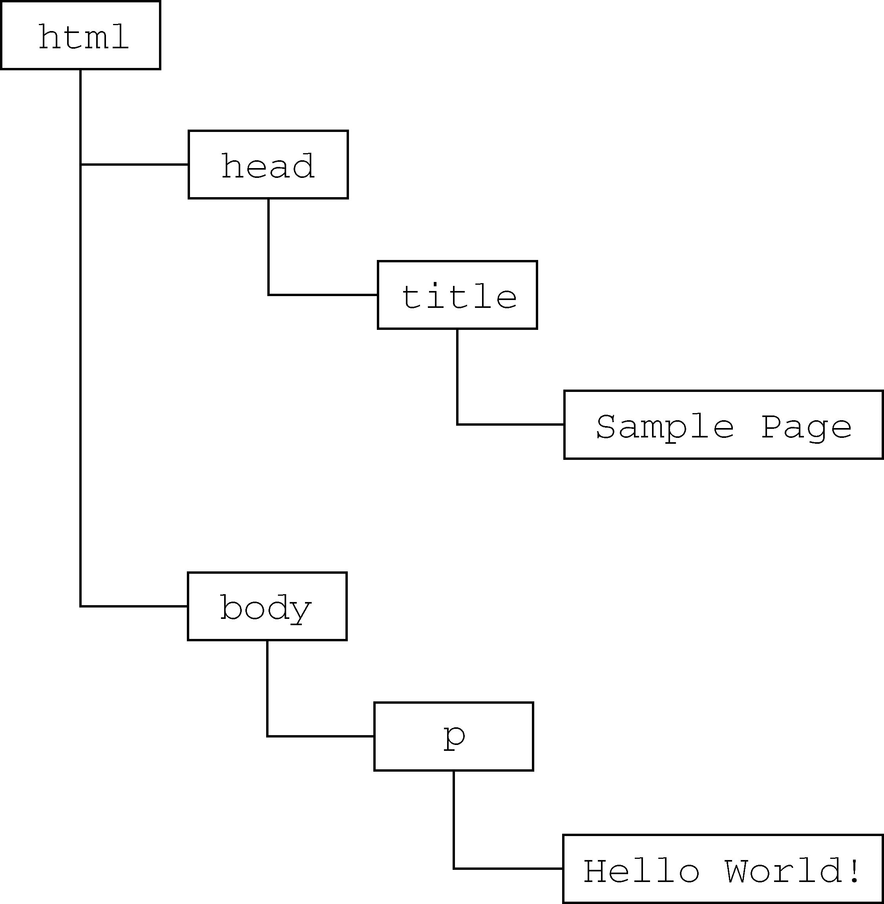

# 第1章 JavaScript 简介

JavaScript诞生于1995年。当时，它的主要目的是处理以前由服务器端语言（如Perl）负责的一些输入验证操作。在JavaScript问世之前，必须把表单数据发送到服务器端才能确定用户是否没有填写某个必填域，是否输入了无效的值。Netscape Navigator希望通过JavaScript来解决这个问题。

## 1.1 JavaScript 简史

当时就职于Netscape公司的布兰登·艾奇（Brendan Eich），为计划于1995年2月发布的Netscape Navigator 2开发一种名为Mocha（后来改名为LiveScript）的脚本语言。在Netscape Navigator 2正式发布前夕，Netscape为了搭上媒体热炒Java的顺风车，临时把LiveScript改名为JavaScript。

由于Netscape的JavaScript 1.0和JavaScript 1.1大获成功，微软也推出了自己的JavaScript实现JScript，这意味着有了两个不同的JavaScript版本。由于当时还没有标准规定JavaScript的语法和特性，JavaScript的标准化问题被提上了议事日程。

1997年，以JavaScript 1.1为蓝本的建议被提交给了欧洲计算机制造商协会（ECMA，European Computer Manufacturers Association）。该协会指定39号技术委员会（TC39，Technical Committee #39）负责“标准化一种通用、跨平台、供应商中立的脚本语言的语法和语义”。TC39由来自Netscape、Sun、微软、Borland及其他关注脚本语言发展的公司的程序员组成，他们经过数月的努力完成了ECMA-262——定义一种名为ECMAScript的新脚本语言的标准。

1998年，ISO/IEC（国际标准化组织和国际电工委员会）也将ECMAScript采纳为标准（即ISO/IEC-16262）。自此以后，各家浏览器均以ECMAScript作为自己JavaScript实现的依据，虽然具体实现各有不同。

## 1.2 JavaScript 实现

虽然JavaScript和ECMAScript基本上是同义词，但JavaScript远远不限于ECMA-262所定义的那样。一个完整的JavaScript实现包含以下3个部分：

- **核心（ECMAScript）** ：由ECMA-262定义，提供核心语言功能；
- **文档对象模型（DOM）** ：提供访问和操作网页内容的方法和接口；
- **浏览器对象模型（BOM）** ：提供与浏览器交互的方法和接口。


### 1.2.1 ECMAScript

由ECMA-262定义的ECMAScript并不局限于Web浏览器。ECMA-262定义的只是这门语言的基础，而在此基础之上可以构建更完善的脚本语言。常见的Web浏览器只是ECMAScript实现可能存在的**宿主环境**之一。其他宿主环境包括Node.js和Adobe Flash。

ECMA-262规定了这门语言的下列组成部分：

- 语法
- 类型
- 语句
- 关键字
- 保留字
- 操作符
- 全局对象

ECMAScript只是对实现这个规范描述的所有方面的一门语言的称呼。JavaScript实现了ECMAScript，而Adobe ActionScript同样也实现了ECMAScript。

#### ECMAScript版本

ECMAScript不同的版本以“edition”表示（也就是描述特定实现的ECMA-262的版本）。以下是一些重要的ES版本：

- ECMA-262的第1版本质上跟网景的JavaScript 1.1相同，只不过删除了所有浏览器特定的代码，外加少量细微的修改。JavaScript 1.1和JavaScript 1.2不符合ECMA-262第1版要求。

- ECMA-262第3版第一次真正对这个标准进行更新，更新了字符串处理、错误定义和数值输出。

- ECMAScript 3.1作为ECMA-262的第5版，于2009年12月3日正式发布。

- ECMA-262第6版，俗称ES6、ES2015或ES Harmony（和谐版），于2015年6月发布。这一版包含了大概这个规范有史以来最重要的一批增强特性。ES6正式支持了类、模块、迭代器、生成器、箭头函数、期约、反射、代理和众多新的数据类型。
- ECMA-262第10版，也称为ES10、ES2019，发布于2019年6月。

#### 什么是ECMAScript符合性

ECMA-262给出了ECMAScript符合性的定义。要成为ECMAScript的实现，则该实现必须做到：

- 支持ECMA-262描述的所有“类型、值、对象、属性、函数以及程序句法和语义”；
- 支持Unicode字符标准。

此外，兼容的实现还可以进行下列扩展。

- 添加ECMA-262没有描述的“更多类型、值、对象、属性和函数”。ECMA-262所说的这些新增特性，主要是指该标准中没有规定的新对象和对象的新属性。
- 支持ECMA-262没有定义的“程序和正则表达式语法”。（也就是说，可以修改和扩展内置的正则表达式语法。）

上述要求为兼容实现的开发人员基于ECMAScript开发一门新语言提供了广阔的空间和极大的灵活性，这也从另一个侧面说明了ECMAScript受开发人员欢迎的原因。

### 1.2.2 文档对象模型 (DOM)

**文档对象模型** (DOM，Document Object Model) 是一种应用程序编程接口（API，Application Programming Interface），用于在HTML中使用扩展的XML。DOM把整个页面抽象为一组分层节点结构。HTML或XML页面中的每个组成部分都是某种类型的节点，其中包含着不同类型的数据。

```html
<html>
    <head> 
        <title>Sample Page</title>
    </head>
    <body>
        <p>Hello World!</p>
    </body>
</html>
```

在DOM中，这个页面可以通过下图所示的分层节点图表示。




#### DOM级别

- **DOM1级（DOM Level 1）：**  DOM1级由两个模块组成：
  - DOM核心（DOM Core）：DOM核心规定的是如何映射基于XML的文档结构，以便简化对文档中任意部分的访问和操作。
  - DOM HTML：模块则在DOM核心的基础上加以扩展，添加了针对HTML的对象和方法。
- **DOM2级：** 引入了下列新模块，也给出了众多新类型和新接口的定义。
  - DOM视图（DOM Views）：定义了跟踪不同文档（例如，应用CSS之前和之后的文档）视图的接口；
  - DOM事件（DOM Events）：定义了事件和事件处理的接口；
  - DOM样式（DOM Style）：定义了处理CSS样式的接口；
  - DOM遍历和范围（DOM Traversal and Range）：定义了遍历和操作文档树的接口。
- **DOM3级：** 进一步扩展了DOM：
  - 引入了以统一方式加载和保存文档的方法——在DOM加载和保存（DOM Load and Save）模块中定义。
  - 新增了验证文档的方法——在DOM验证（DOM Validation）模块中定义。
  - DOM3级也对DOM核心进行了扩展，开始支持XML 1.0规范，涉及XML Infoset、XPath和XML Base。 
  
  目前，W3C不再按照Level来维护DOM了，而是作为DOM Living Standard来维护，其快照称为DOM4。DOM4新增的内容包括替代Mutation Events的Mutation Observers。

#### 其他DOM标准

除了DOM核心和DOM HTML接口之外，下面列出的语言都是基于XML的，每种语言的DOM标准都添加了与特定语言相关的新方法和新接口：

- SVG（Scalable Vector Graphic，可伸缩矢量图）1.0；
- MathML（Mathematical Markup Language，数学标记语言）1.0；
- SMIL（Synchronized Multimedia Integration Language，同步多媒体集成语言）。

### 1.2.3 浏览器对象模型（BOM）

开发人员使用BOM可以控制浏览器显示的页面以外的部分。

BOM只处理浏览器窗口和框架 (frame)，但人们习惯上也把所有特定于浏览器的JavaScript扩展算作BOM的一部分。下面就是一些这样的扩展：

- 弹出新浏览器窗口的功能；
- 移动、缩放和关闭浏览器窗口的功能；
- 提供浏览器详细信息的`navigator`对象；
- 提供浏览器所加载页面的详细信息的`location`对象；
- 提供用户显示器分辨率详细信息的`screen`对象；
- 对cookies的支持；
- 其他自定义对象，如`XMLHttpRequest`和IE的`ActiveXObject`。

## 1.3 JavaScript 版本

作为Netscape“继承人”的Mozilla公司，是目前唯一还在沿用最初的JavaScript版本编号序列的浏览器开发商。

请注意，只有Netscape/Mozilla浏览器才遵循这种编号模式。例如，IE的JScript就采用了另一种版本命名方案。换句话说，JScript的版本号与JavaScript的版本号之间不存在任何对应关系。而且， **大多数浏览器在提及对JavaScript的支持情况时，一般都以ECMAScript兼容性和对DOM的支持情况为准。** 