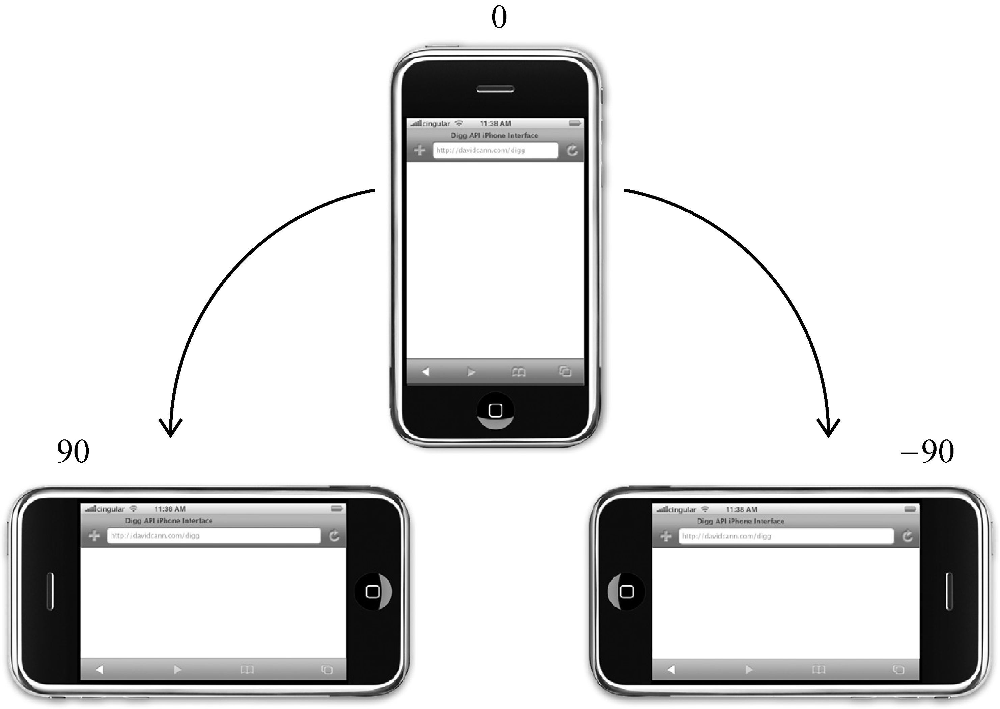
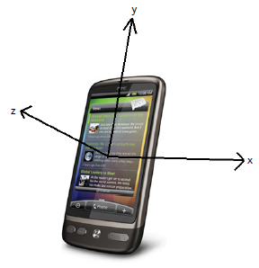
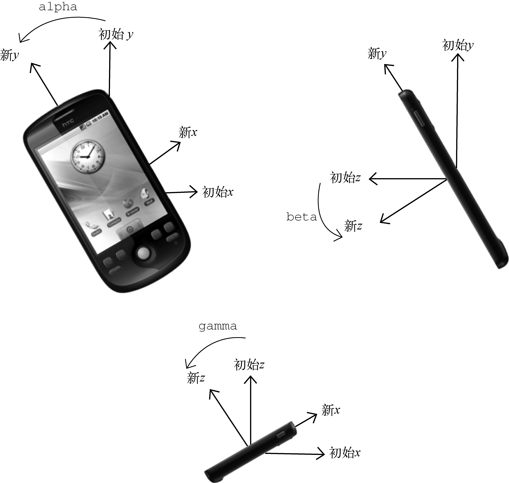

# 第17章 事件

JavaScript与HTML之间的交互是通过**事件**实现的。事件，就是文档或浏览器窗口中发生的一些特定的交互瞬间。可以使用**侦听器**（或处理程序）来预订事件，以便事件发生时执行相应的代码。这种在传统软件工程中被称为观察员模式的模型，支持页面的行为（JavaScript代码）与页面的外观（HTML和CSS代码）之间的松散耦合。

## 17.1 事件流

**事件流**描述的是从页面中接收事件的顺序。但有意思的是，IE和Netscape开发团队居然提出了差不多是完全相反的事件流的概念。IE的事件流是事件冒泡流，而Netscape Communicator的事件流是事件捕获流。

### 17.1.1 事件冒泡

IE的事件流叫做**事件冒泡**（event bubbling），即事件开始时由最具体的元素（文档中嵌套层次最深的那个节点）接收，然后逐级向上传播到较为不具体的节点（文档）。

以下面的HTML页面为例：

```html
<!DOCTYPE html>
<html>
<head>
    <title>Event Bubbling Example</title>
</head>
<body>
    <div id="myDiv">Click Me</div>
</body>
</html>
```

如果你单击了页面中的`<div>`元素，那么这个`click`事件会按照如下顺序传播：


所有现代浏览器都支持事件冒泡，但在具体实现上还是有一些差别。IE5.5及更早版本中的事件冒泡会跳过`<html>`元素（从`<body>`直接跳到`document`）。IE9、Firefox、Chrome和Safari则将事件一直冒泡到`window`对象。

### 17.1.2 事件捕获

Netscape Communicator团队提出的另一种事件流叫做**事件捕获**（event capturing）。事件捕获的思想是不太具体的节点应该更早接收到事件，而最具体的节点应该最后接收到事件。事件捕获的用意在于在事件到达预定目标之前捕获它。

如果仍以前面的HTML页面作为演示事件捕获的例子，那么单击`<div>`元素就会以下列顺序触发`click`事件：


尽管“DOM2级事件”规范要求事件应该从`document`对象开始传播，但**大多数浏览器都是从`window`对象开始捕获事件的。**

由于老版本的浏览器不支持，因此很少有人使用事件捕获。**建议读者放心地使用事件冒泡，在有特殊需要时再使用事件捕获。**

### 17.1.3 DOM事件流

“DOM2级事件”规定的事件流包括3个阶段：

- **事件捕获阶段** ：首先发生的是事件捕获，为截获事件提供了机会。
- **处于目标阶段** ：然后是实际的目标接收到事件。
- **事件冒泡阶段** ：最后一个阶段是冒泡阶段，可以在这个阶段对事件做出响应。

以前面简单的HTML页面为例，单击`<div>`元素会按照下图所示顺序触发事件：


在DOM事件流中，实际的目标（`<div>`元素）在捕获阶段不会接收到事件。这意味着在捕获阶段，事件从`document`到`<html>`再到`<body>`后就停止了。下一个阶段是“处于目标”阶段，于是事件在`<div>`上发生，并在事件处理中被看成冒泡阶段的一部分。然后，冒泡阶段发生，事件又传播回文档。

多数支持DOM事件流的浏览器都实现了一种特定的行为。即使“DOM2级事件”规范明确要求捕获阶段不会涉及事件目标，但所有现代浏览器都会在捕获阶段触发事件对象上的事件。结果，就是有两个机会在目标对象上面操作事件。


## 17.2 事件处理程序 (Event Handlers)

**事件**就是用户或浏览器自身执行的某种动作。诸如`click`、`load`和`mouseover`，都是事件的名字。**事件处理程序** (Event Handlers) 或**事件侦听器** (Event Listener）是响应某个事件的函数。事件处理程序的名字以`"on"`开头，因此`click`事件的事件处理程序就是`onclick`，`load`事件的事件处理程序就是`onload`。

### 17.2.1 HTML事件处理程序

某个元素支持的每种事件，都可以使用一个与相应事件处理程序同名的HTML特性来指定。这个特性的值应该是能够执行的JavaScript代码。

例如，要在按钮被单击时执行一些JavaScript，可以像下面这样编写代码：

```html
<input type="button" value="Click Me" onclick="console.log('Clicked')"/>
```

当单击这个按钮时，就会显示一个控制台日志。这个操作是通过指定`onclick`特性并将一些JavaScript代码作为它的值来定义的。 **由于这个值是JavaScript代码，因此不能在其中使用未经转义的HTML语法字符，例如和号（&）、双引号（""）、小于号（<）或大于号（>）。**

在HTML中定义的事件处理程序可以包含要执行具体动作的JavaScript代码，也可以调用在页面其他地方定义的脚本，还可以调用外部文件中的代码：

```html
<script>
function showMessage() {
    console.log("Hello world!");
}
</script>
<input type="button" value="Click Me" onclick="showMessage()"/>
```

事件处理程序中的代码在执行时，有权访问全局作用域中的任何代码。

这样指定事件处理程序会创建一个封装着元素属性值的函数。这个函数中有一个局部变量**`event`事件对象**。可以直接访问`event`事件对象，你不用自己定义它，也不用从函数的参数列表中读取。

```html
<!-- 输出 "click" -->
<input type="button" value="Click Me" onclick="alert(event.type)">
```

在这个函数内部，`this`值等于事件的目标元素，例如：

```html
<!-- 输出 "Click Me" -->
<input type="button" value="Click Me" onclick="alert(this.value)">
```

**在HTML中指定事件处理程序的缺点：**

- 首先，存在一个时差问题。因为用户可能会在HTML元素一出现在页面上就触发相应的事件，但当时的事件处理程序有可能尚不具备执行条件。假设`showMessage()`函数是在按钮下方、页面的最底部定义的。如果用户在页面解析`showMessage()`函数之前就单击了按钮，就会引发错误。为此，很多HTML事件处理程序都会被封装在一个`try-catch`块中，以便错误不会浮出水面。

- 这样扩展事件处理程序的作用域链在不同浏览器中会导致不同结果。不同JavaScript引擎遵循的标识符解析规则略有差异，很可能会在访问非限定对象成员时出错。

- HTML与JavaScript代码紧密耦合。如果要更换事件处理程序，就要改动两个地方：HTML代码和JavaScript代码。

### 17.2.2 DOM0级事件处理程序

通过JavaScript指定事件处理程序的传统方式，就是将一个函数赋值给一个事件处理程序属性。要使用JavaScript指定事件处理程序，首先必须取得一个要操作的对象的引用。

每个元素（包括`window`和`document`）都有自己的事件处理程序属性，这些属性通常全部小写，例如`onclick`。将这种属性的值设置为一个函数，就可以指定事件处理程序，如下所示：

```js
let btn = document.getElementById("myBtn");
btn.onclick = function() {
	console.log("Clicked");
};
```

注意，在这些代码运行以前不会指定事件处理程序，因此如果这些代码在页面中位于按钮后面，就有可能在一段时间内怎么单击都没有反应。

使用DOM0级方法指定的事件处理程序被认为是元素的方法。因此，这时候的事件处理程序是在元素的作用域中运行；换句话说，程序中的`this`引用当前元素。

```js
let btn = document.getElementById("myBtn");
btn.onclick = function() {
    console.log(this.id); // "myBtn"
};
```

可以在事件处理程序中通过`this`访问元素的任何属性和方法。**以这种方式添加的事件处理程序会在事件流的冒泡阶段被处理。**

也可以删除通过DOM0级方法指定的事件处理程序，只要像下面这样将事件处理程序属性的值设置为`null`即可：

```js
btn.onclick = null;     //删除事件处理程序
```

**注意，DOM0级对每个事件只支持一个事件处理程序。**

### 17.2.3 DOM2级事件处理程序

“DOM2级事件”定义了两个方法，用于处理指定和删除事件处理程序的操作：

- **`addEventListener()`方法** ：添加事件处理程序。

- **`removeEventListener()`方法** ：移除通过`addEventListener()`添加的事件处理程序。移除时传入的参数与添加处理程序时使用的参数相同。这也意味着通过`addEventListener()` **添加的匿名函数将无法移除**。

所有DOM节点中都包含这两个方法，并且它们都接受3个参数：要处理的事件名、作为事件处理程序的函数和一个布尔值。最后这个布尔值参数如果是`true`，表示**在捕获阶段调用**事件处理程序；如果是`false`，表示**在冒泡阶段调用**事件处理程序。

要在按钮上为`click`事件添加事件处理程序，可以使用下列代码：

```js
let btn = document.getElementById("myBtn");
btn.addEventListener("click", () => {   // 为一个按钮添加了onclick事件处理程序
    console.log(this.id);
}, false);
```

与DOM0级方法一样，这里添加的事件处理程序也是在其依附的元素的作用域中运行。

**使用DOM2级方法添加事件处理程序可以为每个事件添加多个事件处理程序。**

```js
/* 
这里为按钮添加了两个事件处理程序。
这两个事件处理程序会按照添加它们的顺序触发，因此首先会显示元素的ID，其次会显示`"Hello world!"`消息。
*/

let btn = document.getElementById("myBtn");

btn.addEventListener("click", () => {
console.log(this.id);
}, false);

btn.addEventListener("click", () => {
console.log("Hello world!");
}, false);
```

通过`addEventListener()` 添加的匿名函数将无法移除：

```js
let btn = document.getElementById("myBtn");
btn.addEventListener("click", () => {
    console.log(this.id);
}, false);

// other code here
btn.removeEventListener("click", function() { // won't work!
    console.log(this.id);
}, false);
```

```js
let btn = document.getElementById("myBtn");
let handler = function() {
    console.log(this.id);
};

btn.addEventListener("click", handler, false);
// other code here
btn.removeEventListener("click", handler, false); // works!
```

**大多数情况下，都是将事件处理程序添加到事件流的冒泡阶段，这样可以最大限度地兼容各种浏览器。最好只在需要在事件到达目标之前截获它的时候将事件处理程序添加到捕获阶段。如果不是特别需要，我们不建议在事件捕获阶段注册事件处理程序。**

### 17.2.4 IE事件处理程序

略

### 17.2.5 跨浏览器的事件处理程序

以下代码实现了一个事件处理对象`EventUtil`，它有两个方法，分别用来实现添加和移除跨浏览器的事件处理程序：

```js
var EventUtil = {
    // addHandler()方法接受3个参数：要操作的元素、事件名称和事件处理程序函数。
    addHandler: function(element, type, handler) {  
        if (element.addEventListener) { // 使用DOM0方法
            element.addEventListener(type, handler, false);
        } else if (element.attachEvent) { // 使用IE方法
            element.attachEvent("on" + type, handler);
        } else { // 默认使用DOM0分发
            element["on" + type] = handler;
        }
    },
    // removeHandler()方法接受3个参数：要操作的元素、事件名称和事件处理程序函数。
    removeHandler: function(element, type, handler) {
        if (element.removeEventListener) { // 使用DOM0方法
            element.removeEventListener(type, handler, false);
        } else if (element.detachEvent) { // 使用IE方法
            element.detachEvent("on" + type, handler);
        } else { // 默认使用DOM0分发
            element["on" + type] = null;
        }
    }
};
```

可以像下面这样使用`EventUtil`对象：

```js
let btn = document.getElementById("myBtn");
let handler = function() {
    console.log("Clicked");
};

EventUtil.addHandler(btn, "click", handler);
// other code here
EventUtil.removeHandler(btn, "click", handler);
```


## 17.3 事件对象

在触发DOM上的某个事件时，会产生一个事件对象`event`，这个对象中包含着所有与事件有关的信息。包括导致事件的元素、事件的类型以及其他与特定事件相关的信息。例如，鼠标操作导致的事件对象中，会包含鼠标位置的信息，而键盘操作导致的事件对象中，会包含与按下的键有关的信息。所有浏览器都支持`event`对象，但支持方式不同。

### 17.3.1 DOM中的事件对象

兼容DOM的浏览器会将一个`event`对象传入到事件处理程序中。无论指定事件处理程序时使用什么方法（DOM0级或DOM2级），都会传入`event`对象。

```js
// 这个例子中的两个事件处理程序都会弹出一个警告框，显示由event.type属性表示的事件类型。

let btn = document.getElementById("myBtn");

btn.onclick = function(event) {
    console.log(event.type); // "click"
};

btn.addEventListener("click", (event) => {
    console.log(event.type); // "click"
}, false);
```

在通过HTML特性指定事件处理程序时，变量`event`中保存着`event`对象。以这种方式提供`event`对象，可以让HTML特性事件处理程序与JavaScript函数执行相同的操作。请看下面的例子：

```html
<input type="button" value="Click Me" onclick="alert(event.type)"/>
```

`event`对象包含与创建它的特定事件有关的属性和方法。触发的事件类型不一样，可用的属性和方法也不一样。下表列出了所有事件都会有的成员：

| 属性/方法                    | 类　　型       | 读/写 | 说　　明                                                     |
| :--------------------------- | :------------- | :---- | :----------------------------------------------------------- |
| `bubbles`                    | `Boolean`      | 只读  | 表明事件是否冒泡                                             |
| `cancelable`                 | `Boolean`      | 只读  | 表明是否可以取消事件的默认行为                               |
| `currentTarget`              | `Element`      | 只读  | 其事件处理程序当前正在处理事件的那个元素。                   |
| `defaultPrevented`           | `Boolean`      | 只读  | 为`true`表示已经调用了`preventDefault()`（DOM3级事件中新增） |
| `detail`                     | `Integer`      | 只读  | 与事件相关的细节信息                                         |
| `eventPhase`                 | `Integer`      | 只读  | 调用事件处理程序的阶段：1表示捕获阶段，2表示“处于目标”，3表示冒泡阶段 |
| `preventDefault()`           | `Function`     | 只读  | 取消事件的默认行为。如果`cancelable`是`true`，则可以使用这个方法 |
| `stopImmediatePropagation()` | `Function`     | 只读  | 取消事件的进一步捕获或冒泡，同时阻止任何事件处理程序被调用（DOM3级事件中新增） |
| `stopPropagation()`          | `Function`     | 只读  | 取消事件的进一步捕获或冒泡。如果`bubbles`为`true`，则可以使用这个方法 |
| `target`                     | `Element`      | 只读  | 事件的实际目标                                               |
| `trusted`                    | `Boolean`      | 只读  | 为`true`表示事件是浏览器生成的。为`false`表示事件是由开发人员通过JavaScript创建的（DOM3级事件中新增） |
| `type`                       | `String`       | 只读  | 被触发的事件的类型                                           |
| `view`                       | `AbstractView` | 只读  | 与事件关联的抽象视图。等同于发生事件的`window`对象           |

在事件处理程序内部，对象`this`始终等于`currentTarget`的值，而`target`则只包含事件的实际目标。如果直接将事件处理程序指定给了目标元素，则`this`、`currentTarget`和`target`包含相同的值。

在需要通过一个函数处理多个事件时，可以使用`event.type`属性。例如：

```js
let btn = document.getElementById("myBtn");

// 定义了一个名为handler的函数，用于处理3种事件：click、mouseover和mouseout。
let handler = function(event) {
    switch(event.type) {
        case "click":
            console.log("Clicked");
            break;
        case "mouseover":
            event.target.style.backgroundColor = "red";
            break;
        case "mouseout":
            event.target.style.backgroundColor = "";
            break;
    }
};

btn.onclick = handler;
btn.onmouseover = handler;
btn.onmouseout = handler;
```

要阻止特定事件的默认行为，可以使用`preventDefault()`方法。例如，链接的默认行为就是在被单击时会导航到其`href`特性指定的URL。如果你想阻止链接导航这一默认行为，那么通过链接的`onclick`事件处理程序可以取消它，如下面的例子所示。

```js
let link = document.getElementById("myLink");
link.onclick = function(event) {
    event.preventDefault();
};
```

另外，`stopPropagation()`方法用于立即停止事件在DOM层次中的传播，即取消进一步的事件捕获或冒泡。例如，直接添加到一个按钮的事件处理程序可以调用`stopPropagation()`，从而避免触发注册在`document.body`上面的事件处理程序，如下面的例子所示：

```js
/*
如果不调用stopPropagation()，就会在单击按钮时出现两个警告框。可是，由于click事件根本不会传播到document.body，因此就不会触发注册在这个元素上的onclick事件处理程序。
*/

let btn = document.getElementById("myBtn");

btn.onclick = function(event) {
    console.log("Clicked");
    event.stopPropagation();
};

document.body.onclick = function(event) {
    console.log("Body clicked");
};
```

事件对象的`eventPhase`属性，可以用来确定事件当前正位于事件流的哪个阶段。如果是在捕获阶段调用的事件处理程序，那么`eventPhase`等于`1`；如果事件处理程序处于目标对象上，则`eventPhase`等于`2`；如果是在冒泡阶段调用的事件处理程序，`eventPhase`等于`3`。这里要注意的是，尽管“处于目标”发生在冒泡阶段，但`eventPhase`仍然一直等于`2`。

```js
/*
当单击这个例子中的按钮时，首先执行的事件处理程序是在捕获阶段触发的添加到document.body中的那一个，结果会弹出一个警告框显示表示eventPhase的1。接着，会触发在按钮上注册的事件处理程序，此时的eventPhase值为2。最后一个被触发的事件处理程序，是在冒泡阶段执行的添加到document.body上的那一个，显示eventPhase的值为3。而当eventPhase等于2时，this、target和currentTarget始终都是相等的。
*/


let btn = document.getElementById("myBtn");

btn.onclick = function(event) {
    console.log(event.eventPhase); // 2
};

document.body.addEventListener("click", (event) => {
    console.log(event.eventPhase); // 1
}, true);

document.body.onclick = (event) => {
    console.log(event.eventPhase); // 3
};
```

> **注意：只有在事件处理程序执行期间，`event`对象才会存在；一旦事件处理程序执行完成，`event`对象就会被销毁。**

### 17.3.2 IE中的事件对象

略

### 17.3.3 跨浏览器的事件对象

虽然DOM和IE中的`event`对象不同，但基于它们之间的相似性依旧可以拿出跨浏览器的方案来。IE中`event`对象的全部信息和方法DOM对象中都有，只不过实现方式不一样。可以对前面介绍的`EventUtil`对象加以增强，添加如下方法：

```js
var EventUtil = {
    addHandler: function(element, type, handler) {
        // code removed for printing
    },
    getEvent: function(event) {
        return event ? event : window.event;
    },
    getTarget: function(event) {
        return event.target || event.srcElement;
    },
    preventDefault: function(event) {
        if (event.preventDefault) {
            event.preventDefault();
        } else {
            event.returnValue = false;
        }
    },
    removeHandler: function(element, type, handler) {
        // code removed for printing
    },
    stopPropagation: function(event) {
        if (event.stopPropagation) {
            event.stopPropagation();
        } else {
            event.cancelBubble = true;
        }
    }
};
```


## 17.4 事件类型

Web浏览器中可能发生的事件有很多类型。如前所述，不同的事件类型具有不同的信息，而“DOM3级事件”规定了以下几类事件。

- UI（User Interface，用户界面）事件，当用户与页面上的元素交互时触发；
- 焦点事件，当元素获得或失去焦点时触发；
- 鼠标事件，当用户通过鼠标在页面上执行操作时触发；
- 滚轮事件，当使用鼠标滚轮（或类似设备）时触发；
- 文本事件，当在文档中输入文本时触发；
- 键盘事件，当用户通过键盘在页面上执行操作时触发；
- 合成事件，当为IME（Input Method Editor，输入法编辑器）输入字符时触发；
- 变动（mutation）事件，当底层DOM结构发生变化时触发。
- 变动名称事件，当元素或属性名变动时触发。此类事件已经被废弃，没有任何浏览器实现它们，因此本章不做介绍。

### 17.4.1 UI事件

现有的UI事件如下：

- `DOMActivate`：表示元素已经被用户操作（通过鼠标或键盘）激活。这个事件在DOM3级事件中被废弃，但Firefox 2+和Chrome支持它。考虑到不同浏览器实现的差异，不建议使用这个事件。
- `load`：当页面完全加载后在`window`上面触发，当所有框架都加载完毕时在框架集上面触发，当图像加载完毕时在``元素上面触发，或者当嵌入的内容加载完毕时在`<object>`元素上面触发。当页面完全加载后（包括所有图像、JavaScript文件、CSS文件等外部资源），就会触发`window`上面的`load`事件。
- `unload`：当页面完全卸载后在`window`上面触发，当所有框架都卸载后在框架集上面触发，或者当嵌入的内容卸载完毕后在`<object>`元素上面触发。
- `abort`：在用户停止下载过程时，如果嵌入的内容没有加载完，则在`<object>`元素上面触发。
- `error`：当发生JavaScript错误时在`window`上面触发，当无法加载图像时在``元素上面触发，当无法加载嵌入内容时在`<object>`元素上面触发，或者当有一或多个框架无法加载时在框架集上面触发。
- `select`：当用户选择文本框（`<input>`或`<textarea>`）中的一或多个字符时触发。
- `resize`：当窗口或框架的大小变化时在`window`或框架上面触发。
- `scroll`：当用户滚动带滚动条的元素中的内容时，在该元素上面触发。`<body>`元素中包含所加载页面的滚动条。

#### `load`事件

当页面完全加载后（包括所有图像、JavaScript文件、CSS文件等外部资源），就会触发`window`上面的`load`事件。

有2种定义`onload`事件处理程序的方式：

- 使用DOM方式
- 使用HTML标签`onload`属性

```js
// 使用DOM方式为window定义onload事件处理程序
window.addEventListener("load", (event) => {
    console.log("Loaded!");
});
```

```html
<!DOCTYPE html>
<html>
<head>
    <title>Load Event Example</title>
</head>
<!-->在window上面发生的任何事件都可以在<body>元素中通过相应的特性来指定，因为在HTML中无法访问window元素。<-->
<body onload="console.log('Loaded!')">
</body>
</html>
```

图像上面也可以触发`load`事件，无论是在DOM中的图像元素还是HTML中的图像元素。

```html
<!-->可以在HTML中为任何图像指定`onload`事件处理程序<-->

```

```js
// 使用DOM为任何图像指定`onload`事件处理程序
let image = document.getElementById("myImage");
image.addEventListener("load", (event) => {
    console.log(event.target.src);
});
```

在创建新的``元素时，可以为其指定一个事件处理程序，以便图像加载完毕后给出提示。此时，最重要的是要在指定`src`属性之前先指定事件：

```js
window.addEventListener("load", () => {
    let image = document.createElement("img");
    image.addEventListener("load", (event) => {
        console.log(event.target.src);
    });
    document.body.appendChild(image);
    image.src = "smile.gif";   // 注意：新图像元素只要设置了src属性就会开始下载。
});
```

```js
// 同样的功能也可以通过使用DOM0级的Image对象实现。
window.addEventListener("load", () => {
    let image = new Image();  // 可以像使用元素一样使用Image对象。
    image.addEventListener("load", (event) => {
        console.log("Image loaded!");
    });
    image.src = "smile.gif";
});
```

还有一些元素也以非标准的方式支持`load`事件。在现代浏览器中，`<script>`元素也会触发`load`事件，以便开发人员确定动态加载的JavaScript文件是否加载完毕。与图像不同，只有在设置了`<script>`元素的`src`属性并将该元素添加到文档后，才会开始下载JavaScript文件。

```js
window.addEventListener("load", () => {
    let script = document.createElement("script");
    script.addEventListener("load", (event) => {
        console.log("Loaded");
    });
    script.src = "example.js";
    document.body.appendChild(script);
});
```

#### `unload`事件

与`load`事件对应的是`unload`事件，这个事件在文档被完全卸载后触发。只要用户从一个页面切换到另一个页面，就会发生`unload`事件。而利用这个事件最多的情况是清除引用，以避免内存泄漏。

与`load`事件类似，也有两种指定`onunload`事件处理程序的方式：

- 使用JavaScript操作DOM；
- 使用`<body>`元素的`onunload`属性；

```js
window.addEventListener("unload", (event) => {
    console.log("Unloaded!");
});
```

```html
<!DOCTYPE html>
<html>
<head>
    <title>Unload Event Example</title>
</head>
<body onunload="console.log('Unloaded!')">
</body>
</html>
```

#### `resize`事件

当浏览器窗口被调整到一个新的高度或宽度时，就会触发`resize`事件。这个事件在`window`（窗口）上面触发，因此可以通过JavaScript或者`<body>`元素中的`onresize`特性来指定事件处理程序。

```js
window.addEventListener("resize", (event) => {
    console.log("Resized");
});
```

#### `scroll`事件

虽然`scroll`事件是在`window`对象上发生的，但它实际表示的则是页面中相应元素的变化。在混杂模式下，可以通过`<body>`元素的`scrollLeft`和`scrollTop`来监控到这一变化；而在标准模式下，除Safari之外的所有浏览器都会通过`<html>`元素来反映这一变化（Safari仍然基于`<body>`跟踪滚动位置）。

```js
window.addEventListener("scroll", (event) => {
    if (document.compatMode == "CSS1Compat") {
        console.log(document.documentElement.scrollTop);
    } else {
        console.log(document.body.scrollTop);
    }
});
```

### 17.4.2 焦点事件

焦点事件会在页面元素获得或失去焦点时触发。利用这些事件并与`document.hasFocus()`方法及`document.activeElement`属性配合，可以知晓用户在页面上的行踪。有以下6个焦点事件：

- `blur`：在元素失去焦点时触发。这个事件不会冒泡；所有浏览器都支持它。
- `DOMFocusIn`：在元素获得焦点时触发。这个事件与HTML事件`focus`等价，但它冒泡。DOM3级事件废弃了`DOMFocusIn`，选择了`focusin`。
- `DOMFocusOut`：在元素失去焦点时触发。这个事件是HTML事件`blur`的通用版本。只有Opera支持这个事件。DOM3级事件废弃了`DOMFocusOut`，选择了`focusout`。
- `focus`：在元素获得焦点时触发。这个事件不会冒泡；所有浏览器都支持它。
- `focusin`：在元素获得焦点时触发。这个事件与HTML事件`focus`等价，但它冒泡。
- `focusout`：在元素失去焦点时触发。这个事件是HTML事件`blur`的通用版本。

当焦点从页面中的一个元素移动到另一个元素，会依次触发下列事件：

1.  `focusout`在失去焦点的元素上触发；
2. `focusin`在获得焦点的元素上触发；
3. `blur`在失去焦点的元素上触发；
4. `DOMFocusOut`在失去焦点的元素上触发；
5. `focus`在获得焦点的元素上触发；
6. `DOMFocusIn`在获得焦点的元素上触发。

### 17.4.3 鼠标与滚轮事件

鼠标事件：

- `click`：在用户单击主鼠标按钮（一般是左边的按钮）或者按下回车键时触发。这一点对确保易访问性很重要，意味着`onclick`事件处理程序既可以通过键盘也可以通过鼠标执行。
- `dblclick`：在用户双击主鼠标按钮（一般是左边的按钮）时触发。从技术上说，这个事件并不是DOM2级事件规范中规定的，但鉴于它得到了广泛支持，所以DOM3级事件将其纳入了标准。
- `mousedown`：在用户按下了任意鼠标按钮时触发。不能通过键盘触发这个事件。
- `mouseenter`：在鼠标光标从元素外部首次移动到元素范围之内时触发。这个事件不冒泡，而且在光标移动到后代元素上不会触发。DOM2级事件并没有定义这个事件，但DOM3级事件将它纳入了规范。
- `mouseleave`：在位于元素上方的鼠标光标移动到元素范围之外时触发。这个事件不冒泡，而且在光标移动到后代元素上不会触发。DOM2级事件并没有定义这个事件，但DOM3级事件将它纳入了规范。
- `mousemove`：当鼠标指针在元素内部移动时重复地触发。不能通过键盘触发这个事件。
- `mouseout`：在鼠标指针位于一个元素上方，然后用户将其移入另一个元素时触发。又移入的另一个元素可能位于前一个元素的外部，也可能是这个元素的子元素。不能通过键盘触发这个事件。
- `mouseover`：在鼠标指针位于一个元素外部，然后用户将其首次移入另一个元素边界之内时触发。不能通过键盘触发这个事件。
- `mouseup`：在用户释放鼠标按钮时触发。不能通过键盘触发这个事件。
- `mousewheel`：当用户通过鼠标滚轮与页面交互、在垂直方向上滚动页面时（无论向上还是向下），就会触发`mousewheel`事件。

**页面上的所有元素都支持鼠标事件。除了`mouseenter`和`mouseleave`，所有鼠标事件都会冒泡，也可以被取消，而取消鼠标事件将会影响浏览器的默认行为。** 只有在同一个元素上相继触发`mousedown`和`mouseup`事件，才会触发`click`事件；如果`mousedown`或`mouseup`中的一个被取消，就不会触发`click`事件。类似地，只有触发两次`click`事件，才会触发一次`dblclick`事件。如果有代码阻止了连续两次触发`click`事件（可能是直接取消`click`事件，也可能通过取消`mousedown`或`mouseup`间接实现），那么就不会触发`dblclick`事件了。

`mousedown`、`mouseup`、`click`、`dblclick`这4个事件触发的顺序始终如下：

1. `mousedown`
2. `mouseup`
3. `click`
4. `mousedown`
5. `mouseup`
6. `click`
7. `dblclick`

#### 客户端坐标位置 (Client Coordinates)

鼠标事件都是在浏览器视口中的特定位置上发生的。这个位置信息保存在事件对象的`clientX`和`clientY`属性中。

- `clientX`属性：表示事件发生时鼠标指针在**视口中的水平坐标** 。

- `clientY`属性：表示事件发生时鼠标指针在**视口中的垂直坐标** 。

#### 页面坐标位置 (Page Coordinates)
页面坐标通过事件对象的`pageX`和`pageY`属性，能告诉你事件是在页面中的什么位置发生的。换句话说，这两个属性表示鼠标光标在页面中的位置，因此坐标是从页面本身而非视口的左边和顶边计算的。在页面没有滚动的情况下，`pageX`和`pageY`的值与`clientX`和`clientY`的值相等。

#### 屏幕坐标位置 (Screen Coordinates)
鼠标事件发生时，不仅会有相对于浏览器窗口的位置，还有一个相对于整个电脑屏幕的位置。而通过`screenX`和`screenY`属性就可以确定鼠标事件发生时鼠标指针相对于整个屏幕的坐标信息。

#### 修改键 (Modifier Keys)
虽然鼠标事件主要是使用鼠标来触发的，但在按下鼠标时键盘上的某些键的状态也可以影响到所要采取的操作。这些修改键就是Shift、Ctrl、Alt和Meta（在Windows键盘中是Windows键，在苹果机中是Cmd键），它们经常被用来修改鼠标事件的行为。DOM为此规定了4个属性，表示这些修改键的状态：`shiftKey`、`ctrlKey`、`altKey`和`metaKey`。这些属性中包含的都是布尔值，如果相应的键被按下了，则值为`true`，否则值为`false`。当某个鼠标事件发生时，通过检测这几个属性就可以确定用户是否同时按下了其中的键。

#### 相关元素 (Related Elements)
在发生`mouseover`和`mouseout`事件时，还会涉及更多的元素。这两个事件都会涉及把鼠标指针从一个元素的边界之内移动到另一个元素的边界之内。对`mouseover`事件而言，事件的主目标是获得光标的元素，而相关元素就是那个失去光标的元素。类似地，对`mouseout`事件而言，事件的主目标是失去光标的元素，而相关元素则是获得光标的元素。DOM通过`event`对象的`relatedTarget`属性提供了相关元素的信息。这个属性只对于`mouseover`和`mouseout`事件才包含值；对于其他事件，这个属性的值是`null`。

#### 鼠标按钮
对于`mousedown`和`mouseup`事件来说，则在其`event`对象存在一个`button`属性，表示按下或释放的按钮。DOM的`button`属性可能有如下3个值：`0`表示主鼠标按钮，`1`表示中间的鼠标按钮（鼠标滚轮按钮），`2`表示次鼠标按钮。在常规的设置中，主鼠标按钮就是鼠标左键，而次鼠标按钮就是鼠标右键。

#### 额外事件信息

“DOM2级事件”规范在`event`对象中还提供了`detail`属性，用于给出有关事件的更多信息。对于鼠标事件来说，`detail`中包含了一个数值，表示在给定位置上发生了多少次单击。在同一个元素上相继地发生一次`mousedown`和一次`mouseup`事件算作一次单击。`detail`属性从`1`开始计数，每次单击发生后都会递增。如果鼠标在`mousedown`和`mouseup`之间移动了位置，则`detail`会被重置为`0`。

#### 鼠标滚轮事件

当用户通过鼠标滚轮与页面交互、在垂直方向上滚动页面时（无论向上还是向下），就会触发`mousewheel`事件。这个事件可以在任何元素上面触发，最终会冒泡到`document`（IE8）或`window`（IE9、Opera、Chrome及Safari）对象。与`mousewheel`事件对应的`event`对象除包含鼠标事件的所有标准信息外，还包含一个特殊的`wheelDelta`属性。当用户向前滚动鼠标滚轮时，`wheelDelta`是120的倍数；当用户向后滚动鼠标滚轮时，`wheelDelta`是-120的倍数。

将`mousewheel`事件处理程序指定给页面中的任何元素或`document`对象，即可处理鼠标滚轮的交互操作：

```js
document.addEventListener("mousewheel", (event) => {
    console.log(event.wheelDelta);
});
```

#### 触控设备的支持

在面向触控设备进行开发时，要记住以下几点：

- 不支持`dblclick`事件。双击浏览器窗口会放大画面，而且没有办法改变该行为。
- 轻击可单击元素会触发`mousemove`事件。如果此操作会导致内容变化，将不再有其他事件发生；如果屏幕没有因此变化，那么会依次发生`mousedown`、`mouseup`和`click`事件。轻击不可单击的元素不会触发任何事件。可单击的元素是指那些单击可产生默认操作的元素（如链接），或者那些已经被指定了`onclick`事件处理程序的元素。
- `mousemove`事件也会触发`mouseover`和`mouseout`事件。
- 两个手指放在屏幕上且页面随手指移动而滚动时会触发`mousewheel`和`scroll`事件。

#### 无障碍性问题 (Accessibility Issues)

如果你的Web应用程序或网站要确保残疾人特别是那些使用屏幕阅读器的人都能访问，那么在使用鼠标事件时就要格外小心。以下是在使用鼠标事件时应当注意的几个易访问性问题。

- 使用`click`事件执行代码。有人指出通过`onmousedown`执行代码会让人觉得速度更快，对视力正常的人来说这是没错的。但是，在屏幕阅读器中，由于无法触发`mousedown`事件，结果就会造成代码无法执行。
- 不要使用`onmouseover`向用户显示新的选项。原因同上，屏幕阅读器无法触发这个事件。如果确实非要通过这种方式来显示新选项，可以考虑添加显示相同信息的键盘快捷方式。
- 不要使用`dblclick`执行重要的操作。键盘无法触发这个事件。

### 17.4.4 键盘与文本事件

有3个键盘事件：

- `keydown`：当用户按下键盘上的任意键时触发，而且如果按住不放的话，会重复触发此事件。
- `keypress`：当用户按下键盘上的字符键时触发，而且如果按住不放的话，会重复触发此事件。按下Esc键也会触发这个事件。DOM Level 3 Events deprecates the keypress event in favor of the textInput event.
- `keyup`：当用户释放键盘上的键时触发。

1个文本事件：

- `textInput`：在将文本显示给用户之前更容易拦截文本。在文本插入文本框之前会触发`textInput`事件。

在用户按了一下键盘上的**字符键**时，首先会触发`keydown`事件，然后紧跟着是`keypress`事件，最后会触发`keyup`事件。其中，`keydown`和`keypress`都是在文本框发生变化之前被触发的；而`keyup`事件则是在文本框已经发生变化之后被触发的。如果用户按下了一个字符键不放，就会重复触发`keydown`和`keypress`事件，直到用户松开该键为止。

如果用户按下的是一个**非字符键**，那么首先会触发`keydown`事件，然后就是`keyup`事件。如果按住这个非字符键不放，那么就会一直重复触发`keydown`事件，直到用户松开这个键，此时会触发`keyup`事件。

#### 键码

在发生`keydown`和`keyup`事件时，`event`对象的`keyCode`属性中会包含一个代码，与键盘上一个特定的键对应。对数字字母字符键，`keyCode`属性的值与ASCII码中对应小写字母或数字的编码相同。

```js
let textbox = document.getElementById("myText");
textbox.addEventListener("keyup", (event) => {
    console.log(event.keyCode);
});
```

#### 字符编码

发生`keypress`事件意味着按下的键会影响到屏幕中文本的显示。在所有浏览器中，按下能够插入或删除字符的键都会触发`keypress`事件；按下其他键能否触发此事件因浏览器而异。

`event`对象都支持一个`charCode`属性，这个属性只有在发生`keypress`事件时才包含值，而且这个值是按下的那个键所代表字符的ASCII编码。

#### DOM3级的变化

尽管所有浏览器都实现了某种形式的键盘事件，DOM3级事件还是做出了一些改变：

- `key`属性：`key`属性是为了取代`keyCode`而新增的，它的值是一个字符串。在按下某个字符键时，`key`的值就是相应的文本字符（如“k”或“M”）；在按下非字符键时，`key`的值是相应键的名（如“Shift”或“Down”）。
- `char`属性：`char`属性在按下字符键时的行为与`key`相同，但在按下非字符键时值为`null`。
- `location`属性：这是一个数值，表示按下了什么位置上的键：0表示默认键盘，1表示左侧位置（例如左位的Alt键），2表示右侧位置（例如右侧的Shift键），3表示数字小键盘，4表示移动设备键盘（也就是虚拟键盘），5表示手柄（如任天堂Wii控制器）。
- `getModifierState()`方法：这个方法接收一个参数，即等于`Shift`、`Control`、`AltGraph`或`Meta`的字符串，表示要检测的修改键。如果指定的修改键是活动的（也就是处于被按下的状态），这个方法返回`true`，否则返回`false`。实际上，通过`event`对象的`shiftKey`、`altKey`、`ctrlKey`和`metaKey`属性已经可以取得类似的属性了。

DOM3级事件中的键盘事件，不再包含`charCode`属性，而是包含两个新属性：`key`和`char`。Safari和Chrome支持名为`keyIdentifier`的属性，在按下非字符键（例如Shift）的情况下与`key`的值相同。对于字符键，`keyIdentifier`返回一个格式类似“U+0000”的字符串，表示`Unicode`值。

**由于存在跨浏览器问题，因此不推荐使用`key`、`keyIdentifier`、`char`或`location`。**

#### `textInput`事件

“DOM3级事件”规范中引入了一个新事件，名叫`textInput`。根据规范，当用户在可编辑区域中输入字符时，就会触发这个事件。

`keypress`事件与`textInput`事件的区别在于：

- 任何可以获得焦点的元素都可以触发`keypress`事件，但只有可编辑区域才能触发`textInput`事件。
- `textInput`事件只会在用户按下能够输入实际字符的键时才会被触发，而`keypress`事件则在按下那些能够影响文本显示的键时也会触发（例如退格键）。

由于`textInput`事件主要考虑的是字符，因此它的`event`对象中还包含一个`data`属性，这个属性的值就是用户输入的字符（而非字符编码）。换句话说，用户在没有按上档键的情况下按下了S键，`data`的值就是`"s"`，而如果在按住上档键时按下该键，`data`的值就是`"S"`。

```js
let textbox = document.getElementById("myText");
textbox.addEventListener("textInput", (event) => {
    console.log(event.data);
});
```

另外，`event`对象上还有一个属性，叫`inputMethod`，表示把文本输入到文本框中的方式：

- 0，表示浏览器不确定是怎么输入的。
- 1，表示是使用键盘输入的。
- 2，表示文本是粘贴进来的。
- 3，表示文本是拖放进来的。
- 4，表示文本是使用IME输入的。
- 5，表示文本是通过在表单中选择某一项输入的。
- 6，表示文本是通过手写输入的（比如使用手写笔）。
- 7，表示文本是通过语音输入的。
- 8，表示文本是通过几种方法组合输入的。
- 9，表示文本是通过脚本输入的。


### 17.4.5 复合事件 (Composition Events)

**复合事件**（composition event）是DOM3级事件中新添加的一类事件，用于处理IME 的输入序列。

IME（Input Method Editor，输入法编辑器）可以让用户输入在物理键盘上找不到的字符。例如，使用拉丁文键盘的用户通过IME照样能输入日文字符。IME通常需要同时按住多个键，但最终只输入一个字符。

**复合事件**就是针对检测和处理这种输入而设计的。

有以下三种复合事件。

- `compositionstart`：在IME的文本复合系统打开时触发，表示要开始输入了。
- `compositionupdate`：在向输入字段中插入新字符时触发。
- `compositionend`：在IME的文本复合系统关闭时触发，表示返回正常键盘输入状态。

复合事件与文本事件在很多方面都很相似。在触发复合事件时，目标是接收文本的输入字段。但它比文本事件的事件对象多一个属性`data`，其中包含以下几个值中的一个：

- 如果在`compositionstart`事件发生时访问，包含正在编辑的文本（例如，已经选中的需要马上替换的文本）；
- 如果在`compositionupdate`事件发生时访问，包含正插入的新字符；
- 如果在`compositionend`事件发生时访问，包含此次输入会话中插入的所有字符。

```js
let textbox = document.getElementById("myText");
textbox.addEventListener("compositionstart", (event) => {
    console.log(event.data);
});
textbox.addEventListener("compositionupdate", (event) => {
    console.log(event.data);
});
textbox.addEventListener("compositionend", (event) => {
    console.log(event.data);
});
```

### 17.4.6 变动事件 (Mutation Events)

The DOM Level 2 mutation events were designed to provide notification when a part of the DOM has been changed.

> **NOTE These events are deprecated, and support is gradually being phased out. This feature is replaced by Mutation Observers, which is covered in The Document Object Model chapter.**


### 17.4.7 HTML5事件

HTML5详尽列出了浏览器应该支持的所有事件。

#### `contextmenu`事件

为了实现上下文菜单，开发人员面临的主要问题是如何确定应该显示上下文菜单（在Windows中，是右键单击；在Mac中，是Ctrl+单击），以及如何屏蔽与该操作关联的默认上下文菜单。为解决这个问题，就出现了`contextmenu`这个事件，用以表示何时应该显示上下文菜单，以便开发人员取消默认的上下文菜单而提供自定义的菜单。

由于`contextmenu`事件是冒泡的，因此可以为`document`指定一个事件处理程序，用以处理页面中发生的所有此类事件。这个事件的目标是发生用户操作的元素。在所有浏览器中都可以取消这个事件。

因为`contextmenu`事件属于鼠标事件，所以其事件对象中包含与光标位置有关的所有属性。

通常使用`contextmenu`事件来显示自定义的上下文菜单，而使用`onclick`事件处理程序来隐藏该菜单。以下面的HTML页面为例。

```html
<!DOCTYPE html>
<html>
<head>
<title>ContextMenu Event Example</title>
</head>
<body>
    <div id="myDiv">Right click or Ctrl+click me to get a custom context menu.
    Click anywhere else to get the default context menu.
    </div>
    <ul id="myMenu" style="position:absolute;visibility:hidden;background-color:
    silver">
        <li><a href="http://www.nczonline.net">Nicholas' site</a></li>
        <li><a href="http://www.wrox.com">Wrox site</a></li>
        <li><a href="http://www.yahoo.com">Yahoo!</a></li>
    </ul>
</body>
</html>
```

这里的`<div>`元素包含一个自定义的上下文菜单。其中，`<ul>`元素作为自定义上下文菜单，并且在初始时是隐藏的。实现这个例子的JavaScript代码如下所示：

```js
window.addEventListener("load", (event) => {
    let div = document.getElementById("myDiv");
    div.addEventListener("contextmenu", (event) => {
        event.preventDefault();
        let menu = document.getElementById("myMenu");
        menu.style.left = event.clientX + "px";
        menu.style.top = event.clientY + "px";
        menu.style.visibility = "visible";
    });
    document.addEventListener("click", (event) => {
        document.getElementById("myMenu").style.visibility = "hidden";
    });
});
```

#### `beforeunload`事件

之所以有发生在`window`对象上的`beforeunload`事件，是为了让开发人员有可能在页面卸载前阻止这一操作。这个事件会在浏览器卸载页面之前触发，可以通过它来取消卸载并继续使用原有页面。但是，不能彻底取消这个事件，因为那就相当于让用户无法离开当前页面了。为此，这个事件的意图是将控制权交给用户。显示的消息会告知用户页面行将被卸载（正因为如此才会显示这个消息），询问用户是否真的要关闭页面，还是希望继续留下来。

```js
window.addEventListener("beforeunload", (event) => {
    let message = "I'm really going to miss you if you go.";
    event.returnValue = message;
    return message;
});
```

#### `DOMContentLoaded`事件

`DOMContentLoaded`事件则在形成完整的DOM树之后就会触发，不理会图像、JavaScript文件、CSS文件或其他资源是否已经下载完毕。

与`load`事件不同，`DOMContentLoaded`支持在页面下载的早期添加事件处理程序，这也就意味着用户能够尽早地与页面进行交互。

要处理`DOMContentLoaded`事件，可以为`document`或`window`添加相应的事件处理程序（尽管这个事件会冒泡到`window`，但它的目标实际上是`document`）：

```js
document.addEventListener("DOMContentLoaded", (event) => {
    console.log("Content loaded");
});
```

#### `readystatechange`事件

`readystatechange`事件的目的是提供与文档或元素的加载状态有关的信息，但这个事件的行为有时候也很难预料。支持`readystatechange`事件的每个对象都有一个`readyState`属性，可能包含下列5个值中的一个：

- `uninitialized`（未初始化）：对象存在但尚未初始化。
- `loading`（正在加载）：对象正在加载数据。
- `loaded`（加载完毕）：对象加载数据完成。
- `interactive`（交互）：可以操作对象了，但还没有完全加载。
- `complete`（完成）：对象已经加载完毕。

这些状态看起来很直观，但并非所有对象都会经历`readyState`的这几个阶段。换句话说，如果某个阶段不适用某个对象，则该对象完全可能跳过该阶段；并没有规定哪个阶段适用于哪个对象。显然，这意味着`readystatechange`事件经常会少于4次，而`readyState`属性的值也不总是连续的。

**对于`document`而言，值为`"interactive"`的`readyState`会在与`DOMContentLoaded`大致相同的时刻触发`readystatechange`事件。** 此时，DOM树已经加载完毕，可以安全地操作它了，因此就会进入交互（interactive）阶段。

```js
document.addEventListener("readystatechange", (event) => {
    if (document.readyState == "interactive") {
        console.log("Content loaded");
    }
});
```

**让问题变得更复杂的是，交互阶段可能会早于也可能会晚于完成阶段出现，无法确保顺序。** 在包含较多外部资源的页面中，交互阶段更有可能早于完成阶段出现；而在页面中包含较少外部资源的情况下，完成阶段先于交互阶段出现的可能性更大。因此，为了尽可能抢到先机，有必要同时检测交互和完成阶段，这样编写代码可以达到与使用`DOMContentLoaded`十分相近的效果。如下面的例子所示。

```js
document.addEventListener("readystatechange", (event) => {
    if (document.readyState == "interactive" || document.readyState == "complete") {
        document.removeEventListener("readystatechange", arguments.callee);
        console.log("Content loaded");
    }
});
```

> 虽然使用`readystatechange`可以十分近似地模拟`DOMContentLoaded`事件，但它们本质上还是不同的。在不同页面中，`load`事件与`readystatechange`事件并不能保证以相同的顺序触发。

#### `pageshow`和`pagehide`事件

现代浏览器都有一个特性，名叫“往返缓存”（back-forward cache，或bfcache），可以在用户使用浏览器的“后退”和“前进”按钮时加快页面的转换速度。这个缓存中不仅保存着页面数据，还保存了DOM和JavaScript的状态；实际上是将整个页面都保存在了内存里。如果页面位于bfcache中，那么再次打开该页面时就不会触发`load`事件。

**`pageshow`事件**在页面显示时触发，无论该页面是否来自bfcache。在重新加载的页面中，`pageshow`会在`load`事件触发后触发；而对于bfcache中的页面，`pageshow`会在页面状态完全恢复的那一刻触发。另外要注意的是，虽然这个事件的目标是`document`，但必须将其事件处理程序添加到`window`。

除了通常的属性之外，`pageshow`事件的`event`对象还包含一个名为`persisted`的布尔值属性。如果页面被保存在了bfcache中，则这个属性的值为`true`；否则，这个属性的值为`false`。

**`pagehide`事件**会在浏览器卸载页面的时候触发，而且是在`unload`事件之前触发。与`pageshow`事件一样，`pagehide`在`document`上面触发，但其事件处理程序必须要添加到`window`对象。

对于`pageshow`事件，如果页面是从bfcache中加载的，那么`persisted`的值就是`true`；对于`pagehide`事件，如果页面在卸载之后会被保存在bfcache中，那么`persisted`的值也会被设置为`true`。因此，当第一次触发`pageshow`时，`persisted`的值一定是`false`，而在第一次触发`pagehide`时，`persisted`就会变成`true`（除非页面不会被保存在bfcache中）。

#### `hashchange`事件

HTML5新增了`hashange`事件，以便在URL的参数列表（即URL中“#”号后面的所有字符串）发生变化时通知开发人员。

必须要把`hashchange`事件处理程序添加给`window`对象，然后URL参数列表只要变化就会调用它。此时的`event`对象应该额外包含两个属性：`oldURL`和`newURL`。这两个属性分别保存着参数列表变化前后的完整URL。

```js
window.addEventListener("hashchange", (event) => {
    console.log(`Old URL: ${event.oldURL}, New URL: ${event.newURL}`);
});
```

由于浏览器实现差异的问题，为了跨浏览器兼容性，最好是使用`location`对象来确定当前的参数列表：

```js
window.addEventListener("hashchange", (event) => {
    console.log(`Current hash: ${location.hash}`);
});
```

### 17.4.8 设备事件 (Device Events)

智能手机和平板电脑的普及，为用户与浏览器交互引入了一种新的方式，而一类新事件也应运而生。设备事件（device event）可以让开发人员确定用户在怎样使用设备。

#### `orientationchange`事件

苹果公司为移动Safari中添加了`orientationchange`事件，以便开发人员能够确定用户何时将设备由横向查看模式切换为纵向查看模式。移动Safari的`window.orientation`属性中可能包含3个值：`0`表示肖像模式，`90`表示向左旋转的横向模式（“主屏幕”按钮在右侧），-90表示向右旋转的横向模式（“主屏幕”按钮在左侧）。



只要用户改变了设备的查看模式，就会触发`orientationchange`事件。此时的`event`对象不包含任何有价值的信息，因为唯一相关的信息可以通过`window.orientation`访问到。

```js
window.addEventListener("load", (event) => {
    let div = document.getElementById("myDiv");
    div.innerHTML = "Current orientation is " + window.orientation;
    window.addEventListener("orientationchange", (event) => { 
        div.innerHTML = "Current orientation is " + window.orientation;
    });
});
```

所有iOS设备都支持`orientationchange`事件和`window.orientation`属性。

#### `deviceorientation`事件

本质上，DeviceOrientation Event规范定义的`deviceorientation`事件是在加速计检测到设备方向变化时在`window`对象上触发。`deviceorientation`事件的意图是告诉开发人员设备在空间中朝向哪儿，而不是如何移动。

设备在三维空间中是靠*x*、*y*和*z*轴来定位的。当设备静止放在水平表面上时，这三个值都是0。*x*轴方向是从左往右，*y*轴方向是从下往上，*z*轴方向是从后往前。



触发`deviceorientation`事件时，事件对象中包含着每个轴相对于设备静止状态下发生变化的信息。事件对象包含以下5个属性。

- `alpha`：在围绕*z*轴旋转时（即左右旋转时），*y*轴的度数差；是一个介于0到360之间的浮点数。
- `beta`：在围绕*x*轴旋转时（即前后旋转时），*z*轴的度数差；是一个介于?180到180之间的浮点数。
- `gamma`：在围绕*y*轴旋转时（即扭转设备时），*z*轴的度数差；是一个介于?90到90之间的浮点数。
- `absolute`：布尔值，表示设备是否返回一个绝对值。
- `compassCalibrated`：布尔值，表示设备的指南针是否校准过。




#### `devicemotion`事件

DeviceOrientation Event规范还定义了一个`devicemotion`事件。这个事件是要告诉开发人员设备什么时候移动，而不仅仅是设备方向如何改变。例如，通过`devicemotion`能够检测到设备是不是正在往下掉，或者是不是被走着的人拿在手里。

触发`devicemotion`事件时，事件对象包含以下属性。

- `acceleration`：一个包含`x`、`y`和`z`属性的对象，在不考虑重力的情况下，告诉你在每个方向上的加速度。
- `accelerationIncludingGravity`：一个包含`x`、`y`和`z`属性的对象，在考虑`z`轴自然重力加速度的情况下，告诉你在每个方向上的加速度。
- `interval`：以毫秒表示的时间值，必须在另一个`devicemotion`事件触发前传入。这个值在每个事件中应该是一个常量。
- `rotationRate`：一个包含表示方向的`alpha`、`beta`和`gamma`属性的对象。

如果读取不到`acceleration`、`accelerationIncludingGravity`和`rotationRate`值，则它们的值为`null`。因此，在使用这三个属性之前，应该先检测确定它们的值不是`null`。

```js
window.addEventListener("devicemotion", (event) => {
    let output = document.getElementById("output");
    if (event.rotationRate !== null) {
        output.innerHTML += `Alpha=${event.rotationRate.alpha}` +
        `Beta=${event.rotationRate.beta}` +
        `Gamma=${event.rotationRate.gamma}`;
    }
});
```


### 17.4.9 触摸与手势事件

#### 触摸事件

**触摸事件**会在用户手指放在屏幕上面时、在屏幕上滑动时或从屏幕上移开时触发。具体来说，有以下几个触摸事件。

- `touchstart`：当手指触摸屏幕时触发；即使已经有一个手指放在了屏幕上也会触发。
- `touchmove`：当手指在屏幕上滑动时连续地触发。在这个事件发生期间，调用`preventDefault()`可以阻止滚动。
- `touchend`：当手指从屏幕上移开时触发。
- `touchcancel`：当系统停止跟踪触摸时触发。关于此事件的确切触发时间，文档中没有明确说明。

上面这几个事件都会冒泡，也都可以取消。虽然这些触摸事件没有在DOM规范中定义，但它们却是以兼容DOM的方式实现的。因此，每个触摸事件的`event`对象都提供了在鼠标事件中常见的属性：`bubbles`、`cancelable`、`view`、`clientX`、`clientY`、`screenX`、`screenY`、`detail`、`altKey`、`shiftKey`、`ctrlKey`和`metaKey`。

除了常见的DOM属性外，触摸事件还包含下列三个用于跟踪触摸的属性。

- `touches`：表示当前跟踪的触摸操作的`Touch`对象的数组。
- `targetTouches`：特定于事件目标的`Touch`对象的数组。
- `changedTouches`：表示自上次触摸以来发生了什么改变的`Touch`对象的数组。

每个`Touch`对象包含下列属性。

- `clientX`：触摸目标在视口中的*x*坐标。
- `clientY`：触摸目标在视口中的*y*坐标。
- `identifier`：标识触摸的唯一ID。
- `pageX`：触摸目标在页面中的*x*坐标。
- `pageY`：触摸目标在页面中的*y*坐标。
- `screenX`：触摸目标在屏幕中的*x*坐标。
- `screenY`：触摸目标在屏幕中的*y*坐标。
- `target`：触摸的DOM节点目标。

这些事件会在文档的所有元素上面触发，因而可以分别操作页面的不同部分。在触摸屏幕上的元素时，这些事件（包括鼠标事件）发生的顺序如下：

1. `touchstart`
2. `mouseover`
3. `mousemove`（一次）
4. `mousedown`
5. `mouseup`
6. `click`
7. `touchend`

#### 手势事件

当两个手指触摸屏幕时就会产生手势，手势通常会改变显示项的大小，或者旋转显示项。有三个手势事件，分别介绍如下。

- `gesturestart`：当一个手指已经按在屏幕上而另一个手指又触摸屏幕时触发。
- `gesturechange`：当触摸屏幕的任何一个手指的位置发生变化时触发。
- `gestureend`：当任何一个手指从屏幕上面移开时触发。

只有两个手指都触摸到事件的接收容器时才会触发这些事件。在一个元素上设置事件处理程序，意味着两个手指必须同时位于该元素的范围之内，才能触发手势事件（这个元素就是目标）。由于这些事件冒泡，所以将事件处理程序放在文档上也可以处理所有手势事件。此时，事件的目标就是两个手指都位于其范围内的那个元素。

触摸事件和手势事件之间存在某种关系。当一个手指放在屏幕上时，会触发`touchstart`事件。如果另一个手指又放在了屏幕上，则会先触发`gesturestart`事件，随后触发基于该手指的`touchstart`事件。如果一个或两个手指在屏幕上滑动，将会触发`gesturechange`事件。但只要有一个手指移开，就会触发`gestureend`事件，紧接着又会触发基于该手指的`touchend`事件。

与触摸事件一样，每个手势事件的`event`对象都包含着标准的鼠标事件属性：`bubbles`、`cancelable`、`view`、`clientX`、`clientY`、`screenX`、`screenY`、`detail`、`altKey`、`shiftKey`、`ctrlKey`和`metaKey`。此外，还包含两个额外的属性：`rotation`和`scale`。其中，`rotation`属性表示手指变化引起的旋转角度，负值表示逆时针旋转，正值表示顺时针旋转（该值从0开始）。而`scale`属性表示两个手指间距离的变化情况（例如向内收缩会缩短距离）；这个值从1开始，并随距离拉大而增长，随距离缩短而减小。


## 17.5 内存和性能

每当将事件处理程序指定给元素时，运行中的浏览器代码与支持页面交互的JavaScript代码之间就会建立一个连接。这种连接越多，页面执行起来就越慢。在JavaScript中，添加到页面上的事件处理程序数量将直接关系到页面的整体运行性能。导致这一问题的原因是多方面的：

- 首先，每个函数都是对象，都会占用内存；内存中的对象越多，性能就越差。
- 其次，必须事先指定所有事件处理程序而导致的DOM访问次数，会延迟整个页面的交互就绪时间。

### 17.5.1 事件委托

对“事件处理程序过多”问题的解决方案就是**事件委托**。事件委托利用了事件冒泡，只指定一个事件处理程序，就可以管理某一类型的所有事件。例如，`click`事件会一直冒泡到`document`层次。也就是说，我们可以为整个页面指定一个`onclick`事件处理程序，而不必给每个可单击的元素分别添加事件处理程序。

以下面的HTML代码为例：

```html
<ul id="myLinks">
    <li id="goSomewhere">Go somewhere</li>
    <li id="doSomething">Do something</li>
    <li id="sayHi">Say hi</li>
</ul>
```

其中包含3个被单击后会执行操作的列表项。按照传统的做法，需要像下面这样为它们添加3个事件处理程序：

```js
let item1 = document.getElementById("goSomewhere");
let item2 = document.getElementById("doSomething");
let item3 = document.getElementById("sayHi");

item1.addEventListener("click", (event) => {
    location.href = "http:// www.wrox.com";
});

item2.addEventListener("click", (event) => {
    document.title = "I changed the document's title";
});

item3.addEventListener("click", (event) => {
    console.log("hi");
});
```

如果在一个复杂的Web应用程序中，对所有可单击的元素都采用这种方式，那么结果就会有数不清的代码用于添加事件处理程序。此时，可以利用事件委托技术解决这个问题。使用事件委托，只需在DOM树中尽量最高的层次上添加一个事件处理程序，如下面的例子所示：

```js
let list = document.getElementById("myLinks");

/* 
使用事件委托只为<ul>元素添加了一个onclick事件处理程序
由于所有列表项都是这个元素的子节点，而且它们的事件会冒泡，所以单击事件最终会被这个函数处理。
*/
list.addEventListener("click", (event) => {
    let target = event.target;  // 事件目标是被单击的列表项
    switch(target.id) {  // 通过检测id属性来决定采取适当的操作
        case "doSomething":
            document.title = "I changed the document's title";
            break;
        case "goSomewhere":
            location.href = "http:// www.wrox.com";
            break;
        case "sayHi":
            console.log("hi");
            break;
    }
});
```

与前面未使用事件委托的代码比一比，会发现这段代码的事前消耗更低，因为只取得了一个DOM元素，只添加了一个事件处理程序。虽然对用户来说最终的结果相同，但这种技术需要占用的内存更少。所有用到按钮的事件（多数鼠标事件和键盘事件）都适合采用事件委托技术。

**如果可行的话，也可以考虑为`document`对象添加一个事件处理程序，用以处理页面上发生的某种特定类型的事件。这样做与采取传统的做法相比具有如下优点：**

- `document`对象很快就可以访问，而且可以在页面生命周期的任何时点上为它添加事件处理程序（无需等待`DOMContentLoaded`或`load`事件）。换句话说，只要可单击的元素呈现在页面上，就可以立即具备适当的功能。
- 在页面中设置事件处理程序所需的时间更少。只添加一个事件处理程序所需的DOM引用更少，所花的时间也更少。
- 整个页面占用的内存空间更少，能够提升整体性能。

**最适合采用事件委托技术的事件包括`click`、`mousedown`、`mouseup`、`keydown`、`keyup`和`keypress`。** 虽然`mouseover`和`mouseout`事件也冒泡，但要适当处理它们并不容易，而且经常需要计算元素的位置。（因为当鼠标从一个元素移到其子节点时，或者当鼠标移出该元素时，都会触发`mouseout`事件。）

### 17.5.2 移除事件处理程序

内存中留有那些过时不用的“空事件处理程序”（dangling event handler），也是造成Web应用程序内存与性能问题的主要原因。

在2种情况下，可能会造成上述问题：

- 第一种情况：就是从文档中移除带有事件处理程序的元素时。如果带有事件处理程序的元素被DOM操作（例如使用`removeChild()`方法、`replaceChild()`方法或`innerHTML`）删除了，那么原来添加到元素中的事件处理程序极有可能无法被当作垃圾回收。
  - 解决办法：如果你知道某个元素即将被移除，那么最好手工移除事件处理程序。
- 另一种情况，就是卸载页面的时候。IE8及更早版本在这种情况下是问题最多的浏览器，尽管其他浏览器或多或少也有类似的问题。如果在页面被卸载之前没有清理干净事件处理程序，那它们就会滞留在内存中。每次加载完页面再卸载页面时（可能是在两个页面间来回切换，也可以是单击了“刷新”按钮），内存中滞留的对象数目就会增加，因为事件处理程序占用的内存并没有被释放。
  - 解决办法：最好的做法是在页面卸载之前，先通过`onunload`事件处理程序移除所有事件处理程序。对这种类似撤销的操作，我们可以把它想象成：只要是通过`onload`事件处理程序添加的东西，最后都要通过`onunload`事件处理程序将它们移除。

如果你知道某个元素即将被移除，那么最好手工移除事件处理程序，如下面的例子所示。

```js
let btn = document.getElementById("myBtn");
btn.onclick = function() {
    // do something
    
    btn.onclick = null; // 移除事件处理程序
    
    document.getElementById("myDiv").innerHTML = "Processing...";
};
```


## 17.6 模拟事件

### 17.6.1 DOM中的事件模拟

在DOM中模拟事件的步骤：

- **创建事件** ：使用`document`对象的`createEvent()`方法创建`event`对象。这个方法接收一个参数，即表示要创建的事件类型的字符串。字符串可以是下列几字符串之一：
    - `UIEvents`：一般化的UI事件。鼠标事件和键盘事件都继承自UI事件。DOM3级中是`UIEvent`。
    - `MouseEvents`：一般化的鼠标事件。DOM3级中是`MouseEvent`。
    - `MutationEvents`：一般化的DOM变动事件。DOM3级中是`MutationEvent`。
    - `HTMLEvents`：一般化的HTML事件。没有对应的DOM3级事件（HTML事件被分散到其他类别中）。
- **对事件进行初始化** ：在创建了`event`对象之后，还需要使用与事件有关的信息对其进行初始化。每种类型的`event`对象都有一个特殊的方法，为它传入适当的数据就可以初始化该`event`对象。不同类型的这个方法的名字也不相同，具体要取决于`createEvent()`中使用的参数。
- **触发事件** ：这一步需要使用`dispatchEvent()`方法，所有支持事件的DOM节点都支持这个方法。调用`dispatchEvent()`方法时，需要传入一个参数，即表示要触发事件的`event`对象。

#### 模拟鼠标事件

创建新的鼠标事件对象并为其指定必要的信息，就可以模拟鼠标事件。创建鼠标事件对象的方法是为`createEvent()`传入字符串`"MouseEvents"`。返回的对象有一个名为`initMouseEvent()`方法，用于指定与该鼠标事件有关的信息。这个方法接收15个参数，分别与鼠标事件中每个典型的属性一一对应；这些参数的含义如下：

- `type`（字符串）：表示要触发的事件类型，例如`"click"`。
- `bubbles`（布尔值）：表示事件是否应该冒泡。为精确地模拟鼠标事件，应该把这个参数设置为`true`。
- `cancelable`（布尔值）：表示事件是否可以取消。为精确地模拟鼠标事件，应该把这个参数设置为`true`。
- `view`（AbstractView）：与事件关联的视图。这个参数几乎总是要设置为`document.defaultView`。
- `detail`（整数）：与事件有关的详细信息。这个值一般只有事件处理程序使用，但通常都设置为0。
- `screenX`（整数）：事件相对于屏幕的X坐标。
- `screenY`（整数）：事件相对于屏幕的Y坐标。
- `clientX`（整数）：事件相对于视口的X坐标。
- `clientY`（整数）：事件想对于视口的Y坐标。
- `ctrlKey`（布尔值）：表示是否按下了Ctrl键。默认值为`false`。
- `altKey`（布尔值）：表示是否按下了Alt键。默认值为`false`。
- `shiftKey`（布尔值）：表示是否按下了Shift键。默认值为`false`。
- `metaKey`（布尔值）：表示是否按下了Meta键。默认值为`false`。
- `button`（整数）：表示按下了哪一个鼠标键。默认值为`0`。
- `relatedTarget`（对象）：表示与事件相关的对象。这个参数只在模拟`mouseover`或`mouseout`时使用。

```js
let btn = document.getElementById("myBtn");

// create event object
let event = document.createEvent("MouseEvents");

// initialize the event object
event.initMouseEvent("click", true, true, document.defaultView, 0, 0, 0, 0, 0, false, false, false, false, 0, null);

// fire the event
btn.dispatchEvent(event); // 当把event对象传给dispatchEvent()方法时，这个对象的target属性会自动设置。
```

#### 模拟键盘事件

DOM3级规定，调用`createEvent()`并传入`"KeyboardEvent"`就可以创建一个键盘事件。返回的事件对象会包含一个`initKeyboardEvent()`方法，这个方法接收下列参数：

- `type`（字符串）：表示要触发的事件类型，如`"keydown"`。
- `bubbles`（布尔值）：表示事件是否应该冒泡。为精确模拟鼠标事件，应该设置为`true`。
- `cancelable`（布尔值）：表示事件是否可以取消。为精确模拟鼠标事件，应该设置为`true`。
- `view`（`AbstractView`）：与事件关联的视图。这个参数几乎总是要设置为`document.defaultView`。
- `key`（布尔值）：表示按下的键的键码。
- `location`（整数）：表示按下了哪里的键。0表示默认的主键盘，1表示左，2表示右，3表示数字键盘，4表示移动设备（即虚拟键盘），5表示手柄。
- `modifiers`（字符串）：空格分隔的修改键列表，如`"Shift"`。
- `repeat`（整数）：在一行中按了这个键多少次。

```js
let textbox = document.getElementById("myTextbox"), event;

// 以DOM3级方式创建事件对象
if (document.implementation.hasFeature("KeyboardEvents", "3.0")) {
    event = document.createEvent("KeyboardEvent");

    // 这个例子模拟的是按住Shift的同时又按下A键。
    event.initKeyboardEvent("keydown", true, true, document.defaultView, "a", 0, "Shift", 0); // 初始化事件对象
}

// 触发事件
textbox.dispatchEvent(event);
```

在Firefox中，调用`createEvent()`并传入`"KeyEvents"`就可以创建一个键盘事件。返回的事件对象会包含一个`initKeyEvent()`方法，这个方法接受下列10个参数。

- `type`（字符串）：表示要触发的事件类型，如`"keydown"`。
- `bubbles`（布尔值）：表示事件是否应该冒泡。为精确模拟鼠标事件，应该设置为`true`。
- `cancelable`（布尔值）：表示事件是否可以取消。为精确模拟鼠标事件，应该设置为`true`。
- `view`（`AbstractView`）：与事件关联的视图。这个参数几乎总是要设置为`document.defaultView`。
- `ctrlKey`（布尔值）：表示是否按下了Ctrl键。默认值为`false`。
- `altKey`（布尔值）：表示是否按下了Alt键。默认值为`false`。
- `shiftKey`（布尔值）：表示是否按下了Shift键。默认值为`false`。
- `metaKey`（布尔值）：表示是否按下了Meta键。默认值为`false`。
- `keyCode`（整数）：被按下或释放的键的键码。这个参数对`keydown`和`keyup`事件有用，默认值为`0`。
- `charCode`（整数）：通过按键生成的字符的ASCII编码。这个参数对`keypress`事件有用，默认值为0。

```js
/*
在指定的文本框中输入字母A
*/

// for Firefox only
let textbox = document.getElementById("myTextbox");

// create event object
let event = document.createEvent("KeyEvents");

// initialize the event object
event.initKeyEvent("keydown", true, true, document.defaultView, false, false, true, false, 65, 65);

// fire the event
textbox.dispatchEvent(event);
```

#### 模拟其他事件

虽然鼠标事件和键盘事件是在浏览器中最经常模拟的事件，但有时候同样需要模拟HTML事件。

要模拟HTML事件，同样需要先创建一个`event`对象——通过`createEvent("HTMLEvents")`，然后再使用这个对象的`initEvent()`方法来初始化它即可，下面的例子展示了如何在给定目标上模拟`focus`事件：

```js
let event = document.createEvent("HTMLEvents");
event.initEvent("focus", true, false);
target.dispatchEvent(event);
```

> 浏览器中很少使用变动事件和HTML事件，因为使用它们会受到一些限制。

#### 自定义DOM事件

DOM3级还定义了“自定义事件”。自定义事件不是由DOM原生触发的，它的目的是让开发人员创建自己的事件。

要创建新的自定义事件，可以调用`createEvent("CustomEvent")`。返回的对象有一个名为`initCustomEvent()`的方法，接收如下4个参数。

- `type`（字符串）：触发的事件类型，例如`"keydown"`。
- `bubbles`（布尔值）：表示事件是否应该冒泡。
- `cancelable`（布尔值）：表示事件是否可以取消。
- `detail`（对象）：任意值，保存在`event`对象的`detail`属性中。

可以像分派 (dispatch) 其他事件一样在DOM中分派 (dispatch) 创建的自定义事件对象：

```js
let div = document.getElementById("myDiv"), event;

div.addEventListener("myevent", (event) => {
    console.log("DIV: " + event.detail);
});

document.addEventListener("myevent", (event) => {
    console.log("DOCUMENT: " + event.detail);
});

if (document.implementation.hasFeature("CustomEvents", "3.0")) {
    event = document.createEvent("CustomEvent");
    event.initCustomEvent("myevent", true, false, "Hello world!");
    div.dispatchEvent(event);
}
```

### 17.6.2 IE中的事件模拟

略

