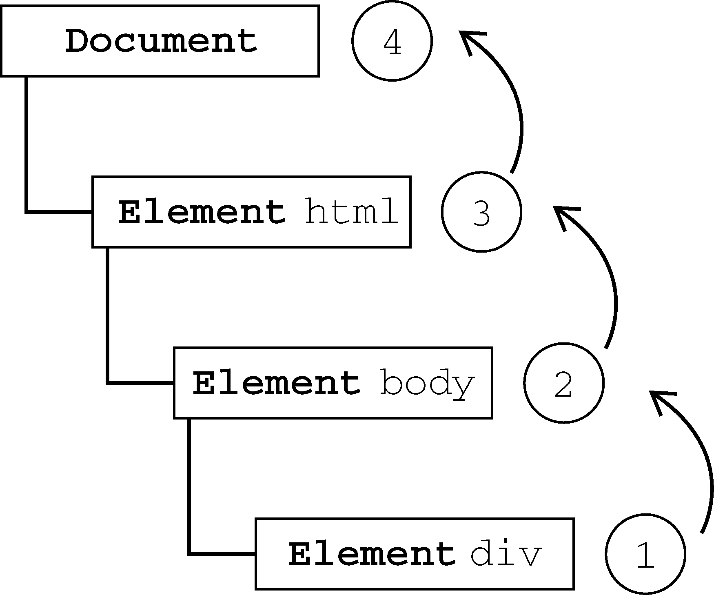
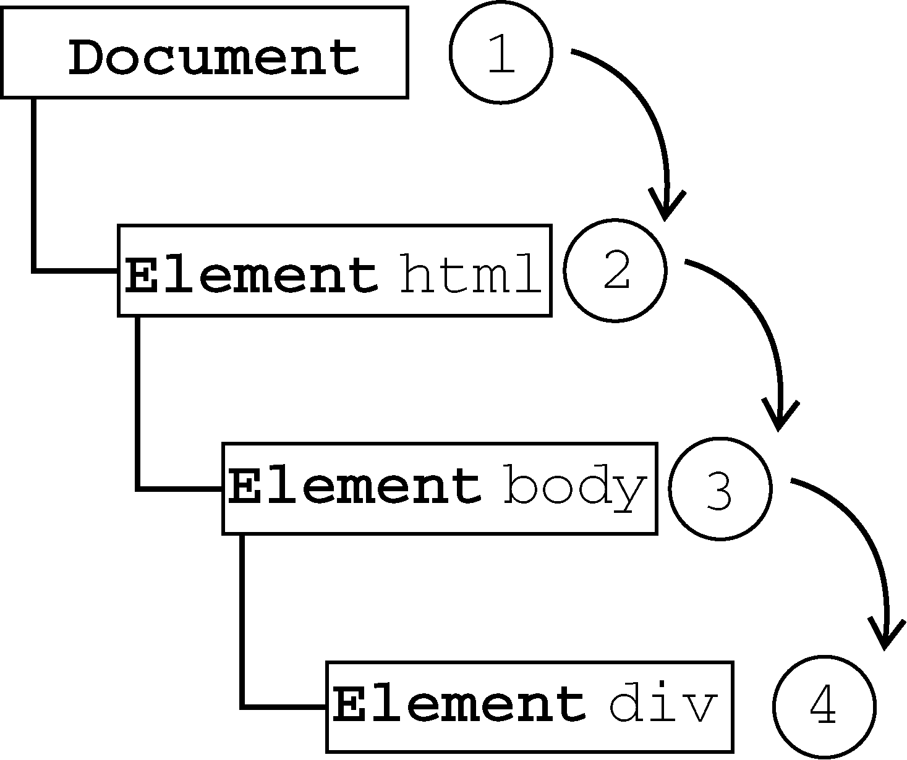
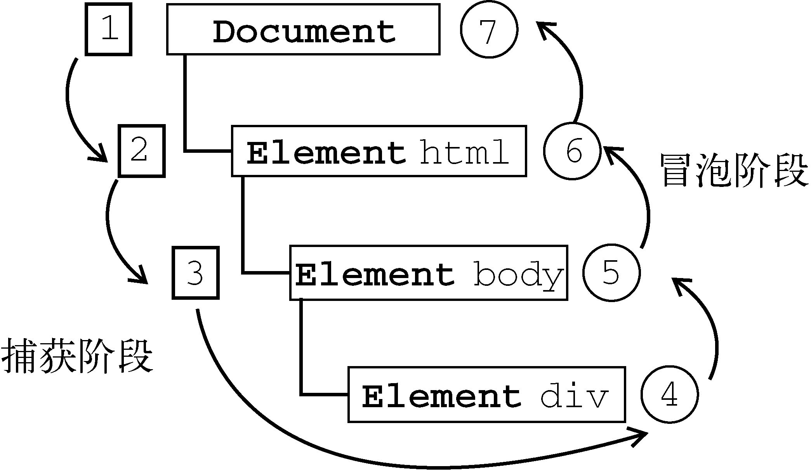

# 第17章 事件

JavaScript与HTML之间的交互是通过**事件**实现的。事件，就是文档或浏览器窗口中发生的一些特定的交互瞬间。可以使用**侦听器**（或处理程序）来预订事件，以便事件发生时执行相应的代码。这种在传统软件工程中被称为观察员模式的模型，支持页面的行为（JavaScript代码）与页面的外观（HTML和CSS代码）之间的松散耦合。

## 17.1 事件流

**事件流**描述的是从页面中接收事件的顺序。但有意思的是，IE和Netscape开发团队居然提出了差不多是完全相反的事件流的概念。IE的事件流是事件冒泡流，而Netscape Communicator的事件流是事件捕获流。

### 17.1.1 事件冒泡

IE的事件流叫做**事件冒泡**（event bubbling），即事件开始时由最具体的元素（文档中嵌套层次最深的那个节点）接收，然后逐级向上传播到较为不具体的节点（文档）。

以下面的HTML页面为例：

```html
<!DOCTYPE html>
<html>
<head>
    <title>Event Bubbling Example</title>
</head>
<body>
    <div id="myDiv">Click Me</div>
</body>
</html>
```

如果你单击了页面中的`<div>`元素，那么这个`click`事件会按照如下顺序传播：



所有现代浏览器都支持事件冒泡，但在具体实现上还是有一些差别。IE5.5及更早版本中的事件冒泡会跳过`<html>`元素（从`<body>`直接跳到`document`）。IE9、Firefox、Chrome和Safari则将事件一直冒泡到`window`对象。

### 17.1.2 事件捕获

Netscape Communicator团队提出的另一种事件流叫做**事件捕获**（event capturing）。事件捕获的思想是不太具体的节点应该更早接收到事件，而最具体的节点应该最后接收到事件。事件捕获的用意在于在事件到达预定目标之前捕获它。

如果仍以前面的HTML页面作为演示事件捕获的例子，那么单击`<div>`元素就会以下列顺序触发`click`事件：



尽管“DOM2级事件”规范要求事件应该从`document`对象开始传播，但**大多数浏览器都是从`window`对象开始捕获事件的。**

由于老版本的浏览器不支持，因此很少有人使用事件捕获。**建议读者放心地使用事件冒泡，在有特殊需要时再使用事件捕获。**

### 17.1.3 DOM事件流

“DOM2级事件”规定的事件流包括3个阶段：

- **事件捕获阶段** ：首先发生的是事件捕获，为截获事件提供了机会。
- **处于目标阶段** ：然后是实际的目标接收到事件。
- **事件冒泡阶段** ：最后一个阶段是冒泡阶段，可以在这个阶段对事件做出响应。

以前面简单的HTML页面为例，单击`<div>`元素会按照下图所示顺序触发事件：



在DOM事件流中，实际的目标（`<div>`元素）在捕获阶段不会接收到事件。这意味着在捕获阶段，事件从`document`到`<html>`再到`<body>`后就停止了。下一个阶段是“处于目标”阶段，于是事件在`<div>`上发生，并在事件处理中被看成冒泡阶段的一部分。然后，冒泡阶段发生，事件又传播回文档。

多数支持DOM事件流的浏览器都实现了一种特定的行为。即使“DOM2级事件”规范明确要求捕获阶段不会涉及事件目标，但所有现代浏览器都会在捕获阶段触发事件对象上的事件。结果，就是有两个机会在目标对象上面操作事件。


## 17.2 事件处理程序 (Event Handlers)

**事件**就是用户或浏览器自身执行的某种动作。诸如`click`、`load`和`mouseover`，都是事件的名字。**事件处理程序** (Event Handlers) 或**事件侦听器** (Event Listener）是响应某个事件的函数。事件处理程序的名字以`"on"`开头，因此`click`事件的事件处理程序就是`onclick`，`load`事件的事件处理程序就是`onload`。

### 17.2.1 HTML事件处理程序

某个元素支持的每种事件，都可以使用一个与相应事件处理程序同名的HTML特性来指定。这个特性的值应该是能够执行的JavaScript代码。

例如，要在按钮被单击时执行一些JavaScript，可以像下面这样编写代码：

```html
<input type="button" value="Click Me" onclick="console.log('Clicked')"/>
```

当单击这个按钮时，就会显示一个控制台日志。这个操作是通过指定`onclick`特性并将一些JavaScript代码作为它的值来定义的。 **由于这个值是JavaScript代码，因此不能在其中使用未经转义的HTML语法字符，例如和号（&）、双引号（""）、小于号（<）或大于号（>）。**

在HTML中定义的事件处理程序可以包含要执行具体动作的JavaScript代码，也可以调用在页面其他地方定义的脚本，还可以调用外部文件中的代码：

```html
<script>
function showMessage() {
    console.log("Hello world!");
}
</script>
<input type="button" value="Click Me" onclick="showMessage()"/>
```

事件处理程序中的代码在执行时，有权访问全局作用域中的任何代码。

这样指定事件处理程序会创建一个封装着元素属性值的函数。这个函数中有一个局部变量**`event`事件对象**。可以直接访问`event`事件对象，你不用自己定义它，也不用从函数的参数列表中读取。

```html
<!-- 输出 "click" -->
<input type="button" value="Click Me" onclick="alert(event.type)">
```

在这个函数内部，`this`值等于事件的目标元素，例如：

```html
<!-- 输出 "Click Me" -->
<input type="button" value="Click Me" onclick="alert(this.value)">
```

**在HTML中指定事件处理程序的缺点：**

- 首先，存在一个时差问题。因为用户可能会在HTML元素一出现在页面上就触发相应的事件，但当时的事件处理程序有可能尚不具备执行条件。假设`showMessage()`函数是在按钮下方、页面的最底部定义的。如果用户在页面解析`showMessage()`函数之前就单击了按钮，就会引发错误。为此，很多HTML事件处理程序都会被封装在一个`try-catch`块中，以便错误不会浮出水面。

- 这样扩展事件处理程序的作用域链在不同浏览器中会导致不同结果。不同JavaScript引擎遵循的标识符解析规则略有差异，很可能会在访问非限定对象成员时出错。

- HTML与JavaScript代码紧密耦合。如果要更换事件处理程序，就要改动两个地方：HTML代码和JavaScript代码。

### 17.2.2 DOM0级事件处理程序

通过JavaScript指定事件处理程序的传统方式，就是将一个函数赋值给一个事件处理程序属性。要使用JavaScript指定事件处理程序，首先必须取得一个要操作的对象的引用。

每个元素（包括`window`和`document`）都有自己的事件处理程序属性，这些属性通常全部小写，例如`onclick`。将这种属性的值设置为一个函数，就可以指定事件处理程序，如下所示：

```js
let btn = document.getElementById("myBtn");
btn.onclick = function() {
	console.log("Clicked");
};
```

注意，在这些代码运行以前不会指定事件处理程序，因此如果这些代码在页面中位于按钮后面，就有可能在一段时间内怎么单击都没有反应。

使用DOM0级方法指定的事件处理程序被认为是元素的方法。因此，这时候的事件处理程序是在元素的作用域中运行；换句话说，程序中的`this`引用当前元素。

```js
let btn = document.getElementById("myBtn");
btn.onclick = function() {
    console.log(this.id); // "myBtn"
};
```

可以在事件处理程序中通过`this`访问元素的任何属性和方法。**以这种方式添加的事件处理程序会在事件流的冒泡阶段被处理。**

也可以删除通过DOM0级方法指定的事件处理程序，只要像下面这样将事件处理程序属性的值设置为`null`即可：

```js
btn.onclick = null;     //删除事件处理程序
```

**注意，DOM0级对每个事件只支持一个事件处理程序。**

### 17.2.3 DOM2级事件处理程序

“DOM2级事件”定义了两个方法，用于处理指定和删除事件处理程序的操作：

- **`addEventListener()`方法** ：添加事件处理程序。

- **`removeEventListener()`方法** ：移除通过`addEventListener()`添加的事件处理程序。移除时传入的参数与添加处理程序时使用的参数相同。这也意味着通过`addEventListener()` **添加的匿名函数将无法移除**。

所有DOM节点中都包含这两个方法，并且它们都接受3个参数：要处理的事件名、作为事件处理程序的函数和一个布尔值。最后这个布尔值参数如果是`true`，表示**在捕获阶段调用**事件处理程序；如果是`false`，表示**在冒泡阶段调用**事件处理程序。

要在按钮上为`click`事件添加事件处理程序，可以使用下列代码：

```js
let btn = document.getElementById("myBtn");
btn.addEventListener("click", () => {   // 为一个按钮添加了onclick事件处理程序
    console.log(this.id);
}, false);
```

与DOM0级方法一样，这里添加的事件处理程序也是在其依附的元素的作用域中运行。

**使用DOM2级方法添加事件处理程序可以为每个事件添加多个事件处理程序。**

```js
/* 
这里为按钮添加了两个事件处理程序。
这两个事件处理程序会按照添加它们的顺序触发，因此首先会显示元素的ID，其次会显示`"Hello world!"`消息。
*/

let btn = document.getElementById("myBtn");

btn.addEventListener("click", () => {
console.log(this.id);
}, false);

btn.addEventListener("click", () => {
console.log("Hello world!");
}, false);
```

通过`addEventListener()` 添加的匿名函数将无法移除：

```js
let btn = document.getElementById("myBtn");
btn.addEventListener("click", () => {
    console.log(this.id);
}, false);

// other code here
btn.removeEventListener("click", function() { // won't work!
    console.log(this.id);
}, false);
```

```js
let btn = document.getElementById("myBtn");
let handler = function() {
    console.log(this.id);
};

btn.addEventListener("click", handler, false);
// other code here
btn.removeEventListener("click", handler, false); // works!
```

**大多数情况下，都是将事件处理程序添加到事件流的冒泡阶段，这样可以最大限度地兼容各种浏览器。最好只在需要在事件到达目标之前截获它的时候将事件处理程序添加到捕获阶段。如果不是特别需要，我们不建议在事件捕获阶段注册事件处理程序。**

### 17.2.4 IE事件处理程序

略

### 17.2.5 跨浏览器的事件处理程序

以下代码实现了一个事件处理对象`EventUtil`，它有两个方法，分别用来实现添加和移除跨浏览器的事件处理程序：

```js
var EventUtil = {
    // addHandler()方法接受3个参数：要操作的元素、事件名称和事件处理程序函数。
    addHandler: function(element, type, handler) {  
        if (element.addEventListener) { // 使用DOM0方法
            element.addEventListener(type, handler, false);
        } else if (element.attachEvent) { // 使用IE方法
            element.attachEvent("on" + type, handler);
        } else { // 默认使用DOM0分发
            element["on" + type] = handler;
        }
    },
    // removeHandler()方法接受3个参数：要操作的元素、事件名称和事件处理程序函数。
    removeHandler: function(element, type, handler) {
        if (element.removeEventListener) { // 使用DOM0方法
            element.removeEventListener(type, handler, false);
        } else if (element.detachEvent) { // 使用IE方法
            element.detachEvent("on" + type, handler);
        } else { // 默认使用DOM0分发
            element["on" + type] = null;
        }
    }
};
```

可以像下面这样使用`EventUtil`对象：

```js
let btn = document.getElementById("myBtn");
let handler = function() {
    console.log("Clicked");
};

EventUtil.addHandler(btn, "click", handler);
// other code here
EventUtil.removeHandler(btn, "click", handler);
```


## 17.3 事件对象

在触发DOM上的某个事件时，会产生一个事件对象`event`，这个对象中包含着所有与事件有关的信息。包括导致事件的元素、事件的类型以及其他与特定事件相关的信息。例如，鼠标操作导致的事件对象中，会包含鼠标位置的信息，而键盘操作导致的事件对象中，会包含与按下的键有关的信息。所有浏览器都支持`event`对象，但支持方式不同。

### 17.3.1 DOM中的事件对象

兼容DOM的浏览器会将一个`event`对象传入到事件处理程序中。无论指定事件处理程序时使用什么方法（DOM0级或DOM2级），都会传入`event`对象。

```js
// 这个例子中的两个事件处理程序都会弹出一个警告框，显示由event.type属性表示的事件类型。

let btn = document.getElementById("myBtn");

btn.onclick = function(event) {
    console.log(event.type); // "click"
};

btn.addEventListener("click", (event) => {
    console.log(event.type); // "click"
}, false);
```

在通过HTML特性指定事件处理程序时，变量`event`中保存着`event`对象。以这种方式提供`event`对象，可以让HTML特性事件处理程序与JavaScript函数执行相同的操作。请看下面的例子：

```html
<input type="button" value="Click Me" onclick="alert(event.type)"/>
```

`event`对象包含与创建它的特定事件有关的属性和方法。触发的事件类型不一样，可用的属性和方法也不一样。下表列出了所有事件都会有的成员：

| 属性/方法                    | 类　　型       | 读/写 | 说　　明                                                     |
| :--------------------------- | :------------- | :---- | :----------------------------------------------------------- |
| `bubbles`                    | `Boolean`      | 只读  | 表明事件是否冒泡                                             |
| `cancelable`                 | `Boolean`      | 只读  | 表明是否可以取消事件的默认行为                               |
| `currentTarget`              | `Element`      | 只读  | 其事件处理程序当前正在处理事件的那个元素。                   |
| `defaultPrevented`           | `Boolean`      | 只读  | 为`true`表示已经调用了`preventDefault()`（DOM3级事件中新增） |
| `detail`                     | `Integer`      | 只读  | 与事件相关的细节信息                                         |
| `eventPhase`                 | `Integer`      | 只读  | 调用事件处理程序的阶段：1表示捕获阶段，2表示“处于目标”，3表示冒泡阶段 |
| `preventDefault()`           | `Function`     | 只读  | 取消事件的默认行为。如果`cancelable`是`true`，则可以使用这个方法 |
| `stopImmediatePropagation()` | `Function`     | 只读  | 取消事件的进一步捕获或冒泡，同时阻止任何事件处理程序被调用（DOM3级事件中新增） |
| `stopPropagation()`          | `Function`     | 只读  | 取消事件的进一步捕获或冒泡。如果`bubbles`为`true`，则可以使用这个方法 |
| `target`                     | `Element`      | 只读  | 事件的实际目标                                               |
| `trusted`                    | `Boolean`      | 只读  | 为`true`表示事件是浏览器生成的。为`false`表示事件是由开发人员通过JavaScript创建的（DOM3级事件中新增） |
| `type`                       | `String`       | 只读  | 被触发的事件的类型                                           |
| `view`                       | `AbstractView` | 只读  | 与事件关联的抽象视图。等同于发生事件的`window`对象           |

在事件处理程序内部，对象`this`始终等于`currentTarget`的值，而`target`则只包含事件的实际目标。如果直接将事件处理程序指定给了目标元素，则`this`、`currentTarget`和`target`包含相同的值。

在需要通过一个函数处理多个事件时，可以使用`event.type`属性。例如：

```js
let btn = document.getElementById("myBtn");

// 定义了一个名为handler的函数，用于处理3种事件：click、mouseover和mouseout。
let handler = function(event) {
    switch(event.type) {
        case "click":
            console.log("Clicked");
            break;
        case "mouseover":
            event.target.style.backgroundColor = "red";
            break;
        case "mouseout":
            event.target.style.backgroundColor = "";
            break;
    }
};

btn.onclick = handler;
btn.onmouseover = handler;
btn.onmouseout = handler;
```

要阻止特定事件的默认行为，可以使用`preventDefault()`方法。例如，链接的默认行为就是在被单击时会导航到其`href`特性指定的URL。如果你想阻止链接导航这一默认行为，那么通过链接的`onclick`事件处理程序可以取消它，如下面的例子所示。

```js
let link = document.getElementById("myLink");
link.onclick = function(event) {
    event.preventDefault();
};
```

另外，`stopPropagation()`方法用于立即停止事件在DOM层次中的传播，即取消进一步的事件捕获或冒泡。例如，直接添加到一个按钮的事件处理程序可以调用`stopPropagation()`，从而避免触发注册在`document.body`上面的事件处理程序，如下面的例子所示：

```js
/*
如果不调用stopPropagation()，就会在单击按钮时出现两个警告框。可是，由于click事件根本不会传播到document.body，因此就不会触发注册在这个元素上的onclick事件处理程序。
*/

let btn = document.getElementById("myBtn");

btn.onclick = function(event) {
    console.log("Clicked");
    event.stopPropagation();
};

document.body.onclick = function(event) {
    console.log("Body clicked");
};
```

事件对象的`eventPhase`属性，可以用来确定事件当前正位于事件流的哪个阶段。如果是在捕获阶段调用的事件处理程序，那么`eventPhase`等于`1`；如果事件处理程序处于目标对象上，则`eventPhase`等于`2`；如果是在冒泡阶段调用的事件处理程序，`eventPhase`等于`3`。这里要注意的是，尽管“处于目标”发生在冒泡阶段，但`eventPhase`仍然一直等于`2`。

```js
/*
当单击这个例子中的按钮时，首先执行的事件处理程序是在捕获阶段触发的添加到document.body中的那一个，结果会弹出一个警告框显示表示eventPhase的1。接着，会触发在按钮上注册的事件处理程序，此时的eventPhase值为2。最后一个被触发的事件处理程序，是在冒泡阶段执行的添加到document.body上的那一个，显示eventPhase的值为3。而当eventPhase等于2时，this、target和currentTarget始终都是相等的。
*/


let btn = document.getElementById("myBtn");

btn.onclick = function(event) {
    console.log(event.eventPhase); // 2
};

document.body.addEventListener("click", (event) => {
    console.log(event.eventPhase); // 1
}, true);

document.body.onclick = (event) => {
    console.log(event.eventPhase); // 3
};
```

> **注意：只有在事件处理程序执行期间，`event`对象才会存在；一旦事件处理程序执行完成，`event`对象就会被销毁。**

### 17.3.2 IE中的事件对象

略

### 17.3.3 跨浏览器的事件对象

虽然DOM和IE中的`event`对象不同，但基于它们之间的相似性依旧可以拿出跨浏览器的方案来。IE中`event`对象的全部信息和方法DOM对象中都有，只不过实现方式不一样。可以对前面介绍的`EventUtil`对象加以增强，添加如下方法：

```js
var EventUtil = {
    addHandler: function(element, type, handler) {
        // code removed for printing
    },
    getEvent: function(event) {
        return event ? event : window.event;
    },
    getTarget: function(event) {
        return event.target || event.srcElement;
    },
    preventDefault: function(event) {
        if (event.preventDefault) {
            event.preventDefault();
        } else {
            event.returnValue = false;
        }
    },
    removeHandler: function(element, type, handler) {
        // code removed for printing
    },
    stopPropagation: function(event) {
        if (event.stopPropagation) {
            event.stopPropagation();
        } else {
            event.cancelBubble = true;
        }
    }
};
```


## 17.4 事件类型

Web浏览器中可能发生的事件有很多类型。如前所述，不同的事件类型具有不同的信息，而“DOM3级事件”规定了以下几类事件。

- UI（User Interface，用户界面）事件，当用户与页面上的元素交互时触发；
- 焦点事件，当元素获得或失去焦点时触发；
- 鼠标事件，当用户通过鼠标在页面上执行操作时触发；
- 滚轮事件，当使用鼠标滚轮（或类似设备）时触发；
- 文本事件，当在文档中输入文本时触发；
- 键盘事件，当用户通过键盘在页面上执行操作时触发；
- 合成事件，当为IME（Input Method Editor，输入法编辑器）输入字符时触发；
- 变动（mutation）事件，当底层DOM结构发生变化时触发。
- 变动名称事件，当元素或属性名变动时触发。此类事件已经被废弃，没有任何浏览器实现它们，因此本章不做介绍。

### 17.4.1 UI事件

现有的UI事件如下：

- `DOMActivate`：表示元素已经被用户操作（通过鼠标或键盘）激活。这个事件在DOM3级事件中被废弃，但Firefox 2+和Chrome支持它。考虑到不同浏览器实现的差异，不建议使用这个事件。
- `load`：当页面完全加载后在`window`上面触发，当所有框架都加载完毕时在框架集上面触发，当图像加载完毕时在``元素上面触发，或者当嵌入的内容加载完毕时在`<object>`元素上面触发。当页面完全加载后（包括所有图像、JavaScript文件、CSS文件等外部资源），就会触发`window`上面的`load`事件。
- `unload`：当页面完全卸载后在`window`上面触发，当所有框架都卸载后在框架集上面触发，或者当嵌入的内容卸载完毕后在`<object>`元素上面触发。
- `abort`：在用户停止下载过程时，如果嵌入的内容没有加载完，则在`<object>`元素上面触发。
- `error`：当发生JavaScript错误时在`window`上面触发，当无法加载图像时在``元素上面触发，当无法加载嵌入内容时在`<object>`元素上面触发，或者当有一或多个框架无法加载时在框架集上面触发。
- `select`：当用户选择文本框（`<input>`或`<textarea>`）中的一或多个字符时触发。
- `resize`：当窗口或框架的大小变化时在`window`或框架上面触发。
- `scroll`：当用户滚动带滚动条的元素中的内容时，在该元素上面触发。`<body>`元素中包含所加载页面的滚动条。

#### `load`事件

当页面完全加载后（包括所有图像、JavaScript文件、CSS文件等外部资源），就会触发`window`上面的`load`事件。

有2种定义`onload`事件处理程序的方式：

- 使用DOM方式
- 使用HTML标签`onload`属性

```js
// 使用DOM方式为window定义onload事件处理程序
window.addEventListener("load", (event) => {
    console.log("Loaded!");
});
```

```html
<!DOCTYPE html>
<html>
<head>
    <title>Load Event Example</title>
</head>
<!-->在window上面发生的任何事件都可以在<body>元素中通过相应的特性来指定，因为在HTML中无法访问window元素。<-->
<body onload="console.log('Loaded!')">
</body>
</html>
```

图像上面也可以触发`load`事件，无论是在DOM中的图像元素还是HTML中的图像元素。

```html
<!-->可以在HTML中为任何图像指定`onload`事件处理程序<-->

```

```js
// 使用DOM为任何图像指定`onload`事件处理程序
let image = document.getElementById("myImage");
image.addEventListener("load", (event) => {
    console.log(event.target.src);
});
```

在创建新的``元素时，可以为其指定一个事件处理程序，以便图像加载完毕后给出提示。此时，最重要的是要在指定`src`属性之前先指定事件：

```js
window.addEventListener("load", () => {
    let image = document.createElement("img");
    image.addEventListener("load", (event) => {
        console.log(event.target.src);
    });
    document.body.appendChild(image);
    image.src = "smile.gif";   // 注意：新图像元素只要设置了src属性就会开始下载。
});
```

```js
// 同样的功能也可以通过使用DOM0级的Image对象实现。
window.addEventListener("load", () => {
    let image = new Image();  // 可以像使用元素一样使用Image对象。
    image.addEventListener("load", (event) => {
        console.log("Image loaded!");
    });
    image.src = "smile.gif";
});
```

还有一些元素也以非标准的方式支持`load`事件。在现代浏览器中，`<script>`元素也会触发`load`事件，以便开发人员确定动态加载的JavaScript文件是否加载完毕。与图像不同，只有在设置了`<script>`元素的`src`属性并将该元素添加到文档后，才会开始下载JavaScript文件。

```js
window.addEventListener("load", () => {
    let script = document.createElement("script");
    script.addEventListener("load", (event) => {
        console.log("Loaded");
    });
    script.src = "example.js";
    document.body.appendChild(script);
});
```

#### `unload`事件

与`load`事件对应的是`unload`事件，这个事件在文档被完全卸载后触发。只要用户从一个页面切换到另一个页面，就会发生`unload`事件。而利用这个事件最多的情况是清除引用，以避免内存泄漏。

与`load`事件类似，也有两种指定`onunload`事件处理程序的方式：

- 使用JavaScript操作DOM；
- 使用`<body>`元素的`onunload`属性；

```js
window.addEventListener("unload", (event) => {
    console.log("Unloaded!");
});
```

```html
<!DOCTYPE html>
<html>
<head>
    <title>Unload Event Example</title>
</head>
<body onunload="console.log('Unloaded!')">
</body>
</html>
```

#### `resize`事件

当浏览器窗口被调整到一个新的高度或宽度时，就会触发`resize`事件。这个事件在`window`（窗口）上面触发，因此可以通过JavaScript或者`<body>`元素中的`onresize`特性来指定事件处理程序。

```js
window.addEventListener("resize", (event) => {
    console.log("Resized");
});
```

#### `scroll`事件

虽然`scroll`事件是在`window`对象上发生的，但它实际表示的则是页面中相应元素的变化。在混杂模式下，可以通过`<body>`元素的`scrollLeft`和`scrollTop`来监控到这一变化；而在标准模式下，除Safari之外的所有浏览器都会通过`<html>`元素来反映这一变化（Safari仍然基于`<body>`跟踪滚动位置）。

```js
window.addEventListener("scroll", (event) => {
    if (document.compatMode == "CSS1Compat") {
        console.log(document.documentElement.scrollTop);
    } else {
        console.log(document.body.scrollTop);
    }
});
```

### 17.4.2 焦点事件

焦点事件会在页面元素获得或失去焦点时触发。利用这些事件并与`document.hasFocus()`方法及`document.activeElement`属性配合，可以知晓用户在页面上的行踪。有以下6个焦点事件：

- `blur`：在元素失去焦点时触发。这个事件不会冒泡；所有浏览器都支持它。
- `DOMFocusIn`：在元素获得焦点时触发。这个事件与HTML事件`focus`等价，但它冒泡。DOM3级事件废弃了`DOMFocusIn`，选择了`focusin`。
- `DOMFocusOut`：在元素失去焦点时触发。这个事件是HTML事件`blur`的通用版本。只有Opera支持这个事件。DOM3级事件废弃了`DOMFocusOut`，选择了`focusout`。
- `focus`：在元素获得焦点时触发。这个事件不会冒泡；所有浏览器都支持它。
- `focusin`：在元素获得焦点时触发。这个事件与HTML事件`focus`等价，但它冒泡。
- `focusout`：在元素失去焦点时触发。这个事件是HTML事件`blur`的通用版本。

当焦点从页面中的一个元素移动到另一个元素，会依次触发下列事件：

1.  `focusout`在失去焦点的元素上触发；
2. `focusin`在获得焦点的元素上触发；
3. `blur`在失去焦点的元素上触发；
4. `DOMFocusOut`在失去焦点的元素上触发；
5. `focus`在获得焦点的元素上触发；
6. `DOMFocusIn`在获得焦点的元素上触发。

### 17.4.3 鼠标与滚轮事件

鼠标事件：

- `click`：在用户单击主鼠标按钮（一般是左边的按钮）或者按下回车键时触发。这一点对确保易访问性很重要，意味着`onclick`事件处理程序既可以通过键盘也可以通过鼠标执行。
- `dblclick`：在用户双击主鼠标按钮（一般是左边的按钮）时触发。从技术上说，这个事件并不是DOM2级事件规范中规定的，但鉴于它得到了广泛支持，所以DOM3级事件将其纳入了标准。
- `mousedown`：在用户按下了任意鼠标按钮时触发。不能通过键盘触发这个事件。
- `mouseenter`：在鼠标光标从元素外部首次移动到元素范围之内时触发。这个事件不冒泡，而且在光标移动到后代元素上不会触发。DOM2级事件并没有定义这个事件，但DOM3级事件将它纳入了规范。
- `mouseleave`：在位于元素上方的鼠标光标移动到元素范围之外时触发。这个事件不冒泡，而且在光标移动到后代元素上不会触发。DOM2级事件并没有定义这个事件，但DOM3级事件将它纳入了规范。
- `mousemove`：当鼠标指针在元素内部移动时重复地触发。不能通过键盘触发这个事件。
- `mouseout`：在鼠标指针位于一个元素上方，然后用户将其移入另一个元素时触发。又移入的另一个元素可能位于前一个元素的外部，也可能是这个元素的子元素。不能通过键盘触发这个事件。
- `mouseover`：在鼠标指针位于一个元素外部，然后用户将其首次移入另一个元素边界之内时触发。不能通过键盘触发这个事件。
- `mouseup`：在用户释放鼠标按钮时触发。不能通过键盘触发这个事件。
- `mousewheel`：当用户通过鼠标滚轮与页面交互、在垂直方向上滚动页面时（无论向上还是向下），就会触发`mousewheel`事件。

**页面上的所有元素都支持鼠标事件。除了`mouseenter`和`mouseleave`，所有鼠标事件都会冒泡，也可以被取消，而取消鼠标事件将会影响浏览器的默认行为。** 只有在同一个元素上相继触发`mousedown`和`mouseup`事件，才会触发`click`事件；如果`mousedown`或`mouseup`中的一个被取消，就不会触发`click`事件。类似地，只有触发两次`click`事件，才会触发一次`dblclick`事件。如果有代码阻止了连续两次触发`click`事件（可能是直接取消`click`事件，也可能通过取消`mousedown`或`mouseup`间接实现），那么就不会触发`dblclick`事件了。

`mousedown`、`mouseup`、`click`、`dblclick`这4个事件触发的顺序始终如下：

1. `mousedown`
2. `mouseup`
3. `click`
4. `mousedown`
5. `mouseup`
6. `click`
7. `dblclick`

#### 客户端坐标位置 (Client Coordinates)

鼠标事件都是在浏览器视口中的特定位置上发生的。这个位置信息保存在事件对象的`clientX`和`clientY`属性中。

- `clientX`属性：表示事件发生时鼠标指针在**视口中的水平坐标** 。

- `clientY`属性：表示事件发生时鼠标指针在**视口中的垂直坐标** 。

#### 页面坐标位置 (Page Coordinates)
页面坐标通过事件对象的`pageX`和`pageY`属性，能告诉你事件是在页面中的什么位置发生的。换句话说，这两个属性表示鼠标光标在页面中的位置，因此坐标是从页面本身而非视口的左边和顶边计算的。在页面没有滚动的情况下，`pageX`和`pageY`的值与`clientX`和`clientY`的值相等。

#### 屏幕坐标位置 (Screen Coordinates)
鼠标事件发生时，不仅会有相对于浏览器窗口的位置，还有一个相对于整个电脑屏幕的位置。而通过`screenX`和`screenY`属性就可以确定鼠标事件发生时鼠标指针相对于整个屏幕的坐标信息。

#### 修改键 (Modifier Keys)
虽然鼠标事件主要是使用鼠标来触发的，但在按下鼠标时键盘上的某些键的状态也可以影响到所要采取的操作。这些修改键就是Shift、Ctrl、Alt和Meta（在Windows键盘中是Windows键，在苹果机中是Cmd键），它们经常被用来修改鼠标事件的行为。DOM为此规定了4个属性，表示这些修改键的状态：`shiftKey`、`ctrlKey`、`altKey`和`metaKey`。这些属性中包含的都是布尔值，如果相应的键被按下了，则值为`true`，否则值为`false`。当某个鼠标事件发生时，通过检测这几个属性就可以确定用户是否同时按下了其中的键。

#### 相关元素 (Related Elements)
在发生`mouseover`和`mouseout`事件时，还会涉及更多的元素。这两个事件都会涉及把鼠标指针从一个元素的边界之内移动到另一个元素的边界之内。对`mouseover`事件而言，事件的主目标是获得光标的元素，而相关元素就是那个失去光标的元素。类似地，对`mouseout`事件而言，事件的主目标是失去光标的元素，而相关元素则是获得光标的元素。DOM通过`event`对象的`relatedTarget`属性提供了相关元素的信息。这个属性只对于`mouseover`和`mouseout`事件才包含值；对于其他事件，这个属性的值是`null`。

#### 鼠标按钮
对于`mousedown`和`mouseup`事件来说，则在其`event`对象存在一个`button`属性，表示按下或释放的按钮。DOM的`button`属性可能有如下3个值：`0`表示主鼠标按钮，`1`表示中间的鼠标按钮（鼠标滚轮按钮），`2`表示次鼠标按钮。在常规的设置中，主鼠标按钮就是鼠标左键，而次鼠标按钮就是鼠标右键。

#### 额外事件信息

“DOM2级事件”规范在`event`对象中还提供了`detail`属性，用于给出有关事件的更多信息。对于鼠标事件来说，`detail`中包含了一个数值，表示在给定位置上发生了多少次单击。在同一个元素上相继地发生一次`mousedown`和一次`mouseup`事件算作一次单击。`detail`属性从`1`开始计数，每次单击发生后都会递增。如果鼠标在`mousedown`和`mouseup`之间移动了位置，则`detail`会被重置为`0`。

#### 鼠标滚轮事件

当用户通过鼠标滚轮与页面交互、在垂直方向上滚动页面时（无论向上还是向下），就会触发`mousewheel`事件。这个事件可以在任何元素上面触发，最终会冒泡到`document`（IE8）或`window`（IE9、Opera、Chrome及Safari）对象。与`mousewheel`事件对应的`event`对象除包含鼠标事件的所有标准信息外，还包含一个特殊的`wheelDelta`属性。当用户向前滚动鼠标滚轮时，`wheelDelta`是120的倍数；当用户向后滚动鼠标滚轮时，`wheelDelta`是-120的倍数。

将`mousewheel`事件处理程序指定给页面中的任何元素或`document`对象，即可处理鼠标滚轮的交互操作：

```js
document.addEventListener("mousewheel", (event) => {
    console.log(event.wheelDelta);
});
```

#### 触控设备的支持

在面向触控设备进行开发时，要记住以下几点：

- 不支持`dblclick`事件。双击浏览器窗口会放大画面，而且没有办法改变该行为。
- 轻击可单击元素会触发`mousemove`事件。如果此操作会导致内容变化，将不再有其他事件发生；如果屏幕没有因此变化，那么会依次发生`mousedown`、`mouseup`和`click`事件。轻击不可单击的元素不会触发任何事件。可单击的元素是指那些单击可产生默认操作的元素（如链接），或者那些已经被指定了`onclick`事件处理程序的元素。
- `mousemove`事件也会触发`mouseover`和`mouseout`事件。
- 两个手指放在屏幕上且页面随手指移动而滚动时会触发`mousewheel`和`scroll`事件。

#### 无障碍性问题 (Accessibility Issues)

如果你的Web应用程序或网站要确保残疾人特别是那些使用屏幕阅读器的人都能访问，那么在使用鼠标事件时就要格外小心。以下是在使用鼠标事件时应当注意的几个易访问性问题。

- 使用`click`事件执行代码。有人指出通过`onmousedown`执行代码会让人觉得速度更快，对视力正常的人来说这是没错的。但是，在屏幕阅读器中，由于无法触发`mousedown`事件，结果就会造成代码无法执行。
- 不要使用`onmouseover`向用户显示新的选项。原因同上，屏幕阅读器无法触发这个事件。如果确实非要通过这种方式来显示新选项，可以考虑添加显示相同信息的键盘快捷方式。
- 不要使用`dblclick`执行重要的操作。键盘无法触发这个事件。

### 