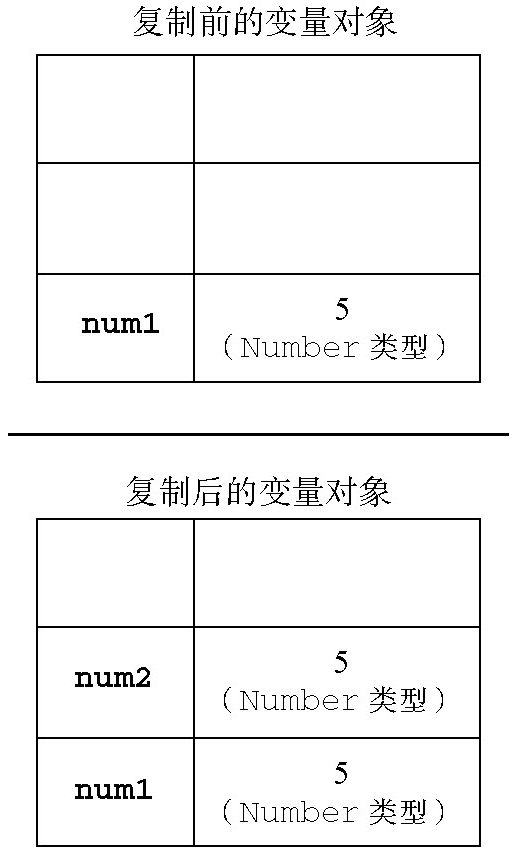

# 第4章 变量、作用域和内存问题

## 4.1 基本类型和引用类型的值(PRIMITIVE AND REFERENCE VALUES)

ECMAScript变量可能包含2种不同数据类型的值：

- **基本类型值：** 指的是6种基本数据类型：`Undefined`、`Null`、`Boolean`、`Number`、`String`和`Symbol`。这6种基本数据类型是按值访问的，因为可以操作保存在变量中的实际的值。
- **引用类型值：** 是保存在内存中的对象。在操作对象时，实际上是在操作对象的引用而不是实际的对象。为此，引用类型的值是按引用访问的。

> **注意：当复制保存着对象的某个变量时，操作的是对象的引用。但在为对象添加属性时，操作的是实际的对象。**

### 4.1.1 动态的属性

对于引用类型的值，我们可以为其添加属性和方法，也可以改变和删除其属性和方法。请看下面的例子：

```js
let person = new Object();
person.name = "Nicholas";
console.log(person.name); // "Nicholas"
```

不能给基本类型的值添加属性，尽管这样做不会导致任何错误。比如：

```js
let name = "Nicholas";
name.age = 27;
console.log(name.age); // undefined
```

### 4.1.2 复制变量值

如果从一个变量向另一个变量复制基本类型的值，会在变量对象上创建一个新值，然后把该值复制到为新变量分配的位置上。来看一个例子：

```js
let num1 = 5;
let num2 = num1;
```



当从一个变量向另一个变量复制引用类型的值时，同样也会将存储在变量对象中的值复制一份放到为新变量分配的空间中。不同的是，这个值的副本实际上是一个指针，而这个指针指向存储在堆中的一个对象。复制操作结束后，两个变量实际上将引用同一个对象。因此，改变其中一个变量，就会影响另一个变量，如下面的例子所示：

```js
let obj1 = new Object();
let obj2 = obj1;
obj1.name = "Nicholas";
console.log(obj2.name); // "Nicholas"
```


### 4.1.3 传递参数

**ECMAScript中所有函数的参数都是按值传递的。**

在向参数传递基本类型的值时，被传递的值会被复制给一个局部变量（即命名参数，或者用ECMAScript的概念来说，就是`arguments`对象中的一个元素）。实例如下：

```js
function addTen(num) {
    num += 10;
    return num;
}

let count = 20;
let result = addTen(count);
console.log(count); // 20 - no change
console.log(result); // 30
```

在向参数传递引用类型的值时，会把这个值在内存中的地址(location)复制给一个局部变量，因此这个局部变量的变化会反映在函数的外部。实例如下：

```js
function setName(obj) {
    obj.name = "Nicholas";
}

let person = new Object();
setName(person);
console.log(person.name); // "Nicholas"
```

### 4.1.4 检测类型

如果变量的值是一个对象或`null`，则`typeof`操作符会像下面例子中所示的那样返回`"object"`：

```js
let s = "Nicholas";
let b = true;
let i = 22;
let u;
let n = null;
let o = new Object();

console.log(typeof s); // string
console.log(typeof i); // number
console.log(typeof b); // boolean
console.log(typeof u); // undefined
console.log(typeof n); // object
console.log(typeof o); // object
```

ECMAScript提供了`instanceof`操作符来检测某个对象是什么引用类型的实例，其语法如下所示：

```js
result = variable instanceof constructor
```

如果变量是给定引用类型（根据它的原型链来识别）的实例，那么`instanceof`操作符就会返回`true`：

```js
console.log(person instanceof Object); // is the variable person an Object?
console.log(colors instanceof Array); // is the variable colors an Array?
console.log(pattern instanceof RegExp); // is the variable pattern a RegExp?
```


## 4.2 执行环境和作用域

