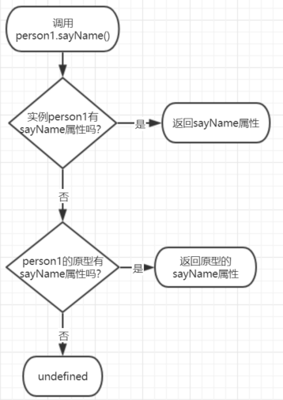
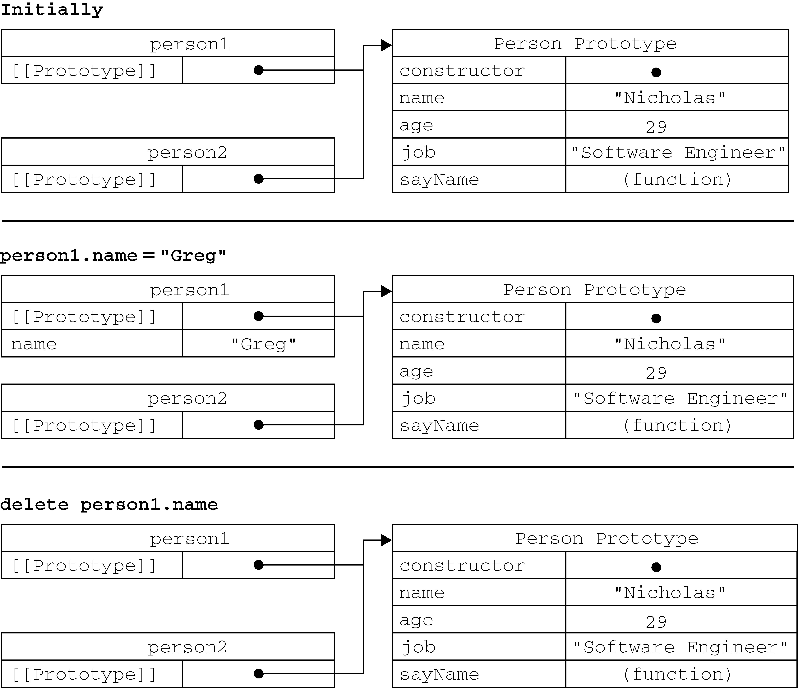

# 第8章 面向对象程序设计

ECMA-262把对象定义为：“无序属性的集合，其属性可以包含基本值、对象或者函数。” 严格来讲，这就相当于说对象是一组没有特定顺序的值。对象的每个属性或方法都有一个名字，而每个名字都映射到一个值。

## 8.1 理解对象

创建自定义对象的最简单方式就是创建一个`Object`的实例，然后再为它添加属性和方法：

```js
let person = new Object();
person.name = "Nicholas";
person.age = 29;
person.job = "Software Engineer";
person.sayName = function() {
    console.log(this.name);
};
```

对象字面量现在是创建这种对象的首选模式，前面的例子用对象字面量语法可以写成这样：

```js
let person = {
    name: "Nicholas",
    age: 29,
    job: "Software Engineer",
    sayName() {
        console.log(this.name);
    }
};
```

### 8.1.1 属性类型

ECMA-262在定义只有内部才用的特性（attribute）时，描述了属性（property）的各种特征。ECMA-262定义这些特性是为了实现JavaScript引擎用的，因此在JavaScript中不能直接访问它们。为了表示特性是内部值，该规范把它们放在了两对儿方括号中，例如`[[Enumerable]]`。

ECMAScript中有2种属性：

- 数据属性（data properties）
- 访问器属性（accessor properties）

#### 1.数据属性

**数据属性** 包含一个数据值的位置。在这个位置可以 **读取 **和 **写入值** 。数据属性有4个描述其行为的特性：

- `[[Configurable]]`：表示能否通过`delete`删除属性从而重新定义属性，能否修改属性的特性，或者能否把属性修改为访问器属性。像前面例子中那样直接在对象上定义的属性，它们的这个特性默认值为`true`。
- `[[Enumerable]]`：表示能否通过`for-in`循环返回属性。像前面例子中那样直接在对象上定义的属性，它们的这个特性默认值为`true`。
- `[[Writable]]`：表示能否修改属性的值。像前面例子中那样直接在对象上定义的属性，它们的这个特性默认值为`true`。
- `[[Value]]`：包含这个属性的数据值。读取属性值的时候，从这个位置读；写入属性值的时候，把新值保存在这个位置。这个特性的默认值为`undefined`。

对于像前面例子中那样直接在对象上定义的属性，它们的`[[Configurable]]`、`[[Enumerable]]`和`[[Writable]]`特性都被设置为`true`，而`[[Value]]`特性被设置为指定的值。

```js
let person = {
    name: "Nicholas"
};
```

**要修改属性默认的特性，必须使用`Object.defineProperty()`方法。** 这个方法接收3个参数：属性所在的对象、属性的名字和一个描述符对象。其中，描述符（descriptor）对象的属性必须是：`configurable`、`enumerable`、`writable`和`value`。设置其中的一或多个值，可以修改对应的特性值。例如：

```js
let person = {};
Object.defineProperty(person, "name", {
    writable: false,
    value: "Nicholas"
});
console.log(person.name); // "Nicholas"
person.name = "Greg";
console.log(person.name); // "Nicholas"
```

类似的规则也适用于不可配置的属性：

```js
let person = {};
Object.defineProperty(person, "name", {
    configurable: false,    //把configurable设置为false，表示不能从对象中删除属性。
    value: "Nicholas"
});
console.log(person.name); // "Nicholas"
delete person.name;
console.log(person.name); // "Nicholas"
```

而且，一旦把属性定义为不可配置的，就不能再把它变回可配置了。此时，再调用`Object.defineProperty()`方法修改除`writable`之外的特性，都会导致错误：

```js
let person = {};
Object.defineProperty(person, "name", {
    configurable: false,
    value: "Nicholas"
});

// 抛出错误
Object.defineProperty(person, "name", {
    configurable: true,
    value: "Nicholas"
});
```

在调用`Object.defineProperty()`方法时，如果不指定，`configurable`、`enumerable`和`writable`特性的默认值都是`false`。

#### 2.访问器属性

访问器属性不包含数据值；它们包含一对儿getter和setter函数（不过，这两个函数都不是必需的）。在读取访问器属性时，会调用getter函数，这个函数负责返回有效的值；在写入访问器属性时，会调用setter函数并传入新值，这个函数负责决定如何处理数据。访问器属性有如下4个特性。

- `[[Configurable]]`：表示能否通过`delete`删除属性从而重新定义属性，能否修改属性的特性，或者能否把属性修改为数据属性。对于直接在对象上定义的属性，这个特性的默认值为`true`。
- `[[Enumerable]]`：表示能否通过`for-in`循环返回属性。对于直接在对象上定义的属性，这个特性的默认值为`true`。
- `[[Get]]`：在读取属性时调用的函数。默认值为`undefined`。
- `[[Set]]`：在写入属性时调用的函数。默认值为`undefined`。

**访问器属性不能直接定义，必须使用`Object.defineProperty()`来定义：** 

```js
// Define object with pseudo-private member 'year_'
// and public member 'edition'
let book = {
    year_: 2017, //year_的下划线是一种常用的记号，用于表示只能通过对象方法访问的属性。
    edition: 1
};

Object.defineProperty(book, "year", {
    get() {
        return this.year_;
    },
    set(newValue) {
        if (newValue > 2017) {
            this.year_ = newValue;
            this.edition += newValue - 2017;
        }
    }
});

book.year = 2018;
console.log(book.edition); // 2
```

**不一定非要同时指定getter和setter。** 只指定getter意味着属性是不能写，尝试写入属性会被忽略。在严格模式下，尝试写入只指定了getter函数的属性会抛出错误。类似地，只指定setter函数的属性也不能读，否则在非严格模式下会返回`undefined`，而在严格模式下会抛出错误。

### 8.1.2 定义多个属性

由于为对象定义多个属性的可能性很大，ECMAScript提供了一个`Object.defineProperties()`方法。利用这个方法可以通过描述符一次定义多个属性。这个方法接收2个对象作为参数：第1个对象是要添加和修改其属性的对象，第2个对象的属性与第1个对象中要添加或修改的属性一一对应。

```js
let book = {};

Object.defineProperties(book, {
    year_: {
        value: 2017
    },
    edition: {
        value: 1
    },
    year: {
        get() {
            return this.year_;
        },
        set(newValue) {
            if (newValue > 2017) {
                this.year_ = newValue;
                this.edition += newValue - 2017;
            }
        }
    }
});
```

### 8.1.3　读取属性的特性

使用`Object.getOwnPropertyDescriptor()`方法，可以取得给定属性的描述符。这个方法接收2个参数：属性所在的对象和要读取其描述符的属性名称。返回值是一个对象，如果是访问器属性，这个对象的属性有`configurable`、`enumerable`、`get`和`set`；如果是数据属性，这个对象的属性有`configurable`、`enumerable`、`writable`和`value`。

```js
let book = {};

Object.defineProperties(book, {
    year_: {
        value: 2017
    },
    edition: {
        value: 1
    },
    year: {
        get: function() {
            return this.year_;
        },
        set: function(newValue){
            if (newValue > 2017) {
                this.year_ = newValue;
                this.edition += newValue - 2017;
            }
        }
    }
});

let descriptor = Object.getOwnPropertyDescriptor(book, "year_");
console.log(descriptor.value); // 2017
console.log(descriptor.configurable); // false
console.log(typeof descriptor.get); // "undefined"

let descriptor = Object.getOwnPropertyDescriptor(book, "year");
console.log(descriptor.value); // undefined
console.log(descriptor.enumerable); // false
console.log(typeof descriptor.get); // "function"
```

New in ECMAScript 2017 is the `Object.getOwnPropertyDescriptors()` static method. This method effectively performs on `Object.getOwnPropertyDescriptor()` on all own properties and returns them in a new object. For the previous example, using this static method would return the following object:

```js
let book = {};

Object.defineProperties(book, {
    year_: {
        value: 2017
    },
    edition: {
        value: 1
    },
    year: {
        get: function() {
            return this.year_;
        },
        set: function(newValue){
            if (newValue > 2017) {
                this.year_ = newValue;
                this.edition += newValue - 2017;
            }
        }
    }
});

console.log(Object.getOwnPropertyDescriptors(book));
// {
//     edition: {
//         configurable: false,
//         enumerable: false,
//         value: 1,
//         writable: false
//     },
//     year: {
//         configurable: false,
//         enumerable: false,
//         get: f(),
//         set: f(newValue),
//     },
//     year_: {
//         configurable: false,
//         enumerable: false,
//         value: 2019,
//         writable: false
//     }
// }
```


### 8.1.4 Merging Objects

### 8.1.5 Object Identity and Equality

### 8.1.6 Enhanced Object Syntax

### 8.1.7 Object Destructuring


## 8.2 创建对象

虽然`Object`构造函数或对象字面量都可以用来创建单个对象，但这些方式有个明显的 **缺点** ： **使用同一个接口创建很多对象，会产生大量的重复代码。**

### 8.2.1 概述

通过连续的规范，ECMAScript的可用功能遵循了非常不寻常的模式。 通过ECMAScript 5.1规范，没有对类或继承等面向对象的构造的正式支持。 但是，正如您在以下各节中将看到的那样，原型继承的巧妙应用使JavaScript开发人员能够成功模仿这种行为。

通过ECMAScript 6规范，引入了对类和继承的正式支持。 这些ES6类旨在完全包含先前规范中设计的基于原型的类解决方案。 但是，它们的实现在许多方面仅是ES5.1样式的构造函数和原型继承的语法抽象。

### 8.2.2 工厂模式

工厂模式抽象了创建具体对象的过程。这是一种用函数来封装以特定接口创建对象的方法：

```js
function createPerson(name, age, job) {
    let o = new Object();
    o.name = name;
    o.age = age;
    o.job = job;
    o.sayName = function() {
        console.log(this.name);
    };
    return o;
}

let person1 = createPerson("Nicholas", 29, "Software Engineer");
let person2 = createPerson("Greg", 27, "Doctor");
```

函数`createPerson()`能够根据接受的参数来构建一个包含所有必要信息的`Person`对象。可以无数次地调用这个函数，而每次它都会返回一个包含三个属性一个方法的对象。

**工厂模式虽然解决了创建多个相似对象的问题，但却没有解决对象识别的问题（即怎样知道一个对象的类型）。这个问题可以由 *构造函数模式* 解决。**


### 8.2.3 构造函数模式

ECMAScript 中的构造函数可用来创建特定类型的对象。我们也可以创建自定义的构造函数，从而定义自定义对象类型的属性和方法。

例如，可以使用构造函数模式将前面的例子重写如下。

```js
function Person(name, age, job){
    this.name = name;
    this.age = age;
    this.job = job;
    this.sayName = function() {
        console.log(this.name);
    };
}

// 创建2个Person的不同实例：person1和person2
let person1 = new Person("Nicholas", 29, "Software Engineer");
let person2 = new Person("Greg", 27, "Doctor");
person1.sayName(); // Nicholas
person2.sayName(); // Greg

// 这两个对象都有一个constructor（构造函数）属性，该属性指向Person
console.log(person1.constructor == Person); // true
console.log(person2.constructor == Person); // true

// 这两个对象既是Object的实例，同时也是Person的实例
console.log(person1 instanceof Object); // true
console.log(person1 instanceof Person); // true
console.log(person2 instanceof Object); // true
console.log(person2 instanceof Person); // true
```

在这个例子中，`Person()`函数取代了`createPerson()`函数。我们注意到，`Person()`中的代码除了与`createPerson()`存在以下不同之处：

- 没有显式地创建对象；
- 直接将属性和方法赋给了`this`对象；
- 没有`return`语句。

按照惯例，***构造函数*** 始终都应该以一个大写字母开头，而 ***非构造函数*** 则应该以一个小写字母开头。

**要创建`Person`的新实例，必须使用`new`操作符。以这种方式调用构造函数实际上会经历以下5个步骤：**

1. A new object is created in memory. 在内存中创建一个新对象；
2. The new object’s internal `[[Prototype]]` pointer is assigned to the constructor’s `prototype`
    property. 将新对象内部的`[[Prototype]]`指针赋给构造函数的`prototype`属性；
3. The `this` value of the constructor is assigned to the new object (so `this` points to the
    new object). 将构造函数的`this`值赋给新对象（因此`this`就指向了这个新对象）；
4. The code inside the constructor is executed (adds properties to the new object). 执行构造函数中的代码（为这个新对象添加属性）；
5. If the constructor function returns a non-null value, that object is returned. Otherwise, the
    new object that was just created is returned. 除非构造函数显式地返回一个其他非空值；否则，将返回新创建的对象。

**优点：创建自定义的构造函数意味着将来可以将它的实例标识为一种特定的类型；而这正是构造函数模式胜过工厂模式的地方。**

> 以这种方式定义的构造函数是定义在`Global`对象（在浏览器中是`window`对象）中的。

Constructor functions do not have to be expressed as a function declaration. A function expression assigned to a variable behaves identically:

```js
let Person = function(name, age, job) {
    this.name = name;
    this.age = age;
    this.job = job;
    this.sayName = function() {
        console.log(this.name);
    };
}

let person1 = new Person("Nicholas", 29, "Software Engineer");
let person2 = new Person("Greg", 27, "Doctor");

person1.sayName(); // Nicholas
person2.sayName(); // Greg

console.log(person1 instanceof Object); // true
console.log(person1 instanceof Person); // true
console.log(person2 instanceof Object); // true
console.log(person2 instanceof Person); // true
```

When instantiating, the parentheses after the constructor function are optional if you do not wish to pass any arguments—the new operator will invoke the constructor function no matter what:

```js
function Person() {
    this.name = "Jake";
    this.sayName = function() {
        console.log(this.name);
    };
}

let person1 = new Person();
let person2 = new Person;

person1.sayName(); // Jake
person2.sayName(); // Jake

console.log(person1 instanceof Object); // true
console.log(person1 instanceof Person); // true
console.log(person2 instanceof Object); // true
console.log(person2 instanceof Person); // true
```

#### 构造函数本身也是函数

**构造函数与其他函数的唯一区别，在于调用它们的方式不同。** 任何函数，只要通过`new`操作符来调用，那它就可以作为构造函数；而任何函数，如果不通过`new`操作符来调用，那它跟普通函数没什么两样。

```js
// 当作构造函数使用
// 这也是构造函数的典型用法，即使用new操作符来创建一个新对象。
let person = new Person("Nicholas", 29, "Software Engineer");
person.sayName(); // "Nicholas"

// 作为普通函数调用
// 当在全局作用域中调用一个函数时，this对象总是指向Global对象（在浏览器中就是window对象）
Person("Greg", 27, "Doctor"); // 属性和方法都被添加给window对象了
window.sayName(); // "Greg"

// 在另一个对象的作用域中调用
// 可以使用call()（或者apply()）在某个特殊对象的作用域中调用Person()函数。
let o = new Object();
Person.call(o, "Kristen", 25, "Nurse"); // 在对象o的作用域中调用Person()
// o就拥有了所有属性和sayName()方法
o.sayName(); // "Kristen"
```

#### 构造函数的问题

**使用构造函数的主要问题，就是每个方法都是`Function`对象的不同实例，即，构造函数创建出的不同对象的方法没有共享同一`Function`实例。** 在前面的例子中，`person1`和`person2`都有一个名为`sayName()`的方法，但那两个方法是`Function`的两个不同实例。因此，不同实例上的同名函数是不相等的，如下所示：

```js
console.log(person1.sayName == person2.sayName); // false
```

**然而，创建两个完成同样任务的`Function`实例的确没有必要；况且有`this`对象在，根本不用在执行代码前就把函数对象实例绑定到特定对象上面。**

这个问题可以通过把函数定义转移到构造函数外部来解决：

```js
function Person(name, age, job){
    this.name = name;
    this.age = age;
    this.job = job;
    this.sayName = sayName;  // 在构造函数内部，将sayName属性设置成等于全局的sayName函数。
}

// 把sayName()函数的定义转移到了构造函数外部。
function sayName() {
    console.log(this.name);
}

let person1 = new Person("Nicholas", 29, "Software Engineer");
let person2 = new Person("Greg", 27, "Doctor");
person1.sayName(); // Nicholas
person2.sayName(); // Greg

// 由于sayName包含的是一个指向函数的指针，因此person1和person2对象就共享了在全局作用域中定义的同一个sayName()函数。
console.log(person1.sayName == person2.sayName); // true
```

**但这种做法仍然有缺点：**

- 在全局作用域中定义的函数实际上只能被某个对象调用，这让全局作用域有点名不副实。
- 如果对象需要定义很多方法，那么就要定义很多个全局函数，于是我们这个自定义的引用类型就丝毫没有封装性可言了。

**这些问题可以通过使用 *原型模式* 来解决。**


### 8.2.4 原型模式 (The Prototype Pattern)

**每个被创建的函数都有一个`prototype`（原型）属性，这个属性是一个指针，指向一个对象，而这个对象的用途是：包含可以由特定类型的所有实例共享的属性和方法。** 

`prototype`就是通过调用构造函数而创建的那个对象实例的 ***原型对象*** 。

使用 *原型对象* 的好处是可以让所有对象实例共享它所包含的属性和方法。

```js
function Person() {}

Person.prototype.name = "Nicholas";
Person.prototype.age = 29;
Person.prototype.job = "Software Engineer";
Person.prototype.sayName = function() {
    console.log(this.name);
};

let person1 = new Person();
person1.sayName(); // "Nicholas"

let person2 = new Person();
person2.sayName(); // "Nicholas"

// person1和person2通过原型对象共享了相同的属性和方法
console.log(person1.sayName == person2.sayName); // true
```

用函数表达式也同样适用：

```js
let Person = function() {};

Person.prototype.name = "Nicholas";
Person.prototype.age = 29;
Person.prototype.job = "Software Engineer";
Person.prototype.sayName = function() {
    console.log(this.name);
};

let person1 = new Person();
person1.sayName(); // "Nicholas"

let person2 = new Person();
person2.sayName(); // "Nicholas"

// person1和person2通过原型对象共享了相同的属性和方法
console.log(person1.sayName == person2.sayName); // true
```

#### 原型对象的工作原理

只要创建了一个新函数，就会根据一组特定的规则为该函数创建一个`prototype`属性，这个属性指向函数的原型对象。

在默认情况下，所有原型对象都会自动获得一个`constructor`（构造函数）属性，这个属性是一个指向`prototype`属性所在函数的指针。就拿前面的例子来说，`Person.prototype.constructor`指向`Person`。

创建了自定义的构造函数之后，其原型对象默认只会取得`constructor`属性；至于其他方法，则都是从`Object`继承而来的。

当调用构造函数创建一个新实例后，该实例的内部将包含一个指针（内部属性），指向构造函数的原型对象。在ECMA-262中，这个指针叫`[[Prototype]]`。虽然在脚本中没有标准的方式访问`[[Prototype]]`，但Firefox、Safari和Chrome在每个对象上都支持一个属性`__proto__`；而在其他实现中，这个属性对脚本则是完全不可见的。

以前面使用`Person`构造函数和`Person.prototype`创建实例的代码为例，下图展示了各个对象之间的关系：


以下代码也验证了其中的各种关系和原型对象的行为：

```js
/**
* Constructor function can exist as function expression
* or function declaration, so both of these are suitable:
* function Person {}
* let Person = function() {}
*/
function Person() {}

/**
* Upon declaration, the constructor function already
* has a prototype object associated with it:
*/
console.log(typeof Person.prototype);
console.log(Person.prototype);
// {
// constructor: f Person(),
// __proto__: Object
// }

/**
* As mentioned previously, the constructor function has
* a 'prototype' reference to the prototype object, and
* the prototype object has a 'constructor' reference to
* the constructor function. These references are cyclical:
*/
console.log(Person.prototype.constructor === Person); // true

/**
* Any normal prototype chain will terminate at the Object prototype.
* The prototype of the Object prototype is null.
*/
console.log(Person.prototype.__proto__ === Object.prototype); // true
console.log(Person.prototype.__proto__.constructor === Object); // true
console.log(Person.prototype.__proto__.__proto__ === null); // true

console.log(Person.prototype.__proto__);
// {
// constructor: f Object(),
// toString: ...
// hasOwnProperty: ...
// isPrototypeOf: ...
// ...
// }

let person1 = new Person(),
person2 = new Person();

/**
* The constructor, the prototype object, and an instance
* are three completely distinct objects:
*/
console.log(person1 !== Person); // true
console.log(person1 !== Person.prototype); // true
console.log(Person.prototype !== person); // true

/**
* An instance is linked to the prototype through __proto__, which
* is the literal manifestation of the [[Prototype]] hidden property.
*
* A constructor is linked to the prototype through the constructor property.
*
* An instance has no direct link to the constructor, only through the prototype.
*/
console.log(person1.__proto__ === Person.prototype); // true
conosle.log(person1.__proto__.constructor === Person); // true

/**
* Two instances created from the same constructor function will share
* a prototype object:
*/
console.log(person1.__proto__ === person2.__proto__); // true

/**
* instanceof will check the instance's prototype chain against the
* prototype property of a constructor function:
*/
console.log(person1 instanceof Person); // true
console.log(person1 instanceof Object); // true
console.log(Person.prototype instanceof Object); // true
```

通过`isPrototypeOf()`方法来确定对象之间是否存在这种关系。如果`[[Prototype]]`指向调用`isPrototypeOf()`方法的对象（`Person.prototype`），那么这个方法就返回`true`，如下所示：

```js
// person1和person2内部都有一个指向Person.prototype的指针，因此都返回了true。
console.log(Person.prototype.isPrototypeOf(person1)); // true
console.log(Person.prototype.isPrototypeOf(person2)); // true
```

ECMAScript的`Object`对象有一个`Object.getPrototypeOf()`方法可以返回`[[Prototype]]`的值。 **利用`Object.getPrototypeOf()`可以方便地取得一个对象的原型，而这在利用原型实现继承的情况下是非常重要的。**

```js
// Object.getPrototypeOf()返回的对象就是这个对象的原型
console.log(Object.getPrototypeOf(person1) == Person.prototype); // true
// 取得了原型对象中name属性的值
console.log(Object.getPrototypeOf(person1).name); // "Nicholas"
```

The `Object` type also features a `setPrototypeOf()` method, which writes a new value into the `[[Prototype]]` of the instance. This allows you to overwrite the prototype hierarchy of an already instantiated object:

```js
let biped = {
    numLegs: 2
};

let person = {
    name: 'Matt'
};

Object.setPrototypeOf(person, biped);

console.log(person.name); // Matt
console.log(person.numLegs); // 2
console.log(Object.getPrototypeOf(person) === biped); // true
```

> WARNING: The `Object.setPrototypeOf()` operation will likely cause severe performance slowdowns when used. 

To avoid these slowdowns, prefer to just create a new object and specify its prototype with `Object.create()`:

```js
let biped = {
    numLegs: 2
};

let person = Object.create(biped);
person.name = 'Matt';

console.log(person.name); // Matt
console.log(person.numLegs); // 2
console.log(Object.getPrototypeOf(person) === biped); // true
```

#### 理解原型的层次结构 (Understanding the Prototype Hierarchy)

**每当读取某个对象的某个属性时，都会对指定名称的属性进行搜索：**

1. 首先搜索对象实例本身是否具有给定名字的属性。如果在实例中找到了具有给定名字的属性，则返回该属性的值。

2. 如果实例本身不具有给定名字的属性，则继续搜索指针指向的原型对象，在原型对象中查找具有给定名字的属性。

3. 如果在原型对象中找到了这个属性，则返回该属性的值。

例如在我们调用`person1.sayName()`的时候，会先后执行2次搜索：



虽然可以通过对象实例访问保存在原型中的值，但却 **不能通过对象实例重写原型中的值。** 当为对象实例添加一个属性时，这个属性就会**屏蔽**原型对象中保存的同名属性，但不会修改那个属性。即使将这个属性设置为`null`，也只会在实例中设置这个属性：

```js
function Person() {}

Person.prototype.name = "Nicholas";
Person.prototype.age = 29;
Person.prototype.job = "Software Engineer";
Person.prototype.sayName = function() {
    console.log(this.name);
};

let person1 = new Person();
let person2 = new Person();

person1.name = "Greg";
console.log(person1.name); // "Greg" - from instance
console.log(person2.name); // "Nicholas" - from prototype
```

不过，使用`delete`操作符则可以完全删除实例属性，从而让我们能够重新访问原型中的属性：

```js
function Person() {}

Person.prototype.name = "Nicholas";
Person.prototype.age = 29;
Person.prototype.job = "Software Engineer";
Person.prototype.sayName = function() {
    console.log(this.name);
};

let person1 = new Person();
let person2 = new Person();

person1.name = "Greg";
console.log(person1.name); // "Greg" - from instance
console.log(person2.name); // "Nicholas" - from prototype

delete person1.name;
console.log(person1.name); // "Nicholas" - from the prototype
```

使用`hasOwnProperty()`方法可以检测一个属性是存在于实例中，还是存在于原型中。这个方法（从`Object`继承）只在给定属性存在于对象实例中时，才会返回`true`：

```js
function Person() {}
Person.prototype.name = "Nicholas";
Person.prototype.age = 29;
Person.prototype.job = "Software Engineer";
Person.prototype.sayName = function() {
    console.log(this.name);
};

let person1 = new Person();
let person2 = new Person();

console.log(person1.hasOwnProperty("name")); // false

person1.name = "Greg";
console.log(person1.name); // "Greg" - from instance
console.log(person1.hasOwnProperty("name")); // true

console.log(person2.name); // "Nicholas" - from prototype
console.log(person2.hasOwnProperty("name")); // false

delete person1.name;
console.log(person1.name); // "Nicholas" - from the prototype
console.log(person1.hasOwnProperty("name")); // false
```

下图展示了上面例子在不同情况下的实现与原型的关系（图中省略了与`Person`构造函数的关系）：



#### 原型与`in`操作符

有2种方式使用`in`操作符：

- 单独使用
- 在`for-in`循环中使用

在单独使用时，`in`操作符会在通过对象能够访问给定属性时返回`true`，无论该属性存在于实例中还是原型中。

```js
function Person() {}

Person.prototype.name = "Nicholas";
Person.prototype.age = 29;
Person.prototype.job = "Software Engineer";
Person.prototype.sayName = function() {
    console.log(this.name);
};

let person1 = new Person();
let person2 = new Person();

console.log(person1.hasOwnProperty("name")); // false
console.log("name" in person1); // true

person1.name = "Greg";
console.log(person1.name); // "Greg" - from instance
console.log(person1.hasOwnProperty("name")); // true
console.log("name" in person1); // true

console.log(person2.name); // "Nicholas" - from prototype
console.log(person2.hasOwnProperty("name")); // false
console.log("name" in person2); // true

delete person1.name;
console.log(person1.name); // "Nicholas" - from the prototype
console.log(person1.hasOwnProperty("name")); // false
console.log("name" in person1); // true
```

